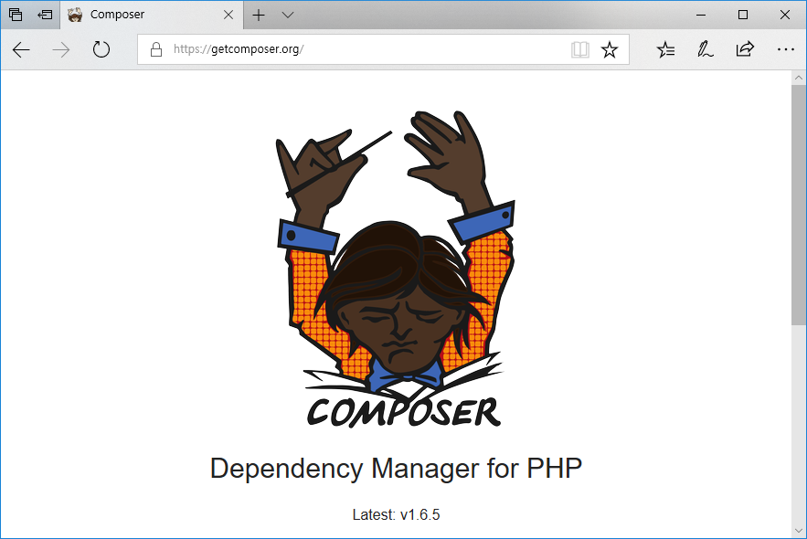
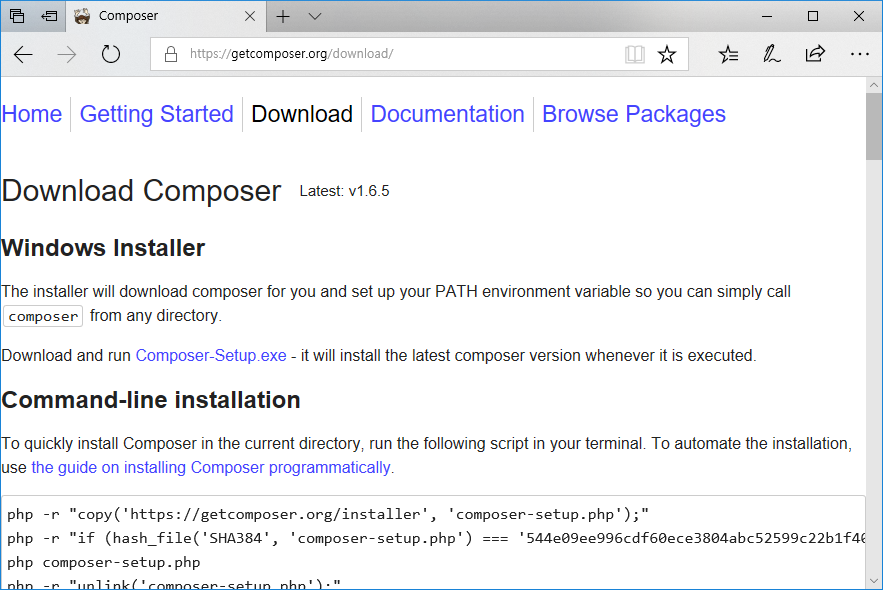
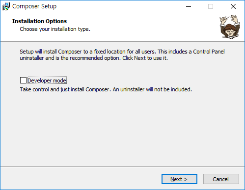

# 컴포저
---
컴포저는 PHP 페키지들의 의존성을 관리하는 도구 입니다. 기존 PHP 라이브러리들은 서로다른 설치 방법과 배포로 인하여 라이브러리를 배포 유지하기가 어려웠습니다. 
또한 라이브러리들의 서로 상호 의존성으로 인해여 쉽게 설치 및 배포하기도 쉽지 않았습니다. 이러한 문제들은 오래동안 많은 개발자들에게 고통을 안겨 주는 일이었습니다.

하지만, 최근들어 노드의`mpn`, 파이썬의 `pip`, C#의 `nuget`과 같은 페키지 관리가 가능해 졌습니다. `private packagis`에서 개발된 composer는 PHP의 라이브러리를 패키지화여 의존성을 자동으로 관리해 주는 프로그램입니다. 또한, 저장소 검색사이트를 통하여 수많은 PHP 패키지들을 검사하여 쉽게 설치를 하실 수 있습니다. 

지니PHP는 개발된 코드들을 패키지화 pagiagist에 배포를 합니다. 또한 자체 패키지와 공개된 다른 패키지들을 같이 설치하여 동작을 하는 구조로 설계가 되어 있습니다. 지니PHP를 설치 사용을 하기 위해서는 composer를 개발PC, 서버에 설치를 하여야 합니다.

페키지를 이용하면 자체 제공되는 기능 이외에 수많은 PHP 응용라이브러리와 결합하여 서버스를 생성해 나아갈 수 있을 것입니다.
 

### 컴포저 설치
---
컴포저는 getcomposer.org 에서 무료로 다운로드 받아 설치 할 수 있습니다. 다음은 사이트에 접속한 화면입니다. 여러개의 패키지를 조합하고 원할하게 관리를 한다는 의미로 지휘자 캐릭터르 사용하고 있습니다.

컴포저의 사용법은 공식 사이트에서도 잘 정리가 되어 있습니다.

컴포저는 다양한 개발환경에서도 사용이 가능합니다. 윈도우 뿐만 아니라 리눅스, 맥에서도 설치가 가능합니다. 이는 PHP가 Linux 이외에 여러 플렛폼에서 개발되어 지고 서비스되고 있기 때문입니다. 
컴포저를 설치하는 방법은 공식사이트에서 `다운로드` 메뉴를 선택하면 됩니다.

다운로드 페이지는 여러 운영체제에 대한 설치파일을 받는 방법과 실행 방법에 대해서 설명을 하고 있습니다.
 

### 윈도우 설치
---
윈도우는 전세계에서 가장 많이 사용하고 있는 운영체제 중의 하나입니다. 또한, 윈도우를 기반으로 PHP코드를 시작하는 수많은 개발자들이 존재합니다. 

컴포저는 윈도우 개발자를 위해서 간단한 설치 파일을 제공합니다. 다운로드 사이트에서 `Composer-setup.exe` 파일을 다운로드 하여 실행하면 됩니다. 

* [Composer-setup.exe 다운로드](https://getcomposer.org/Composer-Setup.exe)

위의 링크를 선택하여 파일을 직접 다운로드 받을 수 있습니다. 그리고 다운로드 받은 파일을 실행해 주시길 바랍니다. 
보통 다운로드 파일은 바로가기> 다운로드 폴더안에 저장이 됩니다.

자동으로 관련 모든 설정을 자동으로 처리해 줍니다. 

설치를 실행하기전에 주의할 점은 컴포저 설치 전에 미리 PHP가 설치되어 있어야 합니다.