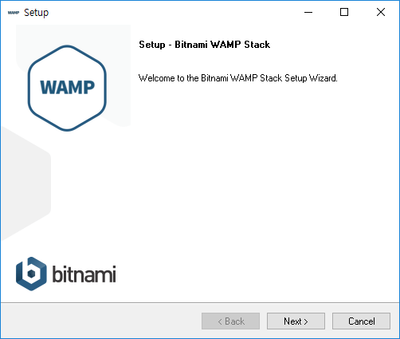
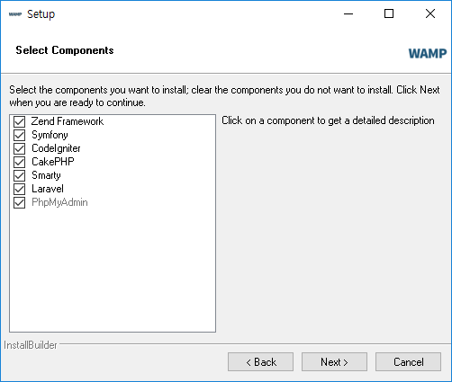
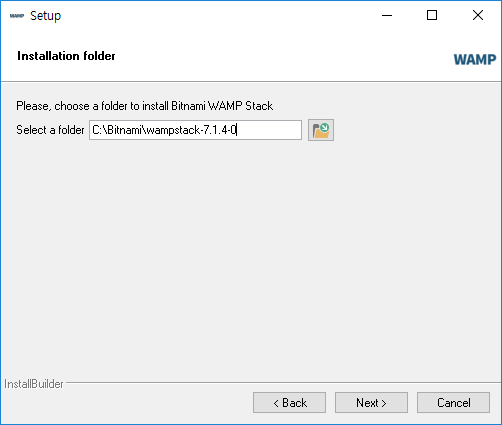
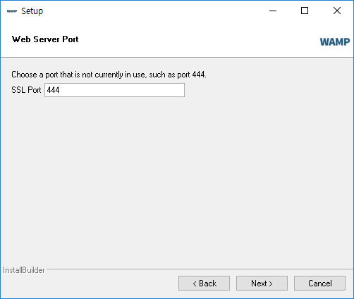
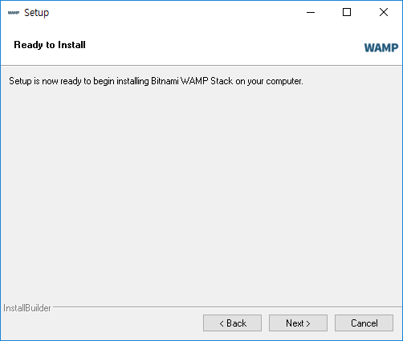
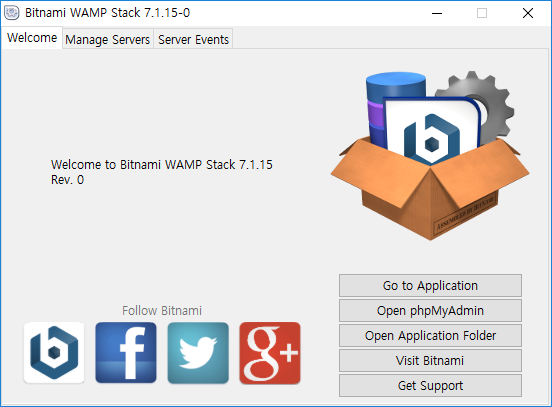
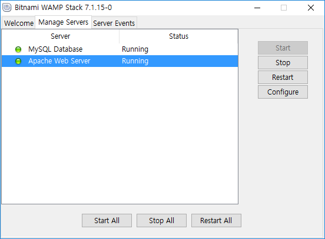

# WAPM
비트나미 사이트에서 아파치 + PHP + Mysql 패키지를 만들어 한번에 자동으로 설치를 할 수 있도록 만들어 배포하고 있습니다.

다운로드 받은 설치파일을 실행합니다.

 

WAPM 설치 화면이 실행된 것을 보실 수 있습니다. 다음(next)를 선택합니다. 

비트나미 WAPM은 기본적으로 아파치, PHP, Mysql 이외에도 PHP에서 인기가 많은 프레임워크 몇가지를 같이 설치하여 사용할 수 있도록 제공을 하고 있습니다. 원하는 페키지들을 선택한 후에 다음(next)를 선택합니다.

비트나미 패키지를 설치할 폴더를 선택합니다. 이 경로는 향후 설정이나 파일들의 경로입니다. 잘 기억을 해두고 다음(next)를 선택합니다.

비트나미는 기본적으로 Mysql 데이터 베이스를 같이 설치합니다. Mysql은 3대 데이터베이스라 할 수 있는 인기있는 데이터베이스 시스템 소프트웨어 입니다.
데이터베이스의 기본 root 유저에 대한 암호를 설정합니다. 설정한 암호를 잘 기억하신 후에 다음(next)를 선택합니다.

웹 포트를 설정합니다. 기본사항을 그대로 두고 다음(next)을 선택합니다.

다음(next)을 선택합니다.

다음(next)을 선택합니다.

설치가 진행이 됩니다. 컴퓨터의 사양에 따라서 약간의 설치 소요 시간이 필요합니다. 하지만, 그렇게 오래 걸리지는 않습니다.

보완경고. 비트나미는 윈도우용 아파치 웹서버를 설치합니다. 윈도우 내부에서 방화벽을 통과 해야 하기 때문에 억세스 허용을 물어 보게 됩니다. 허용을 승락한후에 다음을 진행하 주시길 바랍니다. 

마지막, 성공적으로 설치된 화면을 보실 수 있습니다.

정상적으로 비트나미가 설치가 되었다면, 웹브라우저를 통하여 접속을 해보도록 합니다. 자신의 컴퓨터는 localhost 라는 도메인을 고유적으로 가지고 있습니다. 또는 127.0.0.1 아이피를 가지고 있습니다. 브라우저에 127.0.0.1 을 입력해 봅니다. 위와 같은 화면이 실행되는 것을 보실 수 있습니다.

## 관리툴
비트나미를 통하여 패키지를 설치하였다면 추가로 전용 관리툴이 같이 설치됩니다.

위의 설정탭에서 `Manage Service`를 선택합니다.

관리툴을 이용하여 Mysql, Apache 서버를 중단, 재시작, 시작 등의 작업을 제어할 수 있습니다.