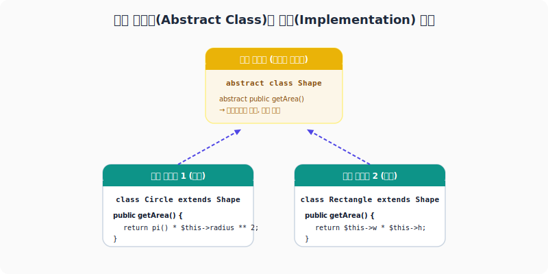

# 추상 클래스 (Abstract Class)
---

추상(abstract) 클래스는 **상속을 위한 미완성 설계도**입니다. 추상 클래스는 자체적으로 객체(인스턴스)를 생성할 수 없으며, 이 클래스를 상속받는 자식 클래스에서 추상 메서드를 반드시 오버라이딩(구현)하여 사용하도록 강제합니다.

<div style="text-align: center; margin: 30px 0;">
  
  <p style="font-size: 13px; color: #64748b; margin-top: 8px;">그림: 추상 클래스의 추상 메서드 명세와 각 자식 클래스의 실제 구현체 바인딩 관계</p>
</div>

<br>

## 추상 클래스 정의 및 구현 예제

추상 클래스와 추상 메서드는 `abstract` 키워드를 사용하여 정의합니다.


```php
<?php
// 추상 클래스 선언
abstract class Shape
{
    protected string $color;

    public function __construct(string $color)
    {
        $this->color = $color;
    }

    // 추상 메서드 (자식 클래스에서 반드시 구현해야 함)
    abstract public function getArea(): float;

    // 일반 메서드도 포함 가능
    public function getColor(): string
    {
        return $this->color;
    }
}

// 자식 클래스에서 추상 클래스 상속 및 구현
class Circle extends Shape
{
    private float $radius;

    public function __construct(string $color, float $radius)
    {
        parent::__construct($color);
        $this->radius = $radius;
    }

    // 추상 메서드 실제 구현
    public function getArea(): float
    {
        return pi() * ($this->radius ** 2);
    }
}

$circle = new Circle("Red", 5.0);
echo "도형 색상: " . $circle->getColor() . "<br>";
echo "도형 넓이: " . $circle->getArea() . "<br>";
?>
```


---

## 📂 추상화 학습 관련 주제
* [추상 클래스 안에서의 정적 선언 한계](static.html)