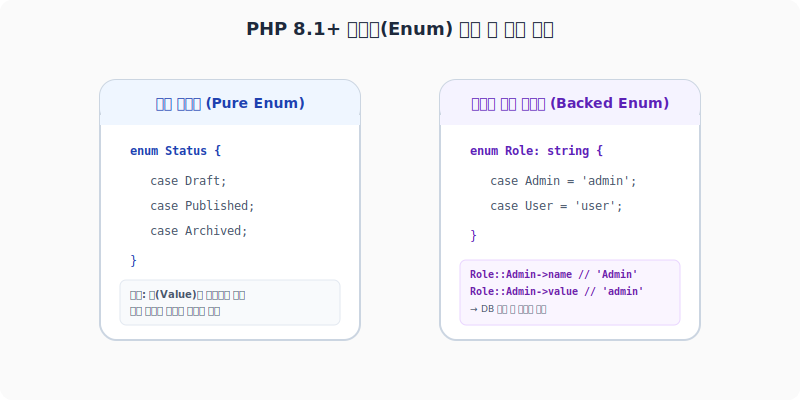

# 열거형 (Enum)
---

과거 PHP에서는 특정 상태(예: 주문 상태, 사용자 역할 등)를 구분하기 위해 클래스 내부에 상수(`const STATUS_PENDING = 1;`)를 정의해 사용하곤 했습니다. 하지만 이러한 상수 방식은 타입 안정성이 떨어지고(엉뚱한 정수를 대입해도 막을 수 없음), 단순한 스칼라 값에 불과하여 의미를 부여하기 까다로웠습니다.

**PHP 8.1부터는** 이러한 단점을 극복하고 강력한 타입 안정성과 객체지향적인 설계를 제공하는 **열거형(Enum)**이 공식 도입되었습니다.

<div style="text-align: center; margin: 30px 0;">
  
  <p style="font-size: 13px; color: #64748b; margin-top: 8px;">그림: PHP 8.1+ Pure Enum(단순 식별형)과 Backed Enum(상수 값 매핑형)의 구조 차이</p>
</div>

<br>

## 1. 단순 열거형 (Pure Enum)

단순 열거형은 추가적인 스칼라 값을 가지지 않고, 오직 각 분기(Case)의 존재 자체가 하나의 유일한 상태 값으로 취급되는 형태입니다.

```php
<?php
declare(strict_types=1);

// 1. 단순 열거형 선언
enum Status
{
    case Draft;
    case Published;
    case Archived;
}

// 2. 변수 타입 제한 및 객체 대입
function publishPost(Status $status): void
{
    if ($status === Status::Published) {
        echo "게시물이 전 세계에 공개됩니다.<br>";
    }
}

// 올바른 호출 (타입 안정성 보장)
publishPost(Status::Published);

// 잘못된 호출 (컴파일/런타임 에러 자동 발생)
// publishPost("Published"); // ❌ TypeError 발생! (문자열은 Status 타입이 아님)
?>
```

<br>

## 2. 백드 열거형 (Backed Enum)

데이터베이스에 저장하거나 API 응답으로 내보낼 때, 각 케이스를 정수(int)나 문자열(string) 형태의 스칼라 값으로 매핑(Backing)해야 할 때가 많습니다. 이를 **백드 열거형(Backed Enum)**이라고 부릅니다.

백드 열거형은 정의할 때 상속처럼 콜론(`:`) 뒤에 `string` 또는 `int` 타입을 선언해 주어야 합니다.

```php
<?php
declare(strict_types=1);

// string 타입의 백드 열거형 정의
enum UserRole: string
{
    case Admin = 'administrator';
    case Editor = 'editor';
    case Guest = 'guest';
}

// 1. 읽기 전용 프로퍼티 자동 지원
$myRole = UserRole::Admin;
echo "케이스 이름: " . $myRole->name . "<br>";  // 출력: Admin
echo "케이스 실제값: " . $myRole->value . "<br>"; // 출력: administrator

// 2. 값(Value)을 통해 Enum 객체로 역복원 (Deserialization)
$dbValue = 'editor';

// form() 메서드는 값과 일치하는 Enum 객체를 리턴합니다. 일치하는 값이 없으면 ValueError 에러를 냅니다.
$roleObj = UserRole::from($dbValue);
echo "복원된 역할: " . $roleObj->name . "<br>"; // 출력: Editor

// tryFrom() 메서드는 일치하지 않을 때 Exception 대신 null을 리턴하므로 훨씬 안전합니다.
$badRole = UserRole::tryFrom('hacker'); 
if ($badRole === null) {
    echo "올바르지 않은 권한명입니다.<br>";
}
?>
```

<br>

## 3. 열거형 메서드 (Enum Methods)

PHP의 Enum은 내부적으로 특수한 클래스로 구현되어 있기 때문에, 일반 클래스처럼 **내부에 메서드를 정의**하여 특정 케이스에 따른 비즈니스 논리를 은닉하여 캡슐화할 수 있습니다.

```php
<?php
declare(strict_types=1);

enum OrderStatus: string
{
    case Pending = 'pending';
    case Shipping = 'shipping';
    case Delivered = 'delivered';

    // 클래스처럼 메서드 정의 가능
    public function getKoreanLabel(): string
    {
        // match 표현식과 결합하여 환상적인 가독성을 냅니다.
        return match($this) {
            self::Pending   => '대기 중',
            self::Shipping  => '배송 중',
            self::Delivered => '배송 완료',
        };
    }

    // 인터페이스 구현도 가능합니다.
}

$status = OrderStatus::Shipping;
echo "현재 상태 한글명: " . $status->getKoreanLabel() . "<br>"; // 출력: 배송 중
?>
```

<br>

## 4. 열거형 모든 케이스 조회

Enum에 정의된 모든 케이스의 목록을 가져오고 싶다면 static 메서드인 `cases()`를 호출합니다.

```php
<?php
$allRoles = UserRole::cases();

foreach ($allRoles as $role) {
    echo "역할: " . $role->name . " (값: " . $role->value . ")<br>";
}
?>
```

---

## 📂 열거형 요약 및 특징
- **클래스 상속 불가**: Enum은 이미 내부적으로 특수한 클래스를 구현하고 있으므로, 다른 Enum이나 일반 클래스로부터 상속을 받거나(`extends`), 다른 클래스의 부모가 될 수 없습니다. (단, **인터페이스 구현(implements)은 허용**됩니다.)
- **인스턴스 생성 불가**: `new UserRole()`과 같이 직접 인스턴스화하는 행위는 문법적으로 완벽히 차단됩니다.
