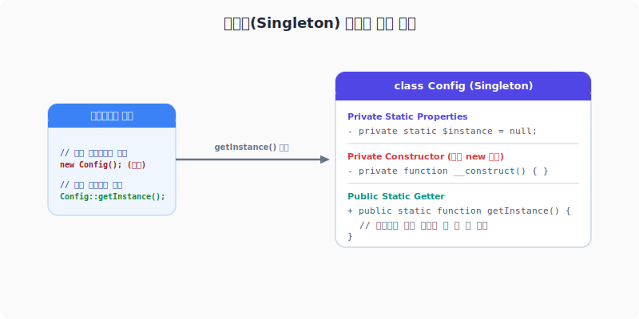

<jiny-book-mark>디자인 패턴</jiny-book-mark>

# 디자인 패턴 (Design Patterns)
---
객체지향 프로그래밍(OOP)을 통해 복잡한 애플리케이션을 개발하다 보면, 수많은 개발자가 공통으로 마주치고 해결해 온 설계상의 문제들이 존재합니다. **디자인 패턴(Design Patterns)**은 이러한 자주 발생하는 설계 문제들에 대해 과거 선배 개발자들이 검증해 놓은 **재사용 가능한 모범 설계 템플릿**이자 공통 규격입니다.

디자인 패턴은 완성된 소스 코드를 의미하지는 않으며, 클래스와 객체 간의 관계를 설계하는 하나의 지침과 원리입니다. 이를 적절히 활용하면 결합도(Coupling)를 낮추고, 응집도(Cohesion)를 높여 유지보수성과 확장성이 우수한 고품질 코드를 작성할 수 있습니다.

<br>

## 1. 싱글톤 패턴 (Singleton Pattern)
---
**싱글톤 패턴**은 애플리케이션 실행 전체에서 **특정 클래스의 인스턴스를 단 하나만 생성하도록 제한**하고, 생성된 인스턴스에 전역적으로 접근할 수 있는 단일 창구를 제공하는 생성 패턴입니다.
데이터베이스 커넥션이나 환경 설정 로더처럼 리소스를 무겁게 공유해야 하는 객체에 널리 활용됩니다.

### 싱글톤의 구현 조건
1. **private 생성자**: 외부에서 `new` 키워드로 인스턴스를 직접 생성하지 못하도록 막습니다.
2. **private static 인스턴스 변수**: 유일한 객체 인스턴스를 클래스 내부 정적 멤버로 보관합니다.
3. **public static 메서드 (getInstance)**: 인스턴스가 존재하지 않으면 생성하고, 존재하면 기존 인스턴스를 반환하여 오직 하나만 존재하도록 조율합니다.

<div style="text-align: center; margin: 30px 0;">
  
  <p style="font-size: 13px; color: #64748b; margin-top: 8px;">그림: private 생성자를 통한 외부 생성 차단 및 static 인스턴스 공유 메커니즘</p>
</div>

### 예제: DatabaseConnection.php
```php
<?php
declare(strict_types=1);

class DatabaseConnection 
{
    private static ?DatabaseConnection $instance = null;
    private string $connectionName;

    // 1. 외부 생성 차단
    private function __construct(string $name) 
    {
        $this->connectionName = $name;
        echo "[DB 연결 완료] " . $this->connectionName . " 생성됨<br>";
    }

    // clone 및 unserialize 메서드도 private으로 차단하여 복제 생성 방지
    private function __clone() {}
    public function __wakeup() {}

    // 2. 단일 인스턴스 반환 및 생성 조율
    public static function getInstance(string $name = "DefaultPool"): DatabaseConnection 
    {
        if (self::$instance === null) {
            self::$instance = new self($name);
        }
        return self::$instance;
    }

    public function query(string $sql): void 
    {
        echo "{$this->connectionName}에서 쿼리 실행: {$sql}<br>";
    }
}

// 동작 테스트
$db1 = DatabaseConnection::getInstance("MySQL_Pool");
$db1->query("SELECT * FROM users");

$db2 = DatabaseConnection::getInstance("PostgreSQL_Pool"); // 이미 존재하므로 무시됨
$db2->query("SELECT * FROM products");

// 두 객체가 완전히 동일한 인스턴스인지 비교 검증
if ($db1 === $db2) {
    echo "db1과 db2는 동일한 메모리 인스턴스입니다.<br>";
}
?>
```

**출력 결과**
```text
[DB 연결 완료] MySQL_Pool 생성됨
MySQL_Pool에서 쿼리 실행: SELECT * FROM users
MySQL_Pool에서 쿼리 실행: SELECT * FROM products
db1과 db2는 동일한 메모리 인스턴스입니다.
```

<br>

## 2. 팩토리 메서드 패턴 (Factory Method Pattern)
---
**팩토리 메서드 패턴**은 객체를 생성할 때 어떤 클래스의 인스턴스를 만들 것인지를 직접 호출처에서 결정하지 않고, **객체 생성을 전담하는 팩토리 클래스(또는 메서드)를 거쳐 대행하게 하는** 패턴입니다. 
클라이언트 코드는 인스턴스화하려는 실제 구현 클래스를 알 필요 없이 인터페이스에만 의존하게 되므로 결합도가 크게 느슨해집니다.

### 예제: MessageFactory.php
```php
<?php
declare(strict_types=1);

// 공통 제품 인터페이스
interface MessageSender 
{
    public function send(string $message): void;
}

// 실제 구현 제품들
class SMSNotification implements MessageSender 
{
    public function send(string $message): void 
    {
        echo "[SMS 발송]: " . $message . "<br>";
    }
}

class EmailNotification implements MessageSender 
{
    public function send(string $message): void 
    {
        echo "[이메일 발송]: " . $message . "<br>";
    }
}

// 팩토리 클래스
class NotificationFactory 
{
    public static function create(string $type): MessageSender 
    {
        return match (strtolower($type)) {
            'sms' => new SMSNotification(),
            'email' => new EmailNotification(),
            default => throw new InvalidArgumentException("알 수 없는 알림 형식: " . $type)
        };
    }
}

// 동작 테스트
$sender1 = NotificationFactory::create('sms');
$sender1->send("인증번호는 [1234] 입니다.");

$sender2 = NotificationFactory::create('email');
$sender2->send("회원가입을 환영합니다.");
?>
```

**출력 결과**
```text
[SMS 발송]: 인증번호는 [1234] 입니다.
[이메일 발송]: 회원가입을 환영합니다.
```

<br>

## 3. 전략 패턴 (Strategy Pattern)
---
**전략 패턴**은 동일 계열의 여러 알고리즘(실행 동작)들을 각각 캡슐화하고 인터페이스로 추상화하여, **런타임에 동적으로 필요한 알고리즘을 자유롭게 교체하여 사용하도록** 만드는 패턴입니다.
이동 수단 결정, 결제 방식 처리(신용카드 vs 페이) 등 하나의 로직을 다양한 방식으로 유연하게 동작시켜야 할 때 주로 사용됩니다.

### 예제: PaymentContext.php
```php
<?php
declare(strict_types=1);

// 전략 인터페이스
interface PaymentStrategy 
{
    public function pay(int $amount): void;
}

// 실제 실행 전략 1
class CreditCardPayment implements PaymentStrategy 
{
    public function pay(int $amount): void 
    {
        echo "신용카드로 {$amount}원 결제를 시도합니다.<br>";
    }
}

// 실제 실행 전략 2
class KakaoPayPayment implements PaymentStrategy 
{
    public function pay(int $amount): void 
    {
        echo "카카오페이로 간편결제 {$amount}원을 승인합니다.<br>";
    }
}

// 전략을 탑재하여 수행하는 컨텍스트 클래스
class ShoppingCart 
{
    private PaymentStrategy $paymentStrategy;

    // 결제 전략 주입 (Dependency Injection)
    public function setPaymentStrategy(PaymentStrategy $strategy): void 
    {
        $this->paymentStrategy = $strategy;
    }

    public function checkout(int $totalPrice): void 
    {
        $this->paymentStrategy->pay($totalPrice);
    }
}

// 동작 테스트
$cart = new ShoppingCart();

// 신용카드 결제 수행
$cart->setPaymentStrategy(new CreditCardPayment());
$cart->checkout(50000);

// 카카오페이 결제로 즉시 스위칭하여 수행
$cart->setPaymentStrategy(new KakaoPayPayment());
$cart->checkout(32000);
?>
```

**출력 결과**
```text
신용카드로 50000원 결제를 시도합니다.
카카오페이로 간편결제 32000원을 승인합니다.
```

<br>

## 4. MVC 아키텍처 패턴 (Model-View-Controller)
---
디자인 패턴이 개별 클래스들의 관계를 다룬다면, **MVC 패턴**은 웹 애플리케이션 전체 시스템을 설계하고 책임을 분할하는 대표적인 **아키텍처 패턴**입니다.
코드의 스파게티화를 방지하고, 유지보수를 원활히 하기 위해 프로그램을 세 가지 주요 컴포넌트로 명확히 격리합니다.

```text
               [ Request (요청) ]
                       │
                       ▼
               ┌───────────────┐
               │  Controller   │ (흐름 제어 및 조율)
               └──────┬────────┘
                      │
            ┌─────────┴─────────┐
            ▼                   ▼
    ┌───────────────┐   ┌───────────────┐
    │     Model     │   │     View      │
    │ (데이터/비즈니스) │   │  (HTML/화면)   │
    └───────────────┘   └───────────────┘
```

1. **Model (모델)**:
   - 애플리케이션의 **데이터와 데이터 처리 로직(비즈니스 로직)**을 전담합니다.
   - 데이터베이스 접속, SQL 쿼리 실행, 값 검증(Validation) 등이 모델의 주요 역할입니다.
   - 화면 구성(HTML)이나 브라우저 입력값의 직접적인 처리 흐름에는 직접 개입하지 않습니다.
2. **View (뷰)**:
   - 사용자에게 실제로 표시되는 **화면 인터페이스(Presentation Layer)**입니다.
   - HTML, CSS, JavaScript가 이에 해당하며, 컨트롤러로부터 정제된 결과 데이터를 전달받아 화면에 단순히 주입·출력하는 역할을 합니다.
   - 비즈니스 로직이나 민감한 내부 처리를 포함하지 않는 것이 원칙입니다.
3. **Controller (컨트롤러)**:
   - 사용자의 요청(Request)을 받아 **전체 애플리케이션의 흐름을 조율하고 가이드**합니다.
   - 사용자 입력을 기반으로 필요한 **Model**을 호출하여 비즈니스 가공 데이터를 획득한 뒤, 그 결과를 알맞은 **View**에 바인딩하여 렌더링하고 사용자에게 응답(Response)을 전달합니다.

### MVC 디렉터리 설계 예시
현대적인 PHP 프레임워크들은 대부분 이러한 구조적 MVC 디렉터리 규칙을 기본으로 사용합니다.

```text
my-project/
├── app/
│   ├── Models/
│   │   └── UserModel.php
│   ├── Views/
│   │   └── user_list.php
│   └── Controllers/
│       └── UserController.php
└── public/
    └── index.html
```

MVC 패턴을 올바르게 준수하면 디자이너와 프론트엔드 개발자는 `Views/` 영역의 코드를 안심하고 손볼 수 있고, 백엔드 엔지니어는 화면 오류 유발에 대한 부담 없이 `Models/`나 `Controllers/` 내부의 논리 설계와 알고리즘 개선에 온전히 집중할 수 있어 협업과 대규모 개발이 매우 원활해집니다.
