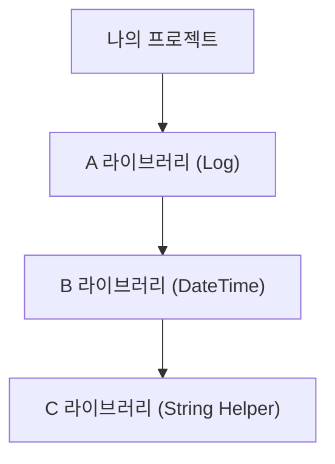

# 컴포저 소개
---
컴포저는 PHP 패키지들의 의존성을 관리하는 도구입니다. 컴포저의 등장으로 PHP 생태계는 혁신적인 도약을 맞이하였으며, 현대적인 웹 애플리케이션을 제작하는 데 필수불가결한 표준 도구로 자리 잡았습니다. 

이 장에서는 컴포저가 왜 도입되었으며, 컴포저가 해결한 "의존성 문제"가 무엇인지 그 개념과 의의를 알아보겠습니다.

 

## 1. 라이브러리(Library)와 재사용
---
아무리 뛰어난 개발자라 하더라도 현대의 복잡한 대형 웹 애플리케이션의 모든 소스코드를 밑바닥부터 혼자 힘으로 개발할 수는 없습니다. 프로그래밍은 수많은 개발자들이 기여하고 검증한 소스코드를 기반으로 진화하고 축적되어 왔습니다.

개발 분야에서 자주 쓰이는 유용한 기능을 묶어 외부에서 가져와 사용할 수 있게 구성한 코드 꾸러미를 **라이브러리(Library)**라고 합니다. 라이브러리를 사용한다는 것은 다른 개발자의 검증된 코드를 자신의 프로그램에 통합하여 개발 속도와 코드 신뢰성을 크게 끌어올리는 행위입니다.

### 1.1 라이브러리의 유용성
우리는 프로젝트를 진행할 때 로그인 처리, 파일 업로드, 데이터베이스 추상화, 이미지 처리 등 유사하고 중복되는 기능적 요구사항을 끊임없이 직면합니다. 인기 있는 외부 오픈소스 라이브러리는 수많은 개발자들에게 검증되고 실시간 피드백을 통해 보안성과 안정성이 강화된 소스코드이므로, 이를 활용하면 애플리케이션 개발 생산성을 극대화할 수 있습니다.

### 1.2 수동 관리의 한계
컴포저가 존재하기 전에는 필요한 라이브러리를 사용하기 위해 개발자가 직접 여러 웹사이트와 깃허브(GitHub) 저장소를 돌아다니며 소스코드를 다운로드해야 했습니다.
1. 소스 코드가 담긴 압축 파일(.zip, .tar.gz)을 내려받아 압축을 풉니다.
2. 프로젝트 디렉터리 내부로 소스 폴더를 업로드합니다.
3. 소스코드 안에서 `require` 혹은 `include` 구문을 적절히 사용하여 파일들을 수동으로 결합합니다.

이러한 수동 방식은 서버 환경이 다중화되거나 라이브러리 개수가 많아질수록 파일 관리 실수가 발생하기 쉽고, 업데이트를 진행할 때 구버전 소스 파일을 찾아서 지우고 새 버전 파일을 덮어써야 하므로 관리적 어려움이 컸습니다.

 

## 2. 라이브러리 간의 의존성(Dependency)
---
대부분의 라이브러리는 완전히 독립적으로 설계되지 않습니다. 라이브러리 자체가 고도화될수록 내부적으로 또 다른 라이브러리를 불러와 사용하도록 설계되는 경우가 많습니다.

예를 들어, 로그를 작성해 주는 A 라이브러리는 날짜를 파싱해 주는 B 라이브러리를 참조하고, B 라이브러리는 문자열 규격을 맞추는 C 라이브러리에 의존할 수 있습니다. 하나의 코드가 실행되기 위해 다른 코드의 존재를 필수적으로 필요로 하는 상호 연동 관계를 **의존성(Dependency)**이라고 합니다.

### 2.1 의존성 지옥 (Dependency Hell)
라이브러리의 수와 의존 관계가 증가함에 따라 배포와 관리는 기하급수적으로 복잡해집니다. 이러한 비정상적인 의존성 연결로 개발 서버 전체가 망가지는 고질적인 문제를 프로그래밍 생태계에서는 **"의존성 지옥(Dependency Hell)"**이라 칭합니다.
* 윈도우 OS의 DLL 지옥(DLL Hell), 자바의 JAR 지옥(JAR Hell)처럼 버전 불일치나 순환 참조로 인해 프로그램이 깨지는 현상은 개발자들의 가장 큰 두통거리 중 하나였습니다.

### 2.2 버전 업데이트 불일치 문제
라이브러리는 완성된 정적 제품이 아니며, 기능 개선이나 보안 취약점 보완을 위해 계속 버전을 높여 출시합니다. 이때 특정 라이브러리를 새 버전으로 업데이트하면, 이를 참조하고 있던 상위 라이브러리들이 새로운 메서드 스펙을 감당하지 못하고 런타임 오류를 유발할 수 있습니다. 이를 수동으로 동기화하는 작업은 시스템 규모가 커질수록 사실상 불가능에 가까웠습니다.

 

## 3. 의존성 해결사, 컴포저(Composer)
---
이러한 문제를 해결하기 위해 타 언어 생태계에서는 Node.js의 **npm**, Python의 **pip**, Ruby의 **gem**, Java의 **Maven** 등 전용 의존성 관리 소프트웨어가 도입되어 있었습니다. PHP 진영에서도 의존성을 체계적으로 자동 관리하기 위해 등장한 도구가 바로 **컴포저(Composer)**입니다.

컴포저는 개발자가 프로젝트에 필요한 외부 라이브러리와 최적 버전을 선언해 놓기만 하면, 인터넷 저장소(Packagist)에서 해당 라이브러리와 하위 의존 패키지들을 알아서 추적해 내려받고 일괄적으로 관리해 줍니다.

### 3.1 프로젝트 독립형 벤더(vendor) 관리
과거의 PHP 라이브러리 배포 시스템이었던 PEAR는 서버 전역에 패키지를 공통 설치하여 여러 프로젝트가 이를 공유하는 형식을 취했습니다. 이 방식은 프로젝트 간의 라이브러리 버전 요구사항이 다를 때 심각한 호환성 충돌을 일으켰습니다.

반면 컴포저는 서버 전체가 아닌 **각 프로젝트 디렉터리 내부에 `vendor`라는 개별 폴더를 생성하고 라이브러리를 격리 설치**합니다. 덕분에 여러 프로젝트를 운영하는 서버에서도 상호 간섭이나 호환성 충돌 없이 개별적인 최적의 개발 환경을 유지할 수 있습니다.

모던 PHP 개발 환경을 구축하고 견고한 프레임워크(Laravel 등)를 활용하여 상용 서비스를 출시하기 위해서 컴포저는 이제 선택이 아닌 필수 도구입니다.

 

## 4. [PEAR와 컴포저의 비교](pear.html)
---
컴포저가 탄생하기 전 오랫동안 사용되었던 PHP 패키지 시스템인 PEAR의 역사적 의의와 컴포저에 자리를 양도하게 된 아키텍처적 차이에 대해 더 자세히 알아봅니다.
