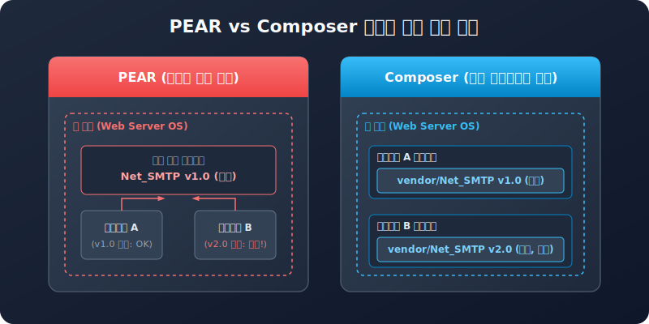

# PEAR와 컴포저 (PEAR vs Composer)
---
컴포저가 등장하기 전, PHP 언어 생태계에서 재사용 가능한 패키지를 구성하고 관리하기 위해 오랫동안 사용했던 도구가 바로 **PEAR(PHP Extension and Application Repository)**입니다. 

PEAR는 역사적으로 PHP 라이브러리 공유의 기틀을 마련했으나, 현대적인 개발 환경의 요구사항을 반영하지 못해 점차 도태되었습니다. 이 장에서는 PEAR의 구조와 한계, 그리고 컴포저가 이를 어떻게 완벽히 극복했는지 기술적 차이점을 학습합니다.



<br>

## 1. PEAR의 개념과 작동 방식
---
PEAR는 1999년 스타스 마이어(Stig S. Bækken)에 의해 창설된 프로젝트로, PHP 개발의 표준 컴포넌트와 확장 라이브러리를 중앙 저장소에 등록하여 편리하게 공유하고자 출범했습니다.

### 1.1 설치 및 실행 방식
PEAR는 기본적으로 운영체제 콘솔 환경에서 다음과 같이 글로벌 명령어를 사용하여 패키지를 설치합니다.
```bash
$ pear install Net_SMTP
```

이 명령어를 실행하면, PEAR 패키지 관리자는 중앙 웹 서버에서 패키지를 다운로드한 후, PHP가 설치된 시스템 전역 디렉터리(예: `/usr/share/php` 또는 C:\php\pear)에 소스코드를 설치합니다.

### 1.2 의존성 처리 옵션
PEAR 또한 의존성을 체크하는 지능적 메커니즘을 내장하고는 있었습니다. 패키지 설치 시 연관 패키지를 동시 자동 설치하기 위해 아래와 같은 옵션을 제공했습니다.
* `-a` (--alldeps): 필수(Required) 의존 관계에 있는 패키지들을 일괄 자동 설치합니다.
* `-o` (--onlyreqdeps): 선택적(Optional) 의존 패키지 설치는 제외하고, 실행에 필수적인 의존 패키지만 설치합니다.

<br>

## 2. PEAR의 치명적인 한계점
---
컴포저의 탄생을 주도한 핵심 동기는 PEAR가 안고 있던 몇 가지 치명적인 아키텍처적 결함 때문이었습니다.

### 2.1 서버 전역(Global) 설치로 인한 버전 충돌
PEAR의 가장 큰 한계는 시스템 전역 폴더에 단 하나의 패키지 버전만 공유 설치된다는 점이었습니다.
* **충돌 시나리오**: 한 서버에서 두 개의 웹사이트(프로젝트 A, 프로젝트 B)를 함께 구동하고 있다고 가정해 봅시다. 프로젝트 A는 구버전 `DB` 패키지(v1.2)를 사용하고, 프로젝트 B는 신버전 `DB` 패키지(v2.0)를 필요로 합니다. 전역 설치 방식에서는 한 사이트의 실행을 위해 다른 사이트의 라이브러리를 망가뜨릴 수밖에 없었습니다.

### 2.2 엄격하고 수동적인 패키지 검수 제도
PEAR 저장소에 패키지를 배포하려면 PEAR 소속 위원회의 엄격한 표준 검수와 투표 과정을 거쳐 승인을 얻어야 했습니다. 이 절차는 오픈소스 패키지의 신속한 릴리스와 자유로운 창조를 가로막는 요소로 작용했습니다.

### 2.3 오토로드 규격(PSR)의 부재
PEAR는 네임스페이스와 규격화된 오토로드가 정립되기 전에 개발되었으므로, 모든 클래스 파일명에 언더바(`_`)를 조합해 유사 네임스페이스를 흉내 냈습니다. 예컨대 `Net_SMTP` 클래스를 불러오려면 `Net/SMTP.php` 파일을 직접 명시적으로 `require`해야 하는 등 수동 작업이 많아 모던 PHP의 표준화에 걸맞지 않았습니다.

<br>

## 3. PEAR와 컴포저의 핵심 차이점 비교
---

| 비교 항목 | PEAR (피어) | Composer (컴포저) |
| :--- | :--- | :--- |
| **설치 범위** | **서버 전역(Global)** 단위 설치 | **프로젝트 디렉터리(Local)** 단위 설치 |
| **의존성 격리** | 프로젝트 간 공유되므로 버전 충돌 위험 큼 | 프로젝트별 `vendor` 폴더 분리로 충돌 원천 방지 |
| **패키지 저장소** | 엄격한 승인 기반의 PEAR 중앙 저장소 | 누구나 자유롭게 배포 가능한 **Packagist.org** |
| **클래스 자동 로딩** | 수동 include 및 언더바(`_`) 기반 매핑 방식 | PSR-4 표준 규격을 활용한 고속 동적 오토로딩 |
| **프로젝트 이식성** | 서버 이전 시 PEAR 패키지를 새로 수동 셋업해야 함 | `composer.json` 복사 후 `composer install`로 자동 복구 |

현대 PHP 개발에서는 PEAR 대신 컴포저를 사용하는 것이 당연한 상식으로 정립되었습니다. PEAR는 과거 유산(Legacy) 시스템의 유지 보수 시점에나 간혹 조우하게 되는 도구로 이해하시면 좋습니다.