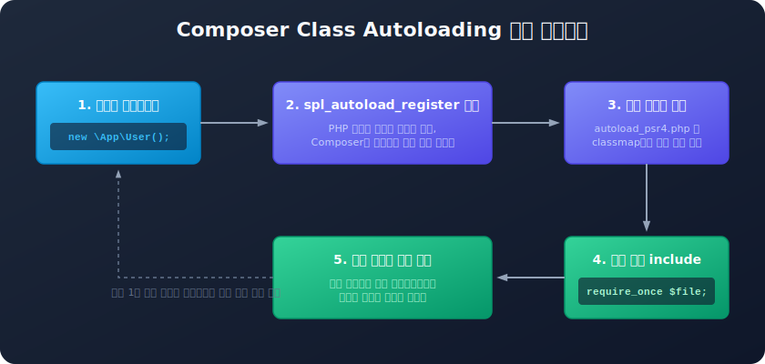

# 오토로드 매커니즘 (Autoloading)
---
전통적인 PHP 개발에서는 다른 파일에 정의된 클래스나 함수를 가져오기 위해 `include` 또는 `require` 명령을 명시적으로 사용했습니다. 

그러나 대규모 개발 환경에서는 수백 개의 소스 파일을 매번 확인하여 불러오기 어려우며, 경로를 잘못 기입하거나 중복 로딩하는 실수가 잦았습니다. 컴포저는 이 문제를 해결하기 위해 **오토로드(Autoloading)** 메커니즘을 내장하여 제공합니다.

이 장에서는 순수 PHP로 직접 오토로더를 등록하는 원리, 컴포저가 제공하는 다양한 오토로드 기법의 특성과 차이점, 그리고 속도 튜닝(최적화) 팁을 배웁니다.



<br>

## 1. PHP 표준 오토로드 (SPL)
---
PHP 5 버전부터는 인스턴스를 생성하거나 클래스를 호출하려 할 때, 해당 클래스가 아직 메모리에 선언되어 있지 않다면 미리 등록해 둔 자동 로더 함수를 트리거하는 기능이 추가되었습니다. 이 역할을 담당하는 표준 내장 함수가 바로 **`spl_autoload_register`**입니다.

### 1.1 직접 구현해 보는 순수 PHP 오토로더 예제
아래 소스는 외부 라이브러리를 require문 없이 자동으로 동적 로딩하는 초소형 오토로더 구현 예시입니다.
```php
<?php
// 1. 미로드 클래스 호출 시 작동할 콜백 함수 정의
spl_autoload_register(function ($className) {
    // 네임스페이스 역슬래시(\)를 물리 디렉터리 구분자(/)로 치환
    $path = __DIR__ . '/src/' . str_replace('\\', '/', $className) . '.php';

    // 파일이 물리적으로 존재하는지 검증 후 동적 인클루드
    if (file_exists($path)) {
        require_once $path;
    }
});

// 2. include/require 문이 없어도 자동으로 src/App/Controllers/UserController.php가 로드됩니다.
$user = new \App\Controllers\UserController();
```

`spl_autoload_register`는 여러 개의 로더 콜백을 큐(Queue) 형태로 중첩 등록할 수 있어, 다양한 라이브러리가 각자의 오토로딩 규칙을 가지고 있어도 간섭 없이 유연하게 공존할 수 있는 기반을 제공합니다.

<br>

## 2. 컴포저가 제공하는 4가지 오토로드 기법
---
컴포저는 `composer.json` 설정을 통해 프로젝트 성격에 맞는 4가지 유형의 오토로드 방식을 지원합니다.

| 분류 (Type) | 작동 원리 및 특징 | 장단점 |
| :--- | :--- | :--- |
| **`psr-4`** | 네임스페이스 접두사(Prefix)와 특정 디렉터리를 매핑하여 동적으로 경로를 유추해 로딩합니다. | 가장 추천되는 모던 표준 방식으로, 파일 추가 시 컴포저 갱신이 불필요해 개발 생산성이 높습니다. |
| **`classmap`** | 지정한 폴더 내의 모든 PHP 파일을 뒤져 클래스 이름과 물리 파일 경로를 1:1로 매핑한 해시 테이블을 빌드합니다. | 탐색 오버헤드가 없어 런타임 속도가 극도로 빠르나, 새 파일이 추가될 때마다 `dump-autoload`를 재수행해야 하는 번거로움이 있습니다. |
| **`files`** | 설정된 PHP 파일들을 요청(Request)이 들어올 때마다 조건 없이 최우선적으로 인클루드(Require)합니다. | 클래스 구조가 아닌 글로벌 공통 헬퍼 함수(`helpers.php`) 등을 항상 로딩해 두고 쓸 때 필수적입니다. |
| **`psr-0`** | 옛날 스타일(PHP 5.3 미만)의 오토로드 규약으로, 클래스명 속 언더바(`_`)를 디렉터리 구분자로 인식합니다. | 하위 호환성을 위한 구식 유산이며, 현재는 거의 사용되지 않고 감쇄(Deprecated) 상태입니다. |

<br>

## 3. 클래스맵 vs PSR-4 상세 분석
---

### 3.1 클래스맵 (Classmap) 방식의 장단점
클래스맵은 `/vendor/composer/autoload_classmap.php` 안에 거대한 매핑 배열을 통째로 구워 보관합니다. 
```php
return [
    'App\\Controllers\\UserController' => $baseDir . '/app/Controllers/UserController.php',
    'App\\Models\\User' => $baseDir . '/app/Models/User.php',
];
```
* **장점**: 런타임에 파일이 존재하는지 하드디스크 디렉터리를 일일이 조회하는 파일 탐색 과정이 아예 생략되므로 속도가 아주 빠릅니다.
* **단점**: 개발 단계에서 새로운 컨트롤러나 모델 파일을 만들 때마다 매번 터미널에 `composer dump-autoload` 명령을 실행해 배열을 다시 빌드해야 하므로 코드가 즉각 반영되지 않아 매우 쇠퇴합니다.

### 3.2 PSR-4 방식의 동적 로딩
PSR-4는 `"App\\": "app/"` 처럼 네임스페이스와 매핑 디렉터리만 정의해 두고 런타임 시점에 실시간으로 파일 존재 여부를 조회합니다.
* **장점**: 개발 중에 새 클래스 파일을 마음껏 추가하거나 파일명을 바꿔도 아무 설정 변경 없이 즉시 변경 사항이 반영됩니다.
* **단점**: 동적으로 네임스페이스 문자열을 가공하고 로컬 디스크 파일의 존재 여부를 탐색하므로 클래스맵 대비 미세한 입출력(I/O) 성능 오버헤드가 존재합니다.

<br>

## 4. 운영(Production) 환경을 위한 오토로드 최적화 팁
---
개발 단계에서는 유연성이 높은 PSR-4 모드를 활용해 빌드 비용을 줄이고, 서비스 배포(Production) 단계에서는 **PSR-4 동적 탐색 룰을 모두 클래스맵(Classmap)으로 컴파일 변환하여 로딩 속도를 최적화**하는 것이 PHP 웹 애플리케이션 가속화의 필수 테크닉입니다.

터미널에서 아래 옵션을 주어 오토로드를 다시 덤프해 줍니다.
```bash
$ composer dump-autoload --optimize
```
또는 축약어로 아래처럼 실행합니다.
```bash
$ composer dumpautoload -o
```
* 이 옵션을 활성화하면 컴포저는 내부적으로 PSR-4/0 설정 경로를 전수 재귀 스캔하여 파일 경로 해시 테이블을 임시 구축하고, 이를 클래스맵 배열로 변환 출력해 줍니다. 이렇게 하면 모던 코딩 표준을 고수하면서도 최상의 로딩 속도를 뽑아낼 수 있습니다.
