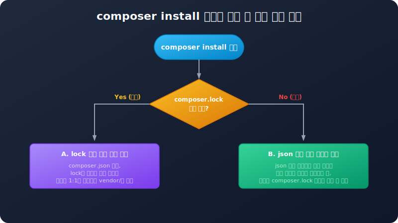

# composer.json 스키마와 lock 파일
---
컴포저의 패키지 설정과 모든 관리 정책은 JSON(JavaScript Object Notation) 데이터 구조 규격으로 작성된 **`composer.json`** 설정 파일에 보관됩니다. 이와 더불어 실제 배치된 버전을 정밀 잠금하는 **`composer.lock`** 파일이 한 쌍으로 맞물려 작동합니다.

이 장에서는 `composer.json` 파일에 지정하는 주요 스키마 키(Key) 명세와 오토로드 개별 옵션의 구체적 기술법, 그리고 `composer.lock` 파일의 존재 의의를 학습합니다.

<br>

## 1. `composer.json` 핵심 스키마 명세
---
`composer.json`은 표준 JSON 문법을 따르므로, 마지막 요소 뒤에 쉼표(Trailing Comma)가 들어가거나 주석이 작성되면 문법 오류(Syntax Error)를 일으키므로 작성을 피해야 합니다.

```json
{
    "name": "jiny/hello",
    "description": "컴포저 패키지 제작 실습을 위한 튜토리얼 패키지입니다.",
    "type": "library",
    "license": "MIT",
    "authors": [
        {
            "name": "Hojin Lee",
            "email": "infohojin@gmail.com"
        }
    ],
    "require": {
        "php": "^8.0",
        "illuminate/support": "^8.0"
    },
    "require-dev": {
        "phpunit/phpunit": "^9.5"
    }
}
```

### 1.1 `name` (패키지 식별명)
* 형식: `[벤더명]/[패키지명]` (반드시 소문자로 공백 없이 입력하며 단어 구분 시 하이픈`-` 등을 사용합니다.)
* 예시: `"jiny/hello"`

### 1.2 `description` (설명)
* 패키지에 대한 짧은 한 줄 설명을 기입합니다. Packagist 등에서 검색할 때 핵심 정보 요약으로 출력됩니다.

### 1.3 `type` (패키지 유형)
* **`library`**: 기본 설정값으로, 외부 프로젝트의 `vendor/` 디렉터리에 다운로드되어 탑재될 목적의 라이브러리 패키지입니다.
* **`project`**: 독립된 애플리케이션의 뼈대를 생성하여 다운로드할 때 지정합니다. (예: `laravel/laravel` 골격)
* **`composer-plugin`**: 컴포저의 핵심 동작 방식을 임의로 확장하거나 특정 이벤트를 처리하기 위한 플러그인 전용 패키지입니다.

### 1.4 `license` (소프트웨어 라이선스)
* 소스 코드 배포 시 적용할 사용권 규약을 명시합니다. 대표적으로 `"MIT"`, `"BSD-3-Clause"`, `"GPL-3.0-only"`, 또는 외부 비공개 기업 독점 소프트웨어일 경우 `"proprietary"`를 지정합니다.

### 1.5 `authors` (작성자 정보)
* 개발자의 이름, 이메일, 웹사이트 링크 등을 배열 내부 객체 형태로 여러 명 지정할 수 있습니다.

### 1.6 `require` & `require-dev` (의존 라이브러리 목록)
* 패키지가 작동하기 위해 필수적인 환경 요건(PHP 최소 요구 버전, 특정 확장 라이브러리 유무)과 연계 라이브러리들의 버전 조건을 명시합니다.
* 개발할 때만 보조용으로 사용하는 테스팅 도구 등은 `require-dev`에 할당합니다.

<br>

## 2. 오토로드 세부 기술법 (Autoload Configurations)
---

### 2.1 `files` (특정 파일 강제 로딩)
클래스 기반이 아닌 순수 전역 헬퍼 함수 파일(`helpers.php` 등)을 애플리케이션 전체에 무조건 인클루드할 때 사용합니다.
```json
"autoload": {
    "files": [
        "src/helpers.php"
    ]
}
```

### 2.2 `classmap` (폴더 전수 스캔 매핑)
지정한 디렉터리를 재귀적으로 탐색하여 하위에 존재하는 모든 PHP 파일 속 클래스 이름을 찾아 물리 경로 매핑 캐시 파일(`autoload_classmap.php`)에 등록합니다.
```json
"autoload": {
    "classmap": [
        "database/seeds",
        "database/factories"
    ]
}
```
* **동작 원리**: 클래스맵에 설정된 폴더 내부는 네임스페이스 경로 선언이 실제 디렉터리 물리 계층 구조와 전혀 일치하지 않아도 컴포저가 소스 파일 헤더를 읽어 클래스명과 실제 파일 주소를 1:1로 매핑해 주므로 안정적으로 작동합니다. 단, 파일이 생성/삭제될 때마다 항상 덤프(`composer dumpautoload`) 명령을 내려 갱신해야 합니다.

### 2.3 `psr-4` (모던 규약 동적 로딩)
네임스페이스와 물리 디렉터리를 연결하여 캐시 맵 갱신 없이 즉시 동적 로딩하도록 설정합니다.
```json
"autoload": {
    "psr-4": {
        "Jiny\\Hello\\": "src/"
    }
}
```

<br>

## 3. `composer.lock` 파일의 중요성 (Version Pinned)
---
컴포저를 통해 패키지를 설치하거나 갱신하면 프로젝트 루트 폴더에 `composer.json`과 별개로 **`composer.lock`** 파일이 추가 생성됩니다.



### 3.1 작동 시나리오와 의의
`composer.json`에 특정 패키지가 `"illuminate/support": "^8.0"`으로 지정된 경우, 이 기호는 v8.0.0부터 v9.0.0 미만 사이의 모든 마이너/패치 버전 업그레이드를 허용한다는 의미입니다. 
1. 개발자 A가 패키지를 처음 연동하는 시점에 `illuminate/support` v8.2.1 버전이 배포되고 있었다면, `composer install` 또는 `require` 시 v8.2.1이 내려받아지고 **`composer.lock` 파일에 정확히 "v8.2.1 버전이 강제 결합되었다"고 물리적 기록을 고정(Lock)**해 둡니다.
2. 시간이 흘러 v8.5.0 패치 버전이 새로 릴리스되었을 때, 신규 참여한 개발자 B가 프로젝트 코드를 복제(Git Clone)한 후 의존 패키지를 다운로드받습니다.
3. 만약 **`composer.lock` 파일이 버전 관리에 누락되어 있다면**, B가 `composer install`을 실행할 때 컴포저는 `composer.json`만 읽어 v8.5.0 최신판을 받아버립니다. A의 로컬 서버(v8.2.1)와 B의 로컬 서버(v8.5.0)의 라이브러리 스펙이 어긋나면서 예상외의 버그가 생깁니다.
4. 반면 **`composer.lock` 파일이 올바르게 커밋되어 있었다면**, B가 `composer install`을 실행할 때 컴포저는 lock 파일의 기록을 우선 신뢰하여 정확히 A와 같은 **v8.2.1** 버전을 다운로드하여 설치하므로 완벽한 환경 일관성을 제공합니다.

따라서 의존성을 일치시키기 위해 **`composer.lock` 파일은 반드시 Git 저장소에 등록하여 배포 공유**되어야 합니다.
