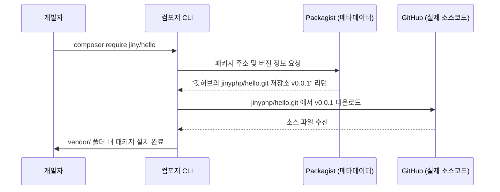

# 패키지와 배포 생태계
---
컴포저를 통해 배포되고 공유되는 모든 PHP 라이브러리 코드 단위를 **패키지(Package)**라고 부릅니다. 

이 장에서는 패키지와 일반 라이브러리의 개념적 차이, 전 세계 패키지 정보가 집약되는 중앙 서버인 **패키지스트(Packagist)** 생태계, 그리고 원하는 패키지를 효율적으로 검색하는 방법에 대해 알아봅니다.

<br>

## 1. 패키지 vs 라이브러리
---
프로그래밍 세계에서 '라이브러리'와 '패키지'는 흔히 혼용됩니다. 그러나 엄밀한 의미에서 둘은 유기적인 배포 단위와 포함 관계를 나타냅니다.
* **라이브러리(Library)**: 다른 프로그램 내부에서 불러와 실행 가능한 기능 중심의 재사용 코드 조각들을 일컫는 범용적 용어입니다.
* **패키지(Package)**: 라이브러리를 특정 패키지 매니저(예: Composer) 규격에 맞춰 압축하고, 버전 메타데이터 및 의존성 기술서(`composer.json`)를 포함하여 배포하기 용이한 형태로 패킹(Packing)한 유통 규격을 의미합니다. 타 언어에서는 '모듈'이나 '젬(Gem)' 등으로 부르기도 합니다.

즉, 모든 패키지는 라이브러리를 품고 있으나, 모든 라이브러리가 자동으로 패키지 규격으로 통용되는 것은 아닙니다.

<br>

## 2. 패키지 중앙 저장소, 패키지스트 (Packagist)
---
컴포저는 소스파일 자체를 직접 보관하지 않습니다. 대신 패키지의 이름, 깃 저장소(GitHub 등) 주소, 의존 패키지, 버전 이력 등의 메타데이터만 중앙 서버에서 관리합니다. 이 메타데이터 저장소를 **패키지스트(Packagist)**라고 하며, 공식 웹사이트는 **[packagist.org](https://packagist.org)**입니다.



### 2.1 프라이빗 패키지스트 (Private Packagist)
오픈소스로 만인에게 공개할 목적이 아닌, 기업 내의 독자적인 비공개 독점 라이브러리 패키지를 관리할 경우에는 [Private Packagist](https://packagist.com)라는 유료 비즈니스 저장소 서비스를 이용하거나 자체적으로 사설 저장소(Satis 등)를 운영해야 합니다.

### 2.2 특수 분야 전용 패키지스트
일부 프레임워크나 CMS 솔루션들은 독립적인 패키지 생태계를 지닙니다. 대표적으로 워드프레스(WordPress) 개발 진영에서는 테마와 플러그인을 컴포저로 연동하기 위해 전용 미러 저장소인 **[wpackagist.org](https://wpackagist.org)**를 구축해 서비스하고 있습니다.

<br>

## 3. 패키지 검색 방법
---
사용하고자 하는 패키지가 존재할 때 아래의 두 가지 경로로 찾을 수 있습니다.

### 3.1 Packagist.org 웹 브라우저 검색
가장 추천하는 방법으로 웹 브라우저로 Packagist 사이트에 접속해 검색창에 키워드를 입력합니다.
* 장점: 해당 패키지의 다운로드 횟수, 깃허브 스타(Star) 개수, 최신 버전 릴리스 일시, 라이선스 종류, 연계 의존 관계를 시각적으로 편하게 확인하고 선택할 수 있습니다.

### 3.2 컴포저 CLI 콘솔 검색
터미널을 떠나고 싶지 않다면 아래의 `search` 커맨드를 사용합니다.
```bash
$ composer search "jiny"
```
명령을 수행하면 검색어로 등록된 패키지 이름과 1줄짜리 핵심 설명 요약 목록이 터미널에 줄지어 출력됩니다.

<br>

## 4. 저장소 미러링과 고속화 (CDN)
---
과거 Composer 1.x 시절에는 패키지 메타데이터 서버가 유럽에 치우쳐 있어 한국 등 아시아권 환경에서 패키지를 다운로드할 때 속도가 상당히 느렸습니다. 이를 개선하기 위해 일본이나 중국의 개발자들이 운영하는 미러 사이트 주소를 컴포저 전역 설정에 기재해 우회 접속하곤 했습니다.

#### [참고] 구식 로컬 미러 설정 방법
```bash
# 일본 미러 등록 예시
$ composer config -g repositories.packagist composer https://packagist.jp

# 미러링 해제 및 순정 복구
$ composer config -g --unset repositories.packagist
```

> [!TIP]
> **Composer 2.x 모던 환경의 변화**:
> 현대 PHP 생태계에서 널리 쓰이는 **Composer 2.x** 버전부터는 메타데이터와 패키지 요약 정보가 전 세계 Cloudflare CDN 캐싱 망을 타도록 아키텍처가 전면 리뉴얼되었습니다. 따라서 현대 개발 환경에서는 **별도의 해외 미러 사이트를 지정하지 않아도 기본 속도가 극도로 빠르며, 미러 설정을 오히려 사용하지 않는 것이 최신의 공식 권장 사항**입니다.
