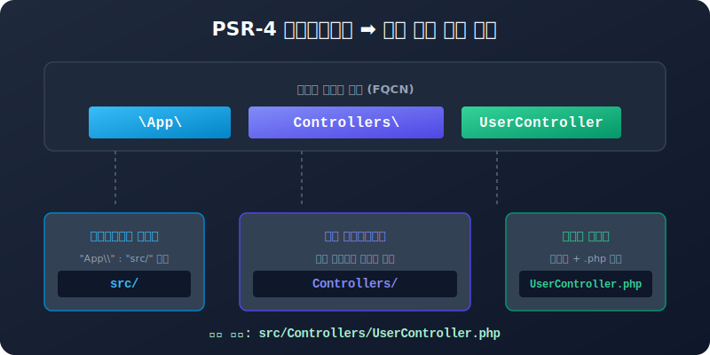

# PSR-4 규약 (PHP Autoloading Standard)
---
**PSR-4**는 PHP 표준 권고(PHP Standard Recommendation) 중 네 번째 명세로, **네임스페이스(Namespace)와 물리적인 디렉터리 경로를 일치시켜 효율적인 파일 자동 로딩을 수행하는 명세**입니다.

이 장에서는 PSR-4 규약의 핵심 매핑 룰, 예시를 통한 개발 과정, 그리고 구식 표준인 PSR-0와의 기술적 차이점을 완벽하게 학습합니다.



<br>

## 1. PSR-4 매핑 기본 규칙 (Mapping Rules)
---
PSR-4 규약에 정의된 정규 클래스 이름(Fully Qualified Class Name, FQCN)의 구성 형태는 다음과 같습니다.

$$\backslash\text{NamespacePrefix}\backslash\text{SubNamespace}\backslash\text{ClassName}$$

1. **네임스페이스 접두사 (Namespace Prefix)**: 하나 이상의 네임스페이스 그룹으로 구성되며, 프로젝트의 기저가 되는 물리적인 특정 폴더(Base Directory)와 일치시킵니다.
2. **하위 네임스페이스 (Sub-Namespace)**: 접두사 뒤에 배치되는 네임스페이스 이름들은 기저 폴더 아래의 실제 하위 디렉터리 경로와 대소문자까지 정확히 1:1로 대응해야 합니다.
3. **클래스명 (ClassName)**: FQCN의 마지막 조각은 물리 파일의 이름과 완전히 같아야 하며, 뒤에 `.php` 확장자가 달라붙습니다.

### 1.1 JSON 파일 매핑 예시
`composer.json` 내 `"autoload"` 영역에 아래와 같이 등록합니다. JSON 구문 분석 규칙 상 **역슬래시(`\`)는 이스케이프가 필요하므로 두 개(`\\`)를 나열**해 주어야 함에 유의합시다.
```json
"autoload": {
    "psr-4": {
        "App\\": "src/"
    }
}
```
* 위 선언은 소스코드 안에서 `App\`으로 시작하는 네임스페이스 클래스를 호출할 경우, 프로젝트 루트의 `src/` 디렉터리 아래에서 파일을 찾으라는 명령입니다.

<br>

## 2. PSR-4 실습 예제
---
실제 폴더를 구성하여 네임스페이스와 클래스를 정의하고 오토로드로 로드하는 과정을 실습해 봅니다.

```text
my-project/
├── composer.json
├── psr4-test.php
└── src/                        # "App\\" 네임스페이스가 매핑된 기저 디렉터리
    ├── Controllers/
    │   └── UserController.php  # 클래스 FQCN: \App\Controllers\UserController
    └── Models/
        └── User.php            # 클래스 FQCN: \App\Models\User
```

### 2.1 클래스 정의 소스

#### 파일: `src/Controllers/UserController.php`
```php
<?php

namespace App\Controllers; // FQCN 경로의 매칭 선언

class UserController
{
    public function __construct()
    {
        echo __CLASS__ . " 객체가 성공적으로 생성되었습니다.<br>";
    }
}
```

#### 파일: `src/Models/User.php`
```php
<?php

namespace App\Models;

class User
{
    public function __construct()
    {
        echo __CLASS__ . " 객체가 성공적으로 생성되었습니다.<br>";
    }
}
```

---

### 2.2 오토로드 캐시 생성
`composer.json`의 `"psr-4"` 영역에 `"App\\": "src/"` 설정을 기입한 후, 터미널에서 다음 명령을 실행해 오토로드를 다시 덤프합니다.
```bash
$ composer dump-autoload
```

명령이 실행되면 컴포저는 `/vendor/composer/autoload_psr4.php` 파일을 갱신하여 방금 등록한 로컬 프로젝트 매핑 경로를 등록합니다.
```php
// autoload_psr4.php 생성본 예시
return array(
    'App\\' => array($baseDir . '/src'),
    // ...타 외부 패키지 매핑 배열...
);
```

---

### 2.3 실행 적용
프로젝트 루트 경로에 테스트 실행 파일을 만들어 생성된 오토로더를 include 한 후 클래스를 직접 조작해 봅니다.

#### 파일: `psr4-test.php`
```php
<?php
// 1. 컴포저 오토로더 단 한 줄만 로딩합니다.
require_once __DIR__ . '/vendor/autoload.php';

// 2. FQCN 명세를 사용해 객체를 인스턴스화합니다.
$controller = new \App\Controllers\UserController();
$model = new \App\Models\User();
```

#### 실행 출력 결과
```text
App\Controllers\UserController 객체가 성공적으로 생성되었습니다.
App\Models\User 객체가 성공적으로 생성되었습니다.
```

<br>

## 3. PSR-0 vs PSR-4 기술적 대조
---
PSR-4가 제정되기 이전의 규약인 **PSR-0**는 다음과 같은 역사적 차이가 있습니다.

* **디렉터리 중복성 최소화**:
  * **PSR-0**는 네임스페이스 접두사조차 물리 경로에 중복 반영되어야 했습니다. 예컨대 `"App\\": "src/"` 설정 시 `App\Controllers\UserController` 클래스를 로드하려면 파일이 `src/App/Controllers/UserController.php`처럼 매핑 디렉터리 내부에 접두사(`App/`) 폴더가 중복 생성되어 디렉터리 구조가 지저분해졌습니다.
  * **PSR-4**는 이 중복을 제거하여 접두사(`App\\`)에 지정된 경로(`src/`) 바로 하위로 경로를 축약하므로 `src/Controllers/UserController.php` 형태로 깔끔하게 보관합니다.
* **언더바(`_`) 변환 차이**:
  * **PSR-0**는 네임스페이스가 없던 PHP 5.2 이전의 레거시 클래스 이름(`App_Controller_User`) 내부의 언더바(`_`)를 런타임에 디렉터리 구분자(`App/Controller/User.php`)로 동적 치환하여 관리했습니다.
  * **PSR-4**는 클래스명에 포함된 언더바를 디렉터리로 변환하지 않고 그대로 클래스명으로 인정하며, 오직 완벽한 네임스페이스 구분자(`\`)만을 디렉터리로 치환하여 깔끔함을 유지합니다.
