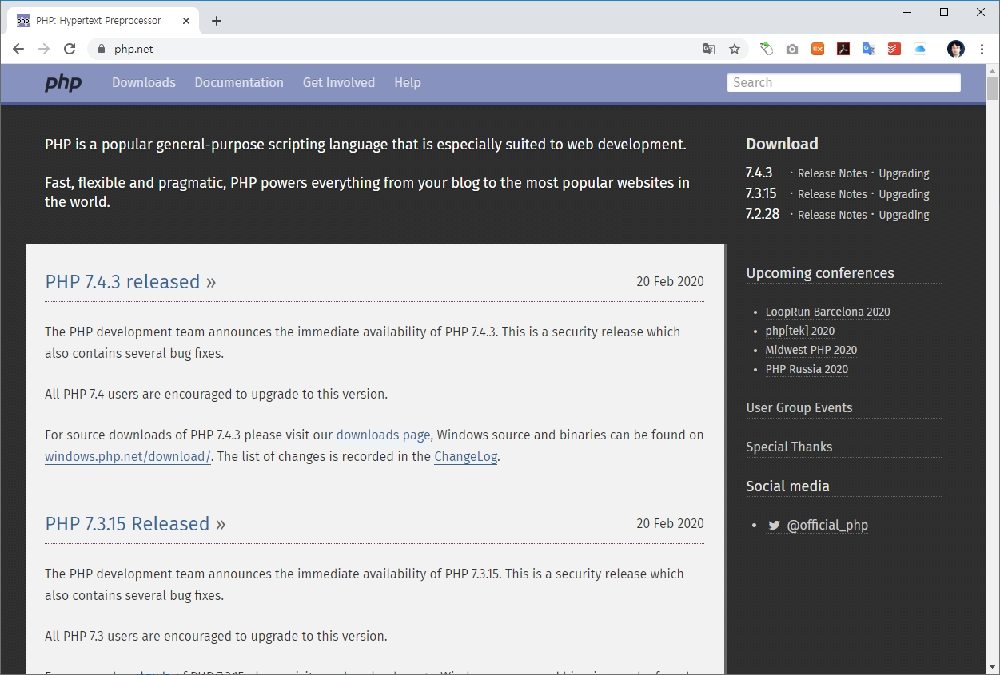

<h1 class="mt-4">공식사이트</h1>
<hr>
PHP 공식사이트는 <a href="php.net">php.net</a> 입니다. 공식사이트를 통하여 다양한 버전의 PHP 인터프리터를 다운로드 받을 수 있습니다.  



상단 메뉴에서 `download`를 클릭합니다.
<br><br>

### 다운로드
<hr>
download 페이지로 이동합니다. 다양한 운용체제와 버전의 PHP를 다운로드 받을 수 있습니다.


<br><br>

### Windows
<hr>
windows 운영체제는 개발자, 일반인등 다양한 사람들이 폭넓게 가장 많이 사용을 하고 있는 운영체제 입니다. 다운로드 화면에서 `windows downloads`를 클릭합니다.  

다운로드 받은 `zip`파일을 적절한 폴더에 압축을 해제합니다. 파일을 목록을 확인합니다.

```
D:\php\php-7.4.0>dir/w
[.]                      [..]                     deplister.exe            [dev]
[ext]                    [extras]                 glib-2.dll               gmodule-2.dll
icudt65.dll              icuin65.dll              icuio65.dll              icuuc65.dll
[lib]                    libcrypto-1_1-x64.dll    libenchant.dll           libpq.dll
libsasl.dll              libsodium.dll            libsqlite3.dll           libssh2.dll
libssl-1_1-x64.dll       license.txt              news.txt                 nghttp2.dll
phar.phar.bat            pharcommand.phar         php-cgi.exe              php-win.exe
php.exe                  php.ini-development      php.ini-production       php7.dll
php7embed.lib            php7phpdbg.dll           phpdbg.exe               readme-redist-bins.txt
README.md                [sasl2]                  snapshot.txt
              32개 파일          51,980,199 바이트
               7개 디렉터리  946,800,377,856 바이트 남음
```

폴더안에 `php.exe` 파일을 찾아 볼 수 있습니다. php를 실행해 보도록 합니다.

```
D:\php\php-7.4.0>php --version
PHP 7.4.0 (cli) (built: Nov 27 2019 10:13:59) ( NTS Visual C++ 2017 x64 )
Copyright (c) The PHP Group
Zend Engine v3.4.0, Copyright (c) Zend Technologies
```

정상적으로 PHP가 실행이 됩니다.

> Note: 설치된 php 폴더를 path 등록을 해두면, 아무 디렉토리에서 php를 실행 할 수 있습니다.

<br><br>

### 패키지 설치
<hr>
공식사이트에서 간단하게 실행파일을 내려받아 PHP를 사용하였습니다. 하지만, PHP는 아파치 웹서버와 Mysql 데이터베이스와 같이 연동하여 웹사이트를 개발하는 것이 일반적입니다. 따라서, 별도로 아파치 웹서버와 Mysql 데이터베이스를 각각 설치해 주어야 합니다.  

하지만, 전용 패키지를 이용하면 보다 쉽게 PHP + Apache + Mysql을 설치할 수 있습니다. 이를 `APM` 페키지라고 합니다. 가장 인기있는 APM 패키지는 비트나미의 `wapm` 입니다. 비트나미 사이트에 접속하여 전용 패키지를 다운로드 받아 설치합니다.

* 비트나미 [Wamp 설치](./wapm)

<br><br>

