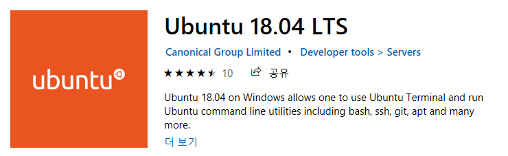
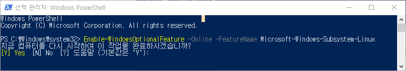
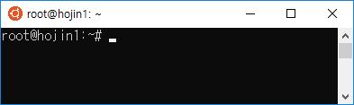

# Linux 설치
---
PHP 언어가 가장많이 설치되어 운영하고 있는 환경은 Linux 입니다. 수많은 리눅스 서버들은 웹서비스 운영을 위해서 PHP 언어를 사용합니다.

* ubuntu
* centos

<br>

## Ubuntu
---


### WLS 설치
리눅스 운영체제는 독립된 컴퓨터 환경입니다. 실습을 위해서는 별도의 서버용 컴퓨터 환경이 필요합니다.  

하지만, 최근들어 마이크로소프트는 윈도우 사용자들도 리눅스를 사용해 볼 수 있도록 별도의 프로그램을 제공합니다.  

윈도우->스토어에서 ubuntu를 검색하여 설치를 할 수 있습니다. 우분투(ubuntu)는 데비안 계열의 리눅스 배포본 입니다.  

 

윈도우에서 실행되는 리눅스 환경을 WSL(windows subsystem linux)라고 합니다. 이를 위해서는 별도의 설정이 필요합니다.  

파워셀을 실행하여 다음과 같이 명령을 입력 합니다.  

```
Enable-WindowsOptionalFeature -Online -FeatureName Microsoft-Windows-Subsystem-Linux
```

  

Yes를 선택후 컴퓨터를 재부팅합니다.  

스토어에서 ubuntu를 선택하여 설치를 합니다. 설치가 완료된 후에 우분투 환경을 실행합니다. 우분투가 처음 실행이 될때에는 약간의 추가 설치 시간이 필요로 합니다.  

  

윈도우에서 우분투 리눅스 환경이 구축되었습니다.  


<br>

## CentOS
---
