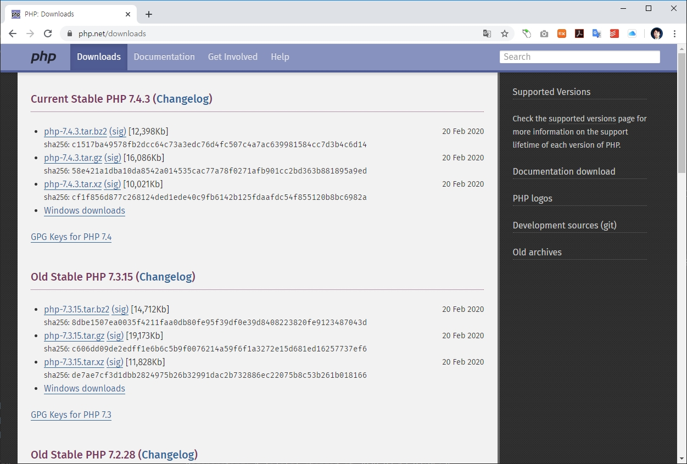

# 윈도우 PHP 설치

PHP는 백엔드 서버용 웹 프로그램을 개발하는 언어로 주로 Linux 와 같은 운영체제 상에서 설치되어 동작되는 경우가 많습니다. 하지만, 개발을 위하여 윈도우 컴퓨터에도 설치가 필요하기도 합니다. 이런 경우에는 직접 소스코드를 설치하지 않고, 컴파일된 파일을 다운로드 받아 사용합니다.


## 다운로드

PHP 공식사이트는 각각의 버젼별로 윈도우에 설치가 가능하도록 컴파일된 압축파일을 제공합니다.

php 공식사이트의 downloads로 이동을 합니다. 




각각의 버젼별 하단에 `windows downloads` 링크를 제공하고 있습니다.  원하는 버젼의 zip 파일을 다운로드 받습니다.

> PHP는 스레드 지원 버젼과 지원하지 않는 버젼으로 나누어져 있습니다. 일반적으로는 스레드를 지원하지 않는 버젼을 다운로드 하여 설치합니다.


zip 파일을 다운로드 받았다면, 적절한 폴더에 압축을 해제합니다.  압축을 해제하기 위해서는 별도의 압축 응용프로그램이 필요할 수 있습니다.  


> 최신의 윈도우 버젼은 자체적으로 압축을 해제할 수 있는 기능이 있습니다. 파일을 선택하고, 마우스 오른쪽 버튼을 클릭합니다. 압축해제하기 목록을 확인할 수 있습니다.


압축을 해제하였다면, 폴더의 파일을 확인합니다.  브라우저 및 윈도우 터미널 창에서  `dir 명령`을 실행합니다.


```console
D:\php\php-7.4.0>dir/w
[.]                      [..]                     deplister.exe            [dev]
[ext]                    [extras]                 glib-2.dll               gmodule-2.dll
icudt65.dll              icuin65.dll              icuio65.dll              icuuc65.dll
[lib]                    libcrypto-1_1-x64.dll    libenchant.dll           libpq.dll
libsasl.dll              libsodium.dll            libsqlite3.dll           libssh2.dll
libssl-1_1-x64.dll       license.txt              news.txt                 nghttp2.dll
phar.phar.bat            pharcommand.phar         php-cgi.exe              php-win.exe
php.exe                  php.ini-development      php.ini-production       php7.dll
php7embed.lib            php7phpdbg.dll           phpdbg.exe               readme-redist-bins.txt
README.md                [sasl2]                  snapshot.txt
              32개 파일          51,980,199 바이트
               7개 디렉터리  946,800,377,856 바이트 남음
```


다양한 파일들이 존재하지만, 여기서 PHP를 실행하는 파일은  `php.exe`  입니다.


## PHP 실행하기
윈도우에서 별도의 설치과정 없이 압축을 해제하는 것은,바로 실행이 가능하다는 의미 입니다. 


윈도우 터미널에서 PHP 압축이 해제되어 있는 폴더로 이동을 합니다. 그리고, php 명령을 입력합니다.

> 이때, php.exe 파일이 위치한 `동일한 디렉토리`에서 명령을 입력합니다.


### 버젼확인하기

`php` 명령뒤에 `--version` 옵션을 같이 입력합니다. `--version` 옵션은 현재의 php 버전정보를 출력합니다.

```console
D:\php\php-7.4.0>php --version
PHP 7.4.0 (cli) (built: Nov 27 2019 10:13:59) ( NTS Visual C++ 2017 x64 )
Copyright (c) The PHP Group
Zend Engine v3.4.0, Copyright (c) Zend Technologies
```


### path 설정
---
우리는 php를 실행하기 위하여 압축파일이 해제된 폴더로 이동을 하였습니다. 다른 폴더로 이동후에 php 명령을 다시 실행해 봅니다. 이전과 달리 PHP가 실행이 되지 않는 것을 확인할 수 있습니다. 


윈도우에서는 프로그램을 실행하기 위해서는 동일한 폴더 안에 실행파일이 존재하거나, 실행 파일을 찾을 수 있는 경로를 추가해 주어야 합니다. 일반적인 설치프로그램과 달리 우리는 압축 파일을 해제하여 PHP를 복사하였기 때문에 경로 설정이 되어 있지 않습니다. 


PHP 파일이 모든 곳에서 실행이 가능하도록 경로를 추가합니다. 경로의 추가는 윈도우 > 설정 > 시스템  > 고급설정 에서 설정할 수 있습니다.


## ini 파일 생성 및 설정

PHP는 다양한 확장 모듈들을 가지고 있습니다. 또한, PHP의 동작의 실행환경을 설정하기 위하여 ini 환경설정 파일이 필요합니다.


압축을 해제한 폴더로 이동하면 `php.ini` 파일이 존재하지 않습니다. 대신,  `php.ini-development` 예제 파일을 볼 수 있습니다. 이 파일을 `php.ini` 파일로 복사하면 됩니다.


### 확장기능 설정

PHP의 확장 모듈들은 미리 컴파일 되어 `ext` 서브 폴더안에 `*.dll` 파일로 존재합니다.


먼저 php.ini 파일에서 확장 폴더의 경로를 활성화 해줍니다.

```ini
; On windows:
extension_dir = "ext"
```

이제 서브폴더인 `ext`에서 확장모듈을 찾아 로드할 수 있습니다.


두번째는 사용하고자 하는 확장 모듈의 주석을 해제합니다. ini 파일에서 주석은 세미콜론`;`입니다. 앞에있는 세미콜론을 제거하면 됩니다.

```ini
extension=pdo_mysql
```

`pdo_mysql`은 mysql 데이터데이스에 접속을 할 수 있도록 제공되는 확장 드라이버 모듈입니다.


