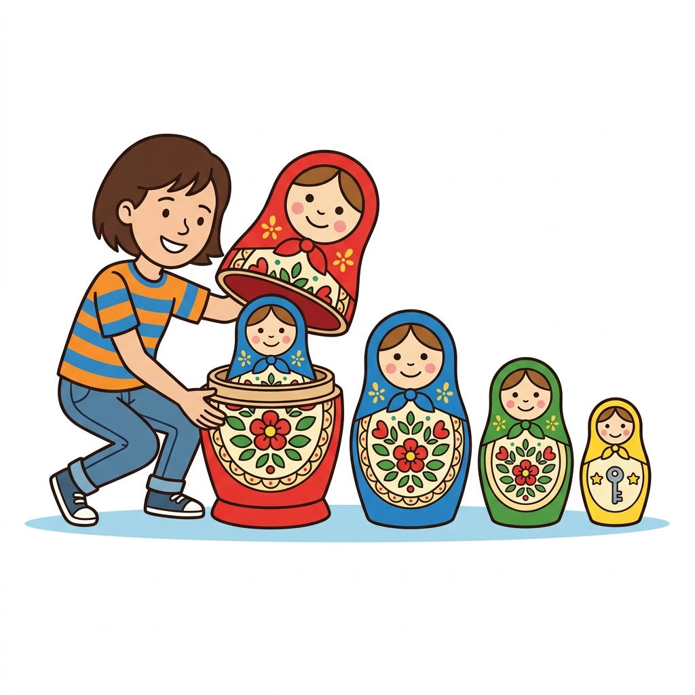

# 재귀 호출
---
재귀 호출이란 함수가 자기 자신을 호출하는 것을 말합니다. 또는 `함수 되부름`이라고도 합니다.  

<div style="text-align: center; margin: 30px 0;">
  
  <p style="font-size: 13px; color: #64748b; margin-top: 8px;">그림: 인형 속에 인형이 들어있는 마트료시카 인형으로 배우는 재귀 호출 개념 (가장 작은 인형 = 탈출 조건)</p>
</div>

재귀 함수는 자기 자신을 반복 수행하기 때문에 세밀하게 주의하여 사용해야 합니다. 
잘못 사용하면 프로그램의 논리적인 오동작이 발생할 수도 있습니다.  

재귀 함수를 쓸 때는 매번 전달하는 호출 아규먼트 인자가 바뀝니다. 이는 자기 자신을 재호출하기 때문입니다. 
값을 바꿔가면서 단계적으로 계속 자기 자신 호출을 실행합니다. 
재귀 함수를 사용할 때는 자기 자신의 반복의 횟수를 정하는 것이 좋습니다.  

또는 재귀 호출 시 탈출할 수 있는 조건을 넣어두는 것이 현명합니다. 
자기 자신의 재귀 호출 반복 횟수를 정의해야 재귀 호출 처리를 한 후에 함수를 탈출할 수 있습니다.  

예제 파일 func-23.php
```php
<?php 
function recursion($a){ 
	if ($a < 5) { 
		echo "입력값 = $a <br>";
		// 자기 자신을 호출합니다.
		recursion($a + 1);

		echo "함수 탈출($a) <br>"; 
	} 
} 

$a = 1; 
recursion($a); 


echo "<br>";

function recursion2($a) { 
	if ($a < 5) { 
		echo "이전: ".$a."<br>"; 
		recursion2($a + 1); 
		echo "이후: ".$a."<br>"; 
	} 
} 
recursion2(0); 
 ?>
```

결과
```
입력값 = 1
입력값 = 2
입력값 = 3
입력값 = 4
함수 탈출(4)
함수 탈출(3)
함수 탈출(2)
함수 탈출(1)

이전: 0
이전: 1
이전: 2
이전: 3
이전: 4
이후: 4
이후: 3
이후: 2
이후: 1
이후: 0
```

<br>

## 재귀 호출의 메모리 스택 및 흐름
---
재귀 함수는 실행 제어권과 데이터 상태가 스택(Stack) 메모리 영역에 순차적으로 쌓였다가(Push), 가장 안쪽에서 탈출 조건(Base Case)이 만족되면 차례대로 스택을 풀고 나옵니다(Pop). 

<div style="text-align: center; margin: 30px 0;">
  
  <p style="font-size: 13px; color: #64748b; margin-top: 8px;">그림: 재귀 호출 진입(Push)과 탈출 및 역순 복귀(Pop) 과정</p>
</div>

함수는 한번 호출될 때마다 호출 값에 대한 메모리 공간(Stack Frame)을 할당하게 됩니다.  
만일 탈출 조건이 없거나 비정상적으로 동작하여 재귀 호출이 무한히 진행되는 경우, 컴퓨터의 스택 영역을 초과하여 차지하므로 **메모리 오버플로우(Stack Overflow)** 에러를 일으켜 웹 서버가 먹통이 될 수 있습니다.

위의 예제에서 함수를 재귀 호출할 때 인자값으로 `$a`를 넘겨 줍니다. 
함수는 `$a < 5`일 경우에만 재귀 호출을 합니다.  
이런 형태로 조건 및 재귀 호출 탈출 조건을 생성합니다.  
항상 재귀 호출을 기능을 구현할 때는 이러한 점들을 주의해야 합니다.  

<br><br>