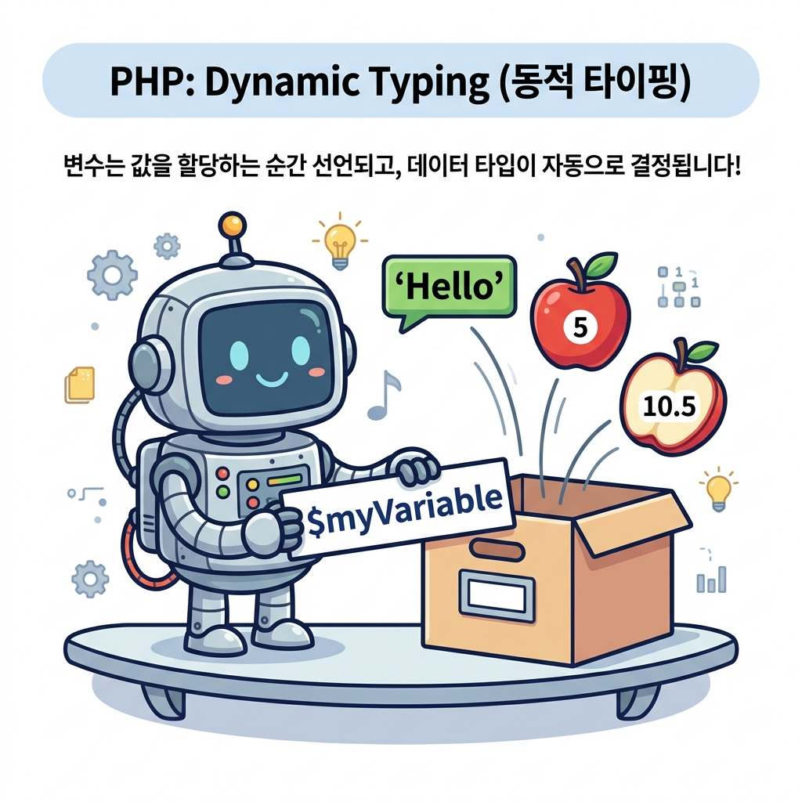

# 변수의 선언
---

<div style="text-align: center; margin: 30px 0;">
  
  <p style="font-size: 13px; color: #64748b; margin-top: 8px;">그림: 변수명 표지판을 붙인 상자에 값이 들어가는 즉시 변수가 선언되고 데이터 타입이 동적으로 결정되는 구조</p>
</div>

PHP 변수는 `C언어` 등 다른 언어와 달리 프로그램 실행 초반에 사용하고자 하는 변수의 타입과 이름을 미리 선언하지 않아도 사용이 가능합니다.  
유연하게 변수 사용이 가능합니다.

이런 점에서 PHP가 빠른 코딩과 유연한 개발 환경을 가지고 있다는 것은 커다란 장점일 수 있습니다. 

<br>

## 선언
---
PHP는 새로운 변수를 사용하고자 할 때 `$변수명`으로 적으면 바로 변수를 생성하여 코드에 적용할 수 있습니다.

예) 

```
$변수명
```


PHP는 변수 데이터 타입을 데이터에 기반하여 자동으로 설정합니다.  
PHP는 데이터 값이 대입 되면 관련된 적합한 데이터 타입이 선택되는 것입니다.  
즉, 변수에 데이터를 삽입함과 동시에 데이터 형이 정의됩니다. 

<br>

## 실습예제
---
변수 사용 예)
예제파일 : var-02.php

```php
<?php
  // PHP변수는 다양한 값을 구분 없이 저장할 수 있습니다. 
  $txt = "Hello world!";
  $x = 5;
  $y = 10.5;
?> 
```


위의 예제를 보면 `$txt` 는 "Hello world!"라는 문자열을 담고 있는 변수입니다.  
$x는 정수 5의 숫자 값을 담고 있는 변수입니다. `$y` 는 10.5 라는 실수 값을 갖고 있는 변수입니다.

>Note: 작은 따옴표로 변수명을 감싸면, 변수의 내용이 아닌 변수의 이름을 출력할 수 있습니다.  

>Note: 큰 따옴표로 변수명을 깜사서 출력하면, 변수의 값이 출력됩니다.  

<br>
