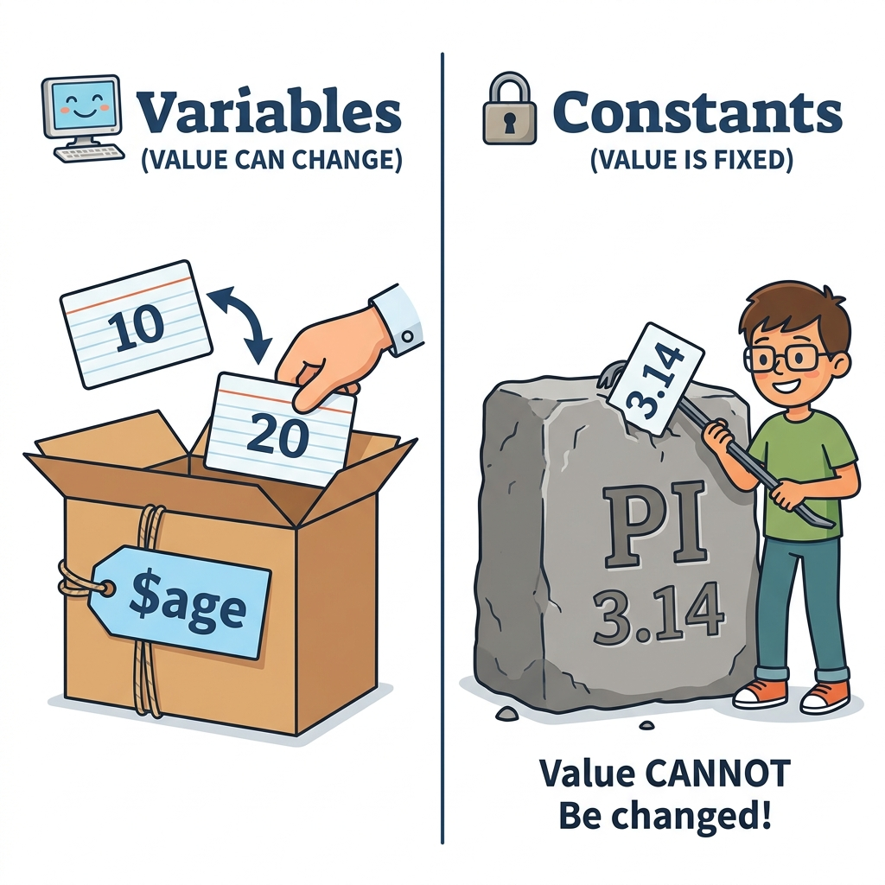

# PHP 변수(Variables) 개념 및 자료 형식
---
프로그램은 고정된 데이터만을 처리하는 것이 아니라, 수많은 유동 데이터를 처리하고, 중간 연산 값을 메모리에 임시 보관한 뒤 필요할 때 다시 읽어 들여 활용합니다. 

이처럼 프로그램이 **실행 중(Runtime)**에 값을 임시로 저장하는 메모리 공간을 **변수(Variables)**라고 부릅니다. 

 

### 1. 변수와 상수의 물리 특성 비교
---
아래 다이어그램은 런타임 중에 값을 자유롭게 재할당할 수 있는 변수와, 한 번 결정되면 값을 변경할 수 없는 불변 고정값인 상수의 구동 차이를 시각적으로 매핑한 구조입니다.

  
  
그림: 값 교체가 가능한 상자(변수)와 값이 돌에 새겨져 바꿀 수 없는 바위(상수) 개념 비교

 

### 2. [변수명을 만드는 규칙](name)
---
PHP의 변수는 이름 앞에 항상 달러 기호(`$`)를 붙여서 선언합니다. 변수명을 선언할 때는 PHP 파서가 식별할 수 있도록 아래의 몇 가지 필수 명명 규칙을 준수해야 합니다.
- **문자 및 언더바 시작**: 변수명은 숫자(`0-9`)로 시작할 수 없으며, 반드시 문자(`a-z`, `A-Z`) 또는 언더스코어(`_`) 기호로 시작해야 합니다.
- **대소문자 철저 구분**: PHP에서 변수명은 대소문자를 엄격히 구별합니다. 예를 들어 `$user`와 `$User`는 서로 다른 메모리 공간을 갖는 독립된 변수로 취급됩니다.
- **한글 변수명**: 기술적으로 UTF-8 바이트 문자열을 사용할 수 있어 `$이름`과 같은 선언도 작동은 하지만, 협업과 코딩 규격 준수를 위해 사용을 피하고 영문자로 명명하는 것을 강력히 권장합니다.

 

### 3. [변수의 선언과 메모리 동적 관리](declare)
---
C나 Java 같은 컴파일 기반 언어는 변수를 사용하기 전 미리 자료형(Type)을 선언해야 하지만, PHP는 **동적 타이핑(Dynamic Typing)**을 지원하므로 변수의 선언과 동시에 자동으로 자료형이 결정됩니다.

- **동적 할당**: 코드 상에서 `$age = 30;`을 선언하는 즉시 PHP 젠드 엔진은 호스트 RAM 상에 빈 메모리 세그먼트를 확보하고 정수 타입 값을 할당합니다.
- **자료형 스위칭**: 동일한 변수명에 문자열이나 배열을 덮어쓰면, 이전에 확보했던 정수형 메모리를 반환하고 새로운 데이터 형식의 크기에 맞춰 메모리가 동적으로 재배치됩니다.

 

### 4. 변수의 9대 [데이터 형식(Data Types)](type)
---
공식 PHP 언어 명세([PHP Manual - Types](https://www.php.net/manual/en/language.types.php))에 따라 PHP 변수는 다음과 같은 핵심 데이터 타입을 가질 수 있습니다.

#### 1) 스칼라 타입 (Scalar Types - 단일 값 보관)
- **[문자와 문자열 (String)](type/string)**: 텍스트 데이터를 저장합니다. 큰따옴표(`"`)와 작은따옴표(`'`)를 사용해 선언합니다.
- **[정수형 (Integer)](type/intiger)**: 소수점이 없는 양수 및 음수 숫자 데이터 형식입니다.
- **[실수형 (Float / Double)](type/float)**: 소수점을 포함하는 정밀 실수 값입니다.
- **[논리변수 (Boolean)](type/bool)**: 참(`true`) 또는 거짓(`false`) 중 하나의 논리 상태만을 나타냅니다.

#### 2) 복합 타입 (Compound Types - 여러 값의 결합)
- **[배열 어레이 (Array)](type/array)**: 순서가 있는 맵 구조의 다중 키-값 리스트 데이터를 저장합니다.
- **[오브젝트 (Object)](type/object)**: 클래스의 인스턴스로서, 객체지향적인 속성(Property)과 메서드(Method)를 탑재합니다.

#### 3) 특수 타입 (Special Types)
- **[NULL 값](type/null)**: 변수에 아무런 값이 할당되어 있지 않음을 상징적으로 표시하는 특수 타입입니다.
- **[리소스 (Resource)](type/Resource)**: 파일 핸들러, 데이터베이스 커넥션 링커 등 PHP 외부 시스템 자원을 가리키는 포인터 역할을 합니다.

 

---
다음 장에서는 변수 이름 명명 규칙의 세부 문법 실례와 유효한 표기법 규격을 상세히 실습합니다.

- **다음 학습**: [변수명 작성 규칙과 명명 규격](name)