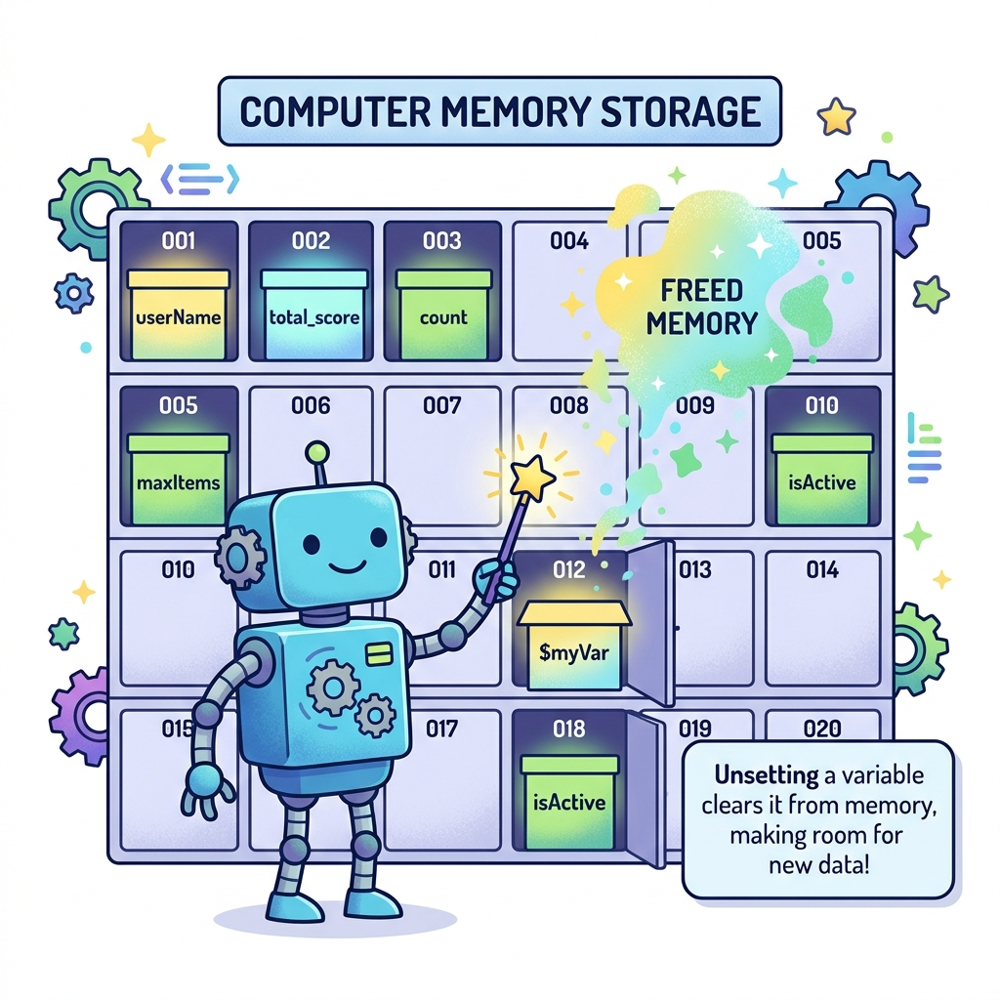

# 변수와 메모리
---

  
  
그림: 메모리 보관함(Memory Locker)에 할당된 변수들을 관리하고, unset()을 사용하여 메모리를 해제하는 모습

PHP 언어는 변수의 사용에 대해서 `엄격한 규칙`을 적용하지 않습니다.  

 

## 동적 생성
---
PHP 스크립트를 `실행 도중`에 새로운 변수를 만나면 `동적`으로 메모리와 변수를 관리합니다.  
동일한 변수가 없을 경우 새로운 변수를 컴퓨터 `메모리에 공간 할당`합니다.  

 

## 메모리
---
변수는 `메모리 공간`과 관련이 있습니다.  
변수의 선언이 많을수록 컴퓨터의 메모리를 많이 할당받아 사용하게 됩니다.  

 

## 메모리 관리
---
PHP는 이렇게 할당 받은 메모리는 사용 종료 후 직접 메모리 `해제`를 하거나 프로그램 실행이 종료되면 자동으로 메모리가 해제됩니다.

생성한 변수를 해제할때는 `unset()` 함수를 호출합니다.

 
