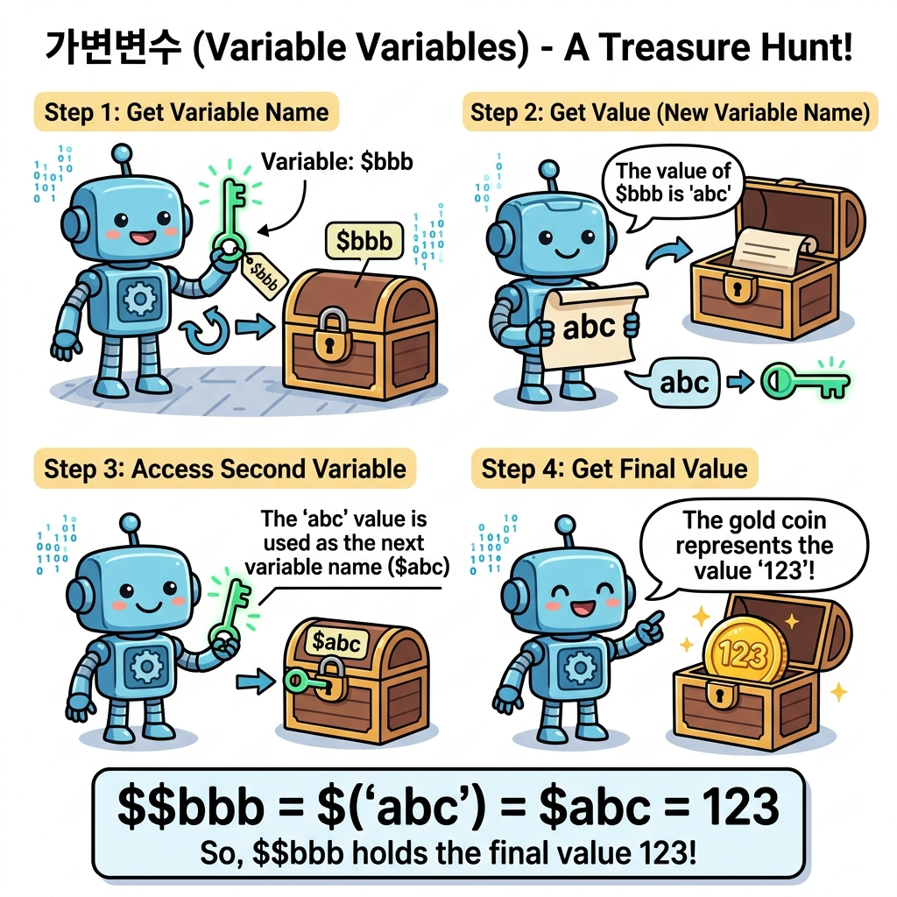

# 가변변수
---

<div style="text-align: center; margin: 30px 0;">
  
  <p style="font-size: 13px; color: #64748b; margin-top: 8px;">그림: 첫 번째 변수 상자에 든 보물지도(값)를 이용해 두 번째 변수 상자를 찾아가는 보물찾기(Treasure Hunt) 형태의 가변변수 원리</p>
</div>

변수를 사용하기 위해서는 변수명을 같이 정의해야 했습니다. 가변변수란 변수의 이름을 다른 변수의 이름을 통해 변수의 이름을 가변적으로 사용할 수 있는 PHP의 기능입니다.  

|문법|

```php
${ 변수 }
```

변수명 앞에 ${ 와 뒤에 } 를 적어서 사용을 하면, 변수명의 값을 가지는 변수와 동일합니다.  

<br>
 

## 개념
---


```
$aaa = “홍길동”;
```

$aaa 변수는 “홍길동”이라는 값을 가지고 있습니다. $aaa 변수를 ${“aaa”}로 가리킬 수도 있습니다.  


```
echo ${"aaa"}; 는 echo $aaa; 와 같습니다.
$bbb = "aaa";
```


$bbb변수에 “aaa” 값을 넣어서 ${ $bbb } 형태로 다시 $aaa 변수를 가리킬 수도 있습니다.  

예제 파일 var-01.php

```php
<?php
	$abc = "123";
	$bbb = "abc";

	echo $bbb."<br>"; // abc라고 출력됩니다.
	echo $$bbb."<br>"; // 123이라고 출력됩니다.

	echo ${$bbb}."<br>"; // 123
	echo ${"abc"}."<br>"; // 123

?>
```


결과

```
abc
123
123
123
```


위의 예제는 가변변수 처리를 위한 예입니다. 변수값을 이용하여 새로운 변수명을 지정할 수 있습니다.  

<br>


## 배열 가변변수
---
다차원 배열을 이용하여 가변변수를 사용할 수 있습니다. 기존 가변변수의 확장입니다. 다차원 배열의 가변변수는 PHP 7.x에서 새롭게 도입된 기능입니다.  

예제 파일 var-02.php

```php
<?php
	
	$name = "jiny";
	printf("name 변수값 = %s <br>", $name);

	$var['foo']['bar'] = "name";
	printf("배열값 = %s <br>", $var['foo']['bar']);

	// 이전 PHP 5.x
	echo "가변변수(name)값  = " . ${$var['foo'][ 'bar']};
	echo "<br><br>";
	
?>
```


결과

```
name 변수값 = jiny
배열값 = name
가변변수(name)값 = jiny
```


위의 예제는 다차원 가변변수의 예입니다. 새롭게 등장한 다차원 배열을 통하여 가변변수로 사용할 수 있습니다.  

<br>