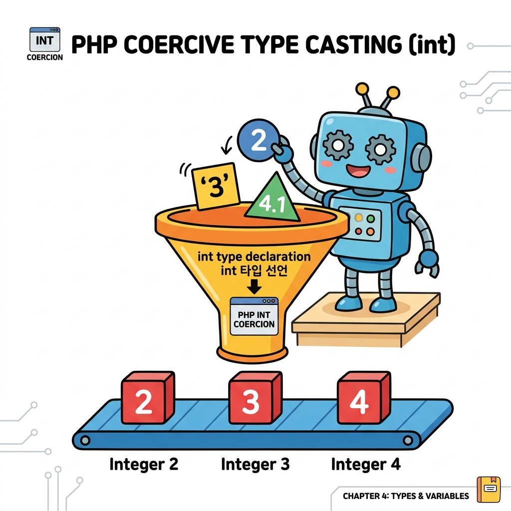

# 스칼라 타입
---

<div style="text-align: center; margin: 30px 0;">
  
  <p style="font-size: 13px; color: #64748b; margin-top: 8px;">그림: 정수(2), 문자열('3'), 실수(4.1) 등의 스칼라 타입 인자가 int 타입 선언 깔때기를 거쳐 모두 정수로 강제 형변환(Coercive Type Casting)되는 과정</p>
</div>

스칼라 타입은 두 가지 방식으로 사용할 수 있습니다. 
기본적 선택인 강제적(coercive)인 방법과 엄격한(strict) 방법입니다.  

PHP에는 네 가지 스칼라 타입이 있습니다.  
* 정수
* 실수
* 문자열
* 논리값

위 타입의 변수는 강요(coercive) 또는 엄격(strict)한 방식으로 사용이 가능합니다.  

다음은 파라미터를 강제적인 방법으로 지정하는 예제입니다.  

예제 파일 scalar-01.php

```php
<?php
	// Coercive 방법
	echo "정수 합계.<br>";
	function sumOfInts(int ...$ints){
		print_r($ints);
		echo "<br>";

		// 배열의 합계를 출력합니다.
    	return array_sum($ints);
	}

	var_dump(sumOfInts(2, '3', 4.1));

	echo "<br>";
	echo "실수 합계.<br>";
	function sumOfFloat(float ...$ints){
		print_r($ints);
		echo "<br>";

		// 배열의 합계를 출력합니다.
    	return array_sum($ints);
	}

	var_dump(sumOfFloat(2, '3', 4.1));

?>
```


결과

```
정수 합계.
Array ( [0] => 2 [1] => 3 [2] => 4 )
int(9)
실수 합계.
Array ( [0] => 2 [1] => 3 [2] => 4.1 )
float(9.1) 
```


예제 파일 scalar-02.php

```php
<?php
	// Coercive 방법
	function sumOfstr(string ...$strs){
		print_r($strs);
		echo "<br>";

	}

	var_dump(sumOfstr('호랑이', '토끼', 4));

?>
```


결과

```
Array ( [0] => 호랑이 [1] => 토끼 [2] => 4 )
NULL 
```


<br>