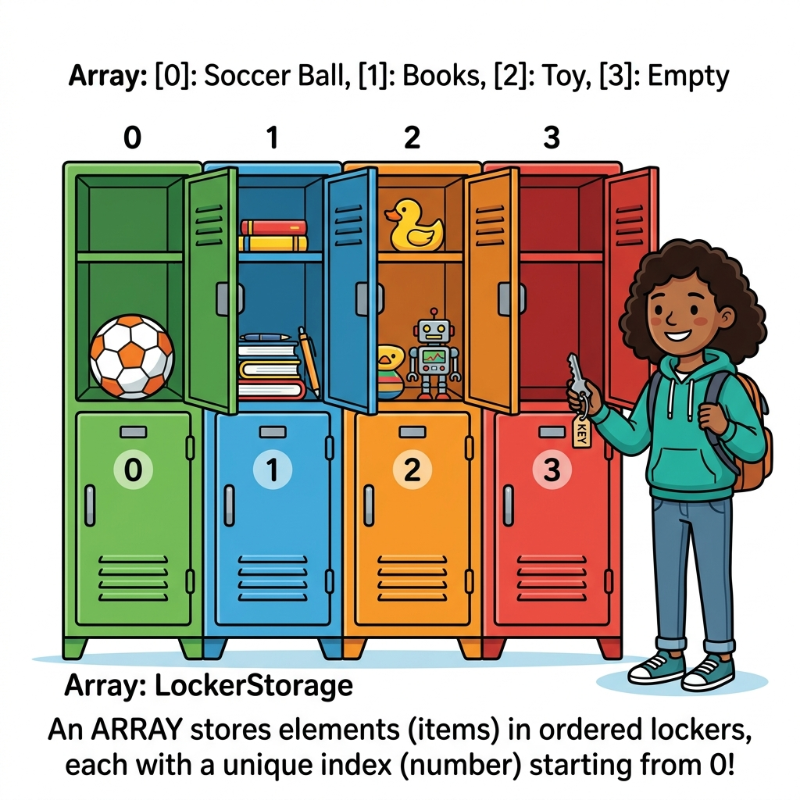

# 배열 어레이
---
기존의 일반적인 변수들은 오직 하나의 데이터 값만을 저장할 수 있습니다. 반면 **배열(Array)**은 이름 그대로 하나의 변수 공간에 다수의 데이터 원소를 순차적 또는 키값 기반으로 그룹화하여 보관할 수 있는 매우 특수하고 유용한 자료구조입니다.

<div style="text-align: center; margin: 30px 0;">
  
  <p style="font-size: 13px; color: #64748b; margin-top: 8px;">그림: 번호표(인덱스)가 매겨진 사물함(배열)에 물건(원소)들을 나누어 담아두는 개념 비유</p>
</div>

<br>
## 배열의 개념
---
배열의 개념은 C 언어와 같은 언어를 참조하여 이해하면 더 쉽습니다. 실제적으로 배열은 여러 개의 변수들의 집합을 가리키는 포인터와 같습니다. 변수의 이름만 같은 여러 변수들을 묶어서 생성하고, 각각의 변수에 번호를 부여하여 사용을 하는 개념입니다.  

PHP는 다양한 형태의 배열을 지원합니다.  

*	Indexed arrays
인덱스 배열이라고 해서 기존 전형적인 배열의 표현입니다. 배열의 각각의 데이터를 숫자 인덱스를 통하여 가리킵니다.  

*	Associative arrays
기존 숫자형 인텍스 키 대신에 각각이 이름 키를 이용하여, 각각의 데이터에 접근을 할 수 있습니다.  

*	Multidimensional arrays
다차원 배열로 하나의 각각의 데이터는 또 다른 배열을 담고 있는 배열변수가 될 수 있습니다.  

<br>

## 배열 생성
---
배열 변수는 array() 함수를 이용하여 변수 선언과 동시에 초기값을 설정할 수 있습니다.  


```php
$변수명 = array(데이터1, 데이터2, 데이터3);
```


array() 변수는 다양한 값을 콤마(,)로 구분하여 배열변수의 초기값을 설정할 수 있습니다.  

또는, 대괄호를 이용하여 쉽게 배열을 선언할 수 있습니다.  


```php
$변수 = [데이터1, 데이터2, 데이터3];
```

대괄호 (`[]`)를 이용한 배열의 선언은 php 5.4부터 지원하는 문법 입니다.  

이렇게 생성된 배열은 기본적으로 indexed array 속성을 가집니다. indexed array는 $변수명 뒤에 배열 [번호] 형태로 접근할 수 있습니다.  

항상 indexed array의 index값은 0부터 시작합니다.  

예제 파일 array-01.php

```php
<?php
  $cars = array("Volvo", "BMW", "Toyota");
  echo "I like " . $cars[0] . ", " . $cars[1] . " and " . $cars[2] . ".";
?>
```


결과

```
I like Volvo, BMW and Toyota.
```


위의 예는 $cars 변수에 array() 함수를 통하여 3개의 값으로 초기화 하였습니다. $cars 는 indexed array 속성을 가지고 있습니다. 각각의 배열의 데이터는 $cars 변수명 뒤에 배열기호 [ ]를 통하여 번호로 접근할 수 있습니다.  


```php
$cars[0] => "Volvo"
$cars[1] => "BMW"
$cars[2] => "Toyota"
```


배열은 이름은 동일하지만 [ ] 를 통하여 각각이 접근할 수 있습니다. indexed 배열은 항상 0부터 시작합니다.  

> note: n번째 배열 원소의 인덱스는 n-1 입니다.  

>note: 배열에 저장된 각각의 값을 `원소`라고 합니다.  
<br>


## Indexed Arrays
---
배열 생성 시 array() 내부함수를 이용하여 일괄적으로 초기할 할 수도 있지만 index 값을 통하여 개별로 하나씩 설정을 할 수도 있습니다.  

예제 파일 array-02.php

```php
<?php
  $cars[0] = "Kia";
  $cars[1] = "BMW";
  $cars[2] = "Toyota";
  echo "I like " . $cars[0] . ", " . $cars[1] . " and " . $cars[2] . ".";
?>
```


결과

```
I like Kia, BMW and Toyota.
```


즉 처음에 배열을 선언하지 않고 변수명 뒤에 [ ]를 통해 배열화로 만들어 저장할 수 있습니다.  

indexed 형태의 배열은 반복문을 통하여 처리하기에 매우 편리합니다. index 값이 일정한 숫자 형태로 처리되기 때문입니다.  

예제 파일 array-03.php

```php
<?php
	// 배열값을 저장
	for ($i=0;$i<5;$i++) {
		$cars[$i] = "array".$i;
	}
	// 배열값을 출력
	for ($i=0;$i<5;$i++) {
	echo $cars[$i]."<br>";
	}
?>
```


결과

```
array0
array1
array2
array3
array4
```


<br>


## 연상(Associative) 배열
---
>note: 연관배열 이라고도 번역됩니다.  

indexed 방식은 편리하나 각각의 값을 직관적으로 알기는 어렵습니다.  

PHP 배열의 두 번째 형태인 연상 키워드를 이용한 배열입니다. PHP는 배열을 처리하는 데 쉽게 배열 키를 인지할 수 있도록 숫자 대신에 이름 키를 부여할 수 있습니다.  

연상 배열 또한 배열을 생성 및 초기화 하는 방식으로 array()함수를 사용할 수 있습니다. 이전 indexed array와의 차이점이라면 배열 값을 입력 시 “이름”=> 형태가 추가 되는 것입니다.  


```php
$변수명 = array(“이름”=>”데이터1”,“이름”=>”데이터2”, “이름”=>”데이터3”);
```


또는  

```
$age['Peter'] = "35";
$age['Ben'] = "37";
$age['Joe'] = "43";
```

형태로 직접 이름 키를 생성하면서 배열을 만들 수 있습니다.  

예제 파일 array-04.php

```php
<?php
  $age = array("Jiny"=>"44", "Ben"=>"37", "Joe"=>"43");
  echo "Jiny  is " . $age['Jiny'] . " years old.";
?>
```


결과

```
Jiny is 44 years old.
```


다음은 연상 배열을 이름 키 값을 통해 foreach 반복문을 이용하여 이름과 값을 출력하는 예입니다.  

예제 파일 array-05.php

```php
<?php
  $age = array("Peter"=>"40", "joy"=>"35", "jiny"=>"43");

  Foreach ($age as $x => $x_value) {
    echo "Key=" . $x . ", Value=" . $x_value;
      echo "<br>";
  }
?> 
```


결과

```
Key=Peter, Value=40
Key=joy, Value=35
Key=jiny, Value=43
```


<br>

## 다차원(Multidimensional) 배열
---
지금까지 배열은 1차원적인 배열에 대해서 설명을 하였습니다.  

실상황적으로는 1차원적인 데이터 보다는 가로, 세로 표처럼 2차원적인 데이터, 다수의 데이터 그룹이나 수학적 처리로 3차원 데이터의 처리도 필요할 것입니다.  

다차원 배열이란 하나의 배열 값이 또 다른 배열을 가지고 있는 중복된 배열 구조를 말합니다.  

*	1차원 배열은 변수명 뒤에 1개의 [ ] 배열 기호가 표시됩니다.
*	2차원 배열은 변수명 뒤에 2개의 [ ][ ] 배열 기호가 표시됩니다.
*	3차원 배열은 변수명 뒤에 3개의 [ ][ ][ ] 배열 기호가 표시됩니다.

이처럼 변수명 뒤에 배열 기호 [ ]를 중복하여 다차원 배열을 접근할 수 있습니다.  


```php
<?php
  echo $age1[ ‘a’ ];
  echo $age2[ ‘a’ ][0];
  echo $age2[ ‘3’ ][0][1];
?>
```


다음과 같은 표를 이차원 배열로 생성해 볼 수 있습니다.  


```
브랜드	재고수량	판매수량
Volvo	10	300
BMW	11	250
Saab	12	350
kia	13	200
```

표는 가로 * 세로 형태의 이차원적인 배열 타입을 가지고 있습니다.  

예제 파일 array-06.php

```php
<?php
$cars = array
  (
  array("Volvo",10,300),
  array("BMW",11,250),
  array("Saab",12,350),
  array("kia",13,200)
  );

echo $cars[0][0].": In stock: ".$cars[0][1].", sold: ".$cars[0][2].".<br>";
echo $cars[1][0].": In stock: ".$cars[1][1].", sold: ".$cars[1][2].".<br>";
echo $cars[2][0].": In stock: ".$cars[2][1].", sold: ".$cars[2][2].".<br>";
echo $cars[3][0].": In stock: ".$cars[3][1].", sold: ".$cars[3][2].".<br>";
?>
```


결과

```
Volvo: In stock: 10, sold: 300.
BMW: In stock: 11, sold: 250.
Saab: In stock: 12, sold: 350.
kia: In stock: 13, sold: 200.
```


이중 반복문을 통하여 다차원 배열을 처리할 수 있습니다.  

예제 파일 array-07.php

```php
<?php
$cars = array
  (
  array("Volvo",10,300),
  array("BMW",11,250),
  array("Saab",12,350),
  array("kia",13,200)
  );
  
for ($row = 0; $row < 4; $row++) {
  echo "<p><b>Row number $row</b></p>";
  echo "<ul>";
  for ($col = 0; $col < 3; $col++) {
    echo "<li>".$cars[$row][$col]."</li>";
  }
  echo "</ul>";
}
?>
```


결과

```
Row number 0
●	Volvo
●	10
●	300
Row number 1
●	BMW
●	11
●	250
Row number 2
●	Saab
●	12
●	350
Row number 3
●	kia
●	13
●	200
```


<br>

## 배열 확인
---
PHP는 생성한 변수가 배열변수를 확인할 수 있는 is_array()이라는 내부함수를 제공합니다.  

|관련함수|

```php
bool is_array ( mixed $var )
```


매개변수 인자값으로 변수를 전달하면, 변수의 배열 타입 여부를 논리값 형태로 반환합니다.  

예제 파일 array-08.php

```php
<?php
$yes = array('this', 'is', 'an array');

echo is_array($yes) ? 'Array' : 'not an Array';
echo "\n";

$no = 'this is a string';

echo is_array($no) ? 'Array' : 'not an Array';
?> 
```


결과

```
Array not an Array 
```


<br>