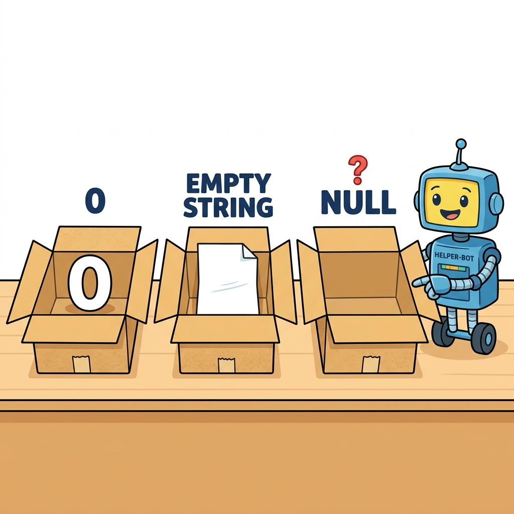

# NULL 값
---
NULL은 프로그래밍에서 매우 특별한 상태를 의미하는 데이터 유형입니다. 변수가 선언되었으나 아직 어떤 값도 할당되지 않았거나, 의도적으로 비어있는 상태임을 명시적으로 나타낼 때 사용됩니다.

<div style="text-align: center; margin: 30px 0;">
  
  <p style="font-size: 13px; color: #64748b; margin-top: 8px;">그림: 숫자 0이 들어있는 상자, 빈 종이(공백 문자열 "")가 들어있는 상자, 그리고 아무것도 없이 텅 빈 상자(NULL)의 물리적 차이 비교</p>
</div>

## 개념
---
NULL이란 변수에 어떠한 값도 설정되어 있지 않는 비어 있는 타입입니다. 또한 NULL은 공백(“”)과도 다른 의미입니다.  
변수를 NULL로 설정하고 싶다면 특수 키워드 null을 대입하면 됩니다.  

|문법|

```
$변수명 = null;
```


예제 파일 null-01.php

```
<?php
	// $x변수에는 Hello world! 문자열이 저장되어 있습니다.
	$x = "Hello world!";
	echo $x;

	echo "<br>";
	echo "=====";
	echo "<br>";

	// $x 변수에 null값을 선언합니다.
	$x = null;
	var_dump($x);
?>
```


PHP에서는 변수를 생성하고 데이터 값을 할당하지 않은 경우에는 기본적으로 NULL 로 설정됩니다.  

예제 파일 null-02.php

```
<?php
    $x;
    var_dump($x);
?>
```

<br>

## NULL 확인
---
PHP는 생성한 변수가 NULL인지를 확인할 수 있는 is_null()이라는 내부 함수를 제공합니다.  

|관련함수|

```php
bool is_null ( mixed $var )
```


is_null() 함수는 변수의 NULL 여부를 확인하여 논리값으로 결과를 반환합니다.  

예제 파일 null-03.php

```php
<?php
    $x;
    If (is_null($x)) {
    	echo "x = NULL입니다.";
    } else {
    	echo "x = NULL이 아닙니다.";
    }

    echo "<br>";

    var_dump($x);
?>
```


결과

```
x = NULL입니다.
NULL 
```


<br>


## NULL 연산자
---
NULL 값을 가진 변수는 경우에 따라서 프로그램의 오류의 원인이 되기도 합니다. 따라서 기존 is_null() 함수로 단순히 변수가 NULL 여부를 확인하는 것으로는 부족합니다.  

NULL 변수인 경우에는 초기값을 설정해야 안전합니다.  

PHP 7.x부터 새로운 NULL 연산자가 도입되었습니다.  

|문법|

```php
$username = $_POST['user'] ?? 'nobody';
```


위의 새로운 연산자 ??는 만일 변수의 값이 있으면 변수의 값을 대입하고, NULL인 경우에는 'nobody'를 대입하는 예입니다.  

예제 파일 null-04.php

```php
<?php

$x;

if (is_null($x)) {
    	echo "x = NULL입니다.";
} else {
    	echo "x = NULL이 아닙니다.";
}

echo "<br>";

$username = $x ?? 'nobody';
echo "username = $username";

?>
```


결과

```
x = NULL입니다.
username = nobody
```


>?? 연산자의 특성  
>?? 연산자는 기존 isset() 함수와 is_null() 함수로 두 가지 상태 모두를 체크하는 것과 비슷합니다.  

PHP 7.x 이전의 버전을 사용하고 있다면 ?? 연산자를 다음과 같이 함수 형태로 만들어서 사용할 수 도 있습니다.  

예제 파일 null-05.php

```php
<?php
	function _coalescing($var, $default){
		if (isset($var)) {
			if ($var == NULL) {
				return $var;
			} else {
				return $default;
			}
		} else {
			return $default;
		}
	}

	$x;
	if (is_null($x)) {
    	echo "x = NULL입니다.";
    } else {
    	echo "x = NULL이 아닙니다.";
    }

    echo "<br>";

	$username = _coalescing($x,"nobody");
	echo "username = $username";
?>
```


결과

```
x = NULL입니다.
username = nobody
```

출력 결과를 동일하게 확인할 수 있습니다.  

?? 연산자는 삼항연산자(?)를 통해 응용할 수도 있습니다.  


```
$username = isset($_GET['user']) ? $_GET['user'] : 'nobody';
```


또한 ?? 연산자도 삼항연산자의 중복하여 연결하는 것처럼 ?? 연산자도 연결하여 사용할 수도 있습니다.  


```
<?php
    // ?? 연산자는 연결을 하여 사용을 할 수 도 있습니다.
    $username = $_GET['user'] ?? $_POST['user'] ?? 'nobody';
?>
```


<br>