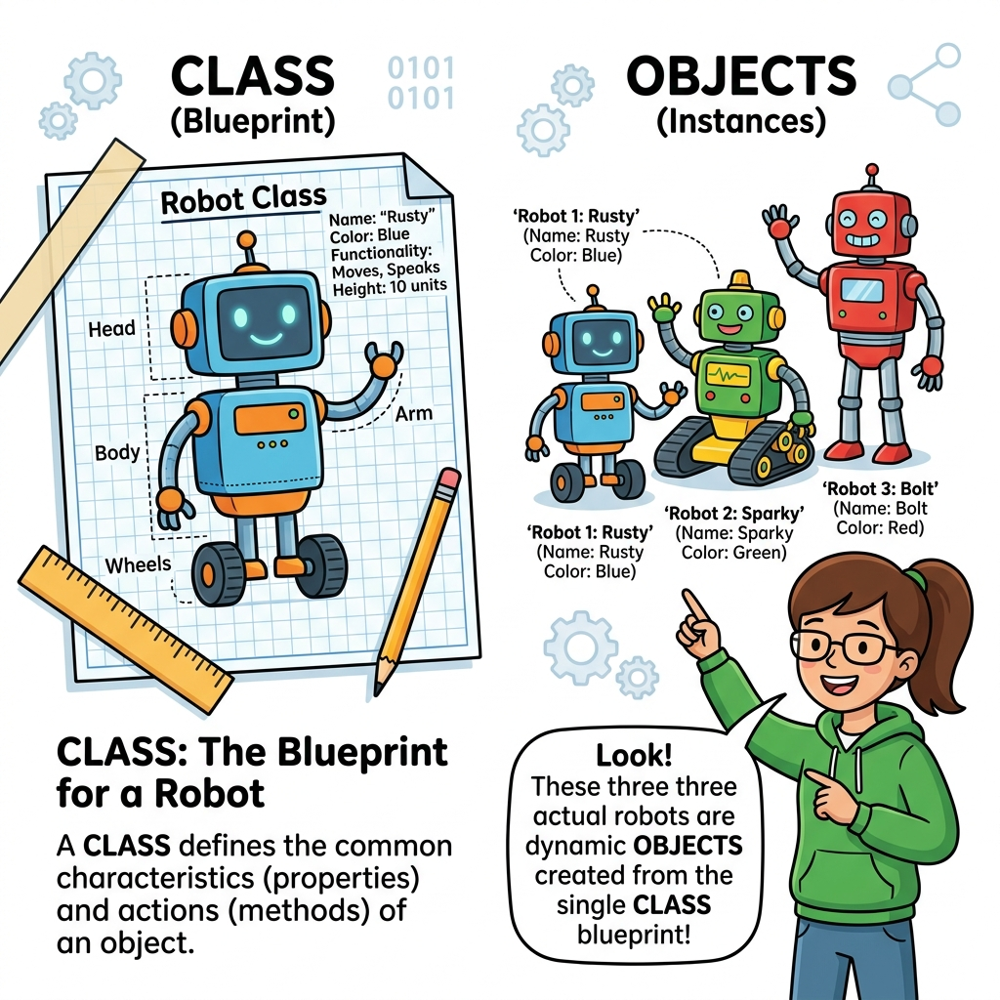

# 오브젝트
---
오브젝트(Object, 객체)는 데이터(상태)와 해당 데이터를 가공하고 처리하는 함수(동작)들을 묶어서 담을 수 있는 매우 강력하고 복잡한 변수 타입입니다. 객체지향 프로그래밍(OOP)을 이해하기 위해 반드시 학습해야 하는 핵심 형식입니다.

<div style="text-align: center; margin: 30px 0;">
  
  <p style="font-size: 13px; color: #64748b; margin-top: 8px;">그림: 설계도(클래스)와 그 설계도로부터 만들어진 실제 움직이는 로봇들(객체 인스턴스)의 차이 비교</p>
</div>

<br>
## 객체 저장
---
변수를 객체로 설정하는 방법은 객체생성 키워드 또는 객체 변수를 대입을 하면 됩니다. 다음은 클래스 객체의 인스턴스를 생성하여 새로운 객체 변수를 생성합니다.  

예제 파일 obj-01.php

```php
<?php
class Car {
        function Car() 
{
          $this->model = "Grandure";
        }
}

// 객체 인스턴스를 생성하는 변수
$hyndai = new Car();

// 객체의 프로퍼티를 출력합니다.
echo $hyndai->model;

?>
```


결과

```
Grandure
```


오브젝트 변수타입은 향후 객체지향 코딩을 할때 가장 많이 사용하는 변수 타입입니다.  

<br>


## 객체 확인
---
PHP는 생성한 변수가 객체변수를 확인할 수 있는 is_object()이라는 내부함수를 제공합니다.  

|관련함수|

```php
bool is_object ( mixed $var )
```


매개변수 인자값으로 변수를 전달하면 변수의 오브젝트 타입 여부를 논리값 형태로 반환합니다.  

예제 파일 obj-02.php

```php
<?php
$obj = new stdClass();
if (is_object($obj)) {
  echo "객체입니다.";
} else {
  echo "객체가 아닙니다.";
}
?>
```


결과

```
객체입니다.
```


<br>