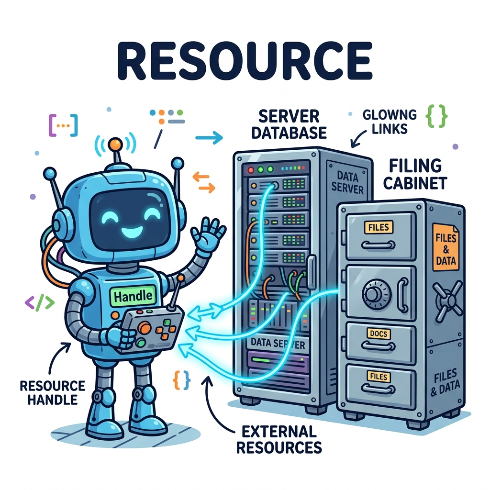

# 리소스(Resource)
---
리소스(Resource)는 PHP 내부에서 직접 데이터를 갖고 있는 일반적인 자료형이 아닙니다. 파일 열기(`fopen`), 데이터베이스 연결 등 PHP 외부의 하드웨어나 데이터베이스 자원, 운영체제 리소스를 가리키는 특수 '포인터/핸들(Handle)' 역할을 하는 특별한 변수 타입입니다.

<div style="text-align: center; margin: 30px 0;">
  
  <p style="font-size: 13px; color: #64748b; margin-top: 8px;">그림: 리모컨(Resource Handle)을 통해 외부에 있는 파일 금고나 데이터베이스 서버(External Resources)를 제어하는 원리</p>
</div>

<br>
## 리소스 확인
---
get_resource_type() 내부 함수를 이용하면 리소스 타입을 확인할 수 있습니다.  

|관련함수|

```
string get_resource_type ( resource $handle )
```


예제 파일 resource-01.php

```
<?php
// prints: mysql link
$c = mysql_connect();
echo get_resource_type($c) . "\n";

// prints: stream
$fp = fopen("foo", "w");
echo get_resource_type($fp) . "\n";

// prints: domxml document
$doc = new_xmldoc("1.0");
echo get_resource_type($doc->doc) . "\n";
?> 
```


<br>