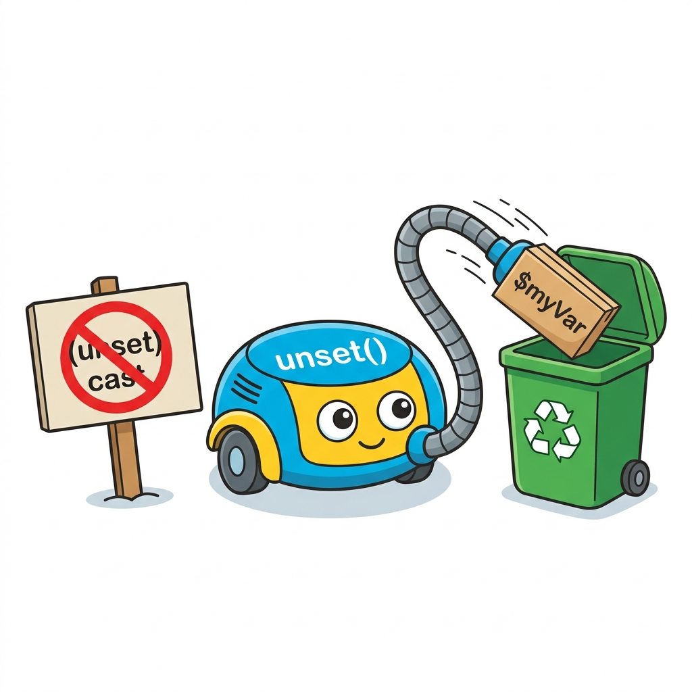

# 변수 삭제
---

<div style="text-align: center; margin: 30px 0;">
  
  <p style="font-size: 13px; color: #64748b; margin-top: 8px;">그림: unset() 함수를 사용하여 변수를 안전하게 삭제하고, 더 이상 지원하지 않는 (unset) 캐스팅을 배제하는 메모리 청소 로봇</p>
</div>

캐스팅 방식으로 변수를 삭제하는 표현식인 `(unset)` 캐스팅은 PHP 7.2에서 Deprecated(권장되지 않음) 되었으며, **PHP 8.0에서 완전히 제거(Removed)**되었습니다. 

과거의 호환성을 위해 아래 예제를 살펴볼 수 있으나, 현재는 변수를 삭제하고 메모리를 해제할 때 **`unset()` 함수**를 사용하는 것이 올바른 표준 방법입니다.  

예제 파일 casting-01.php

```php
 <?php 
 	echo "casting <br>";

 	$a = "변수를 삭제합니다."; 
 	echo $a."<br>";
 	echo "변수 삭제 = ".(unset)$a; // 결과:  
 ?>
```


결과

```
casting
변수를 삭제합니다.
변수 삭제 = 
```


위의 예제는 변수를 삭제하는 예입니다. 과거에는 별도의 `unset()` 함수를 사용하지 않고도 캐스팅이라는 간단한 표현으로 생성된 변수를 삭제하고 메모리 해제를 할 수 있었습니다. 현재는 `unset($a)`와 같은 형태로 작성하는 것을 강력히 권장합니다.

<br>
