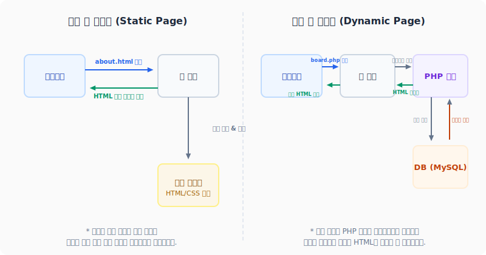

# 1. 웹 개발이란 무엇인가?
---
인터넷 브라우저 주소창에 도메인을 입력하면 단 몇 초 만에 세련된 화면이 표시되고 로그인이 이뤄집니다. 백엔드 개발자로서 튼튼하고 안전한 웹 시스템을 만들기 위해서는 이러한 단순한 동작 이면에 숨겨진 **웹 아키텍처(Web Architecture)**의 기본 메커니즘을 정확히 파악해야 합니다.

이 문서에서는 웹 개발의 근간이 되는 클라이언트-서버 모델, 프론트엔드와 백엔드의 역할, 그리고 정적 및 동적 웹 페이지의 동작 구조 차이를 학습합니다.

<br>

## 1.1 클라이언트 - 서버 모델 (Client-Server Model)
웹 서비스는 기본적으로 정보를 요청하는 **클라이언트(Client)**와 정보를 보관하며 이를 처리해 응답하는 **서버(Server)** 간의 1대1 협업 통신으로 동작합니다.

```text
+-----------------------+                    +------------------------+
|  클라이언트 (Client)  | ─── (1) Request ──> |      서버 (Server)      |
|  - 웹 브라우저        |                     |  - Apache, Nginx       |
|  - 모바일 앱, 기기    | <── (2) Response ── |  - PHP 엔진, DB        |
+-----------------------+                    +------------------------+
```

* **클라이언트 (Client)**
  * 사용자가 다루는 인터페이스 영역입니다. 크롬, 사파리와 같은 **웹 브라우저(Web Browser)**가 대표적입니다.
  * 사용자의 액션(클릭, 입력)을 감지하여 규격화된 형식의 요청(Request) 패킷으로 변환해 인터넷 망을 거쳐 서버로 발송하고, 서버로부터 되돌려 받은 최종 결과물(HTML, 이미지 등)을 사용자 화면에 드로잉(Rendering)해 보여줍니다.
* **서버 (Server)**
  * 네트워크상에서 상시 구동되며 클라이언트의 연결을 기다리는 고성능 컴퓨터와 소프트웨어 시스템을 칭합니다.
  * 클라이언트로부터 도착한 요청 패킷을 수집·분석하여 데이터베이스에서 필요한 자료를 꺼내 가공한 뒤, 그 결과를 응답(Response) 패킷으로 만들어 되돌려 주는 인프라 제공 장치입니다.

<br>

## 1.2 프론트엔드(Frontend)와 백엔드(Backend)의 경계
웹 개발 영역은 코드가 실행되는 환경과 제어하는 목적에 따라 크게 프론트엔드와 백엔드로 나뉩니다.

```text
+-------------------------------------------------------------+
|  [ 사용자 환경: 클라이언트 브라우저 ] - 프론트엔드 (Frontend)   |
|  - HTML (뼈대) / CSS (디자인) / JavaScript (화면 인터랙션)   |
+-------------------------------------------------------------+
                              │
                    [ 인터넷 망 통신 ]
                              │
+-------------------------------------------------------------+
|  [ 백그라운드 서버 환경 ] - 백엔드 (Backend)                  |
|  - 웹 서버 (Nginx / Apache)                                 |
|  - WAS / 언어 인터프리터 (PHP 엔진)                          |
|  - 데이터 스토어 (MySQL / Redis 등 데이터베이스)             |
+-------------------------------------------------------------+
```

### 1.2.1 프론트엔드 (Frontend / Client-Side)
* **주요 임무**: 사용자가 직접 보고 조작하는 시각적 화면(UI)의 구현 및 동작성 제어.
* **작동 언어**: 브라우저 엔진이 직접 해독할 수 있는 **HTML, CSS, JavaScript**만을 활용합니다.
* **실행 환경**: 서버가 코드를 그대로 전송해주면, 실제 실행 및 렌더링 연산은 **사용자의 개별 로컬 컴퓨터(브라우저)**가 처리합니다.

### 1.2.2 백엔드 (Backend / Server-Side)
* **주요 임무**: 비즈니스 논리 구현, 데이터 보안 가공, DB 영속성 제어, 서버 리소스 모니터링.
* **작동 언어**: **PHP**, Python, Java, Node.js 등과 SQL 질의어.
* **실행 환경**: 모든 민감한 연산과 데이터 가공은 외부 침입이 철저히 격리된 **중앙 서버 환경**에서 실행됩니다. 연산이 종료되어 화면에 뿌릴 수 있도록 완성된 순수 HTML 코드나 가공된 JSON 데이터 구조체만을 최종 클라이언트에 송신하므로, 사용자는 내부 PHP 소스 코드를 절대로 훔쳐볼 수 없습니다.

<br>

## 1.3 정적 웹 페이지 vs 동적 웹 페이지
웹 페이지가 요청을 처리하고 화면을 동적으로 가공해 응답하는 형태에 따라 정적 웹 페이지와 동적 웹 페이지로 구분됩니다.

<div style="text-align: center; margin: 30px 0;">
  
  <p style="font-size: 13px; color: #64748b; margin-top: 8px;">그림: 정적 웹 페이지(단순 파일 읽기)와 동적 웹 페이지(PHP 스크립트 실행 및 DB 쿼리)의 처리 흐름 차이</p>
</div>

### 1.3.1 정적 웹 페이지 (Static Web Page)
정적 웹 페이지는 서버의 저장 공간에 이미 물리적 파일 형태로 존재하고 있는 HTML 문서를 어떠한 추가 가공 없이 클라이언트에게 그대로 송신해 주는 웹 문서입니다.

* **동작 흐름**:
  1. 브라우저가 `/about.html` 요청 발송.
  2. Nginx 또는 Apache 웹 서버가 하드디스크에 저장된 `about.html` 파일을 로드.
  3. 로드된 HTML 텍스트 코드를 가공 없이 브라우저로 100% 그대로 전달.
* **특징**:
  * 모든 사용자는 시각과 권한에 관계없이 항상 똑같은 파일 내용을 전달받아 보게 됩니다.
  * 서버에서 특별히 수행할 계산이나 연산이 없으므로 응답 속도가 무척 빠르지만, 실시간 댓글이나 개인화 프로필 기능 등을 구현할 수 없습니다.

### 1.3.2 동적 웹 페이지 (Dynamic Web Page)
동적 웹 페이지는 클라이언트가 요청을 보낸 즉시, 서버가 해당 요청 인자(시간, 로그인 ID 등)를 분석하여 **실시간으로 데이터베이스를 조회하고 연산해 화면 HTML 코드를 매번 새로 조립(Rendering)**하여 반환하는 웹 문서입니다.

* **동작 흐름**:
  1. 브라우저가 `/user_profile.php?id=7` 요청 발송.
  2. 웹 서버가 PHP 인터프리터 엔진에 이 스크립트 실행 제어권을 전달.
  3. PHP 스크립트가 구동되며 MySQL DB에 접속해 `SELECT * FROM users WHERE id = 7;` 수행.
  4. 획득한 회원의 개인 정보를 HTML 코드 뼈대 안의 변수 자리에 대입하여 **완성된 HTML 텍스트를 실시간으로 새로 창조**.
  5. 완성된 HTML 최종본을 웹 서버가 받아 브라우저로 응답.
* **특징**:
  * 누가, 언제, 어떤 조건으로 요청했는가에 따라 각기 다르게 개인화된 실시간 화면을 그려 보낼 수 있습니다.
  * 현대 거의 대다수의 상영상용 웹 서비스(페이스북, 쇼핑몰, 예약 시스템 등)는 동적 웹 페이지 메커니즘을 기반으로 가동됩니다.
