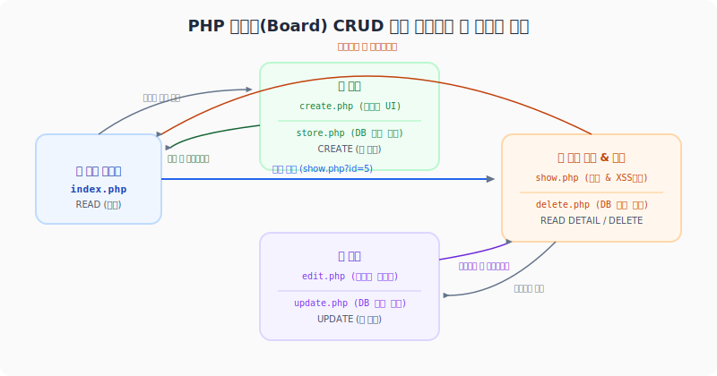

# 6. 게시판 만들기 (Bulletin Board CRUD Project)
---

웹 서비스 개발에서 가장 기본적이면서도 핵심이 되는 프로젝트는 바로 **게시판(Board)** 만들기입니다. 게시판을 구현하면서 사용자 요청 처리, 데이터베이스 연동, 데이터 CRUD(Create, Read, Update, Delete) 조작, 그리고 보안(XSS 방어)까지 웹 개발의 필수 요소를 종합적으로 실습할 수 있습니다.

본 실습에서는 이전 단원에서 다룬 **PDO 데이터베이스 연동**을 바탕으로, 데이터 입력폼 구성부터 안전한 데이터 조작 기법까지 단계별로 완결된 하나의 애플리케이션을 완성해 봅니다.

<div style="text-align: center; margin: 30px 0;">
  
  <p style="font-size: 13px; color: #64748b; margin-top: 8px;">그림: 목록 조회, 작성 폼, 상세 보기, 수정 및 삭제로 연결되는 PHP 게시판 CRUD 전체 파일 유기적 흐름</p>
</div>

<br>

## 6.1 데이터베이스 및 테이블 설계

게시판 데이터를 저장하기 위해 RDBMS(MySQL/MariaDB 등)에 `posts` 테이블을 생성합니다. 테이블 구조는 글 번호(ID), 제목, 내용, 작성자, 작성일로 구성합니다.

### 6.1.1 테이블 생성 SQL (DDL)

```sql
CREATE TABLE `posts` (
  `id` INT AUTO_INCREMENT PRIMARY KEY,
  `title` VARCHAR(255) NOT NULL,
  `content` TEXT NOT NULL,
  `writer` VARCHAR(100) NOT NULL,
  `created_at` DATETIME DEFAULT CURRENT_TIMESTAMP
) ENGINE=InnoDB DEFAULT CHARSET=utf8mb4;
```


### 6.1.2 데이터베이스 공통 커넥션 설정 (`db.php`)
매 페이지마다 PDO 연결 코드를 작성하지 않도록 공통 접속 설정을 파일로 분리합니다.


```php
<?php
// db.php: PDO 데이터베이스 접속 공통 모듈
declare(strict_types=1);

$host = '127.0.0.1';
$db   = 'my_project_db';
$user = 'db_user';
$pass = 'secret_password_123';
$charset = 'utf8mb4';

$dsn = "mysql:host={$host};dbname={$db};charset={$charset}";
$options = [
    PDO::ATTR_ERRMODE            => PDO::ERRMODE_EXCEPTION,
    PDO::ATTR_DEFAULT_FETCH_MODE => PDO::FETCH_ASSOC,
    PDO::ATTR_EMULATE_PREPARES   => false,
];

try {
    $pdo = new PDO($dsn, $user, $pass, $options);
} catch (PDOException $e) {
    error_log($e->getMessage());
    die("데이터베이스 연결 실패: 시스템 오류가 발생했습니다.");
}
```


<br>

## 6.2 1단계: 글 목록 조회 (Read - `index.php`)

작성된 모든 게시글을 데이터베이스로부터 내림차순(`ORDER BY id DESC`)으로 조회하여 웹 브라우저에 HTML 표(`<table>`) 형식으로 깔끔하게 출력합니다.


```php
<?php
// index.php: 글 목록 페이지
require_once 'db.php';

try {
    // 1. 최신 글이 가장 위에 보이도록 조회
    $sql = "SELECT id, title, writer, created_at FROM posts ORDER BY id DESC";
    $stmt = $pdo->prepare($sql);
    $stmt->execute();
    $posts = $stmt->fetchAll();
} catch (PDOException $e) {
    die("오류 발생: " . $e->getMessage());
}
?>
<!DOCTYPE html>
<html lang="ko">
<head>
    <meta charset="UTF-8">
    <title>게시판 목록</title>
    <style>
        body { font-family: sans-serif; margin: 40px; background-color: #f9f9f9; color: #333; }
        h1 { border-bottom: 2px solid #333; padding-bottom: 10px; }
        table { width: 100%; border-collapse: collapse; margin-top: 20px; background: #fff; }
        th, td { border: 1px solid #ddd; padding: 12px; text-align: left; }
        th { background-color: #f4f4f4; }
        tr:hover { background-color: #f1f1f1; }
        .btn { display: inline-block; padding: 8px 16px; background-color: #007bff; color: white; text-decoration: none; border-radius: 4px; font-weight: bold; border: none; cursor: pointer; }
        .btn:hover { background-color: #0056b3; }
        .actions { margin-top: 20px; }
    </style>
</head>
<body>
    <h1>게시판 목록</h1>
    
    <table>
        <thead>
            <tr>
                <th style="width: 10%;">번호</th>
                <th style="width: 50%;">제목</th>
                <th style="width: 20%;">작성자</th>
                <th style="width: 20%;">작성일</th>
            </tr>
        </thead>
        <tbody>
            <?php if (empty($posts)): ?>
                <tr>
                    <td colspan="4" style="text-align: center; color: #999;">작성된 게시글이 없습니다.</td>
                </tr>
            <?php else: ?>
                <?php foreach ($posts as $post): ?>
                    <tr>
                        <td><?= (int)$post['id'] ?></td>
                        <td>
                            <!-- 상세 보기 링크에 id 파라미터를 넘겨줍니다 -->
                            <a href="show.php?id=<?= (int)$post['id'] ?>">
                                <?= htmlspecialchars($post['title'], ENT_QUOTES, 'UTF-8') ?>
                            </a>
                        </td>
                        <td><?= htmlspecialchars($post['writer'], ENT_QUOTES, 'UTF-8') ?></td>
                        <td><?= htmlspecialchars($post['created_at'], ENT_QUOTES, 'UTF-8') ?></td>
                    </tr>
                <?php endforeach; ?>
            <?php endif; ?>
        </tbody>
    </table>

    <div class="actions">
        <!-- 새 글 쓰기 버튼 -->
        <a href="create.php" class="btn">새 글 쓰기</a>
    </div>
</body>
</html>
```


<br>

## 6.3 2단계: 글 작성 및 저장 (Create - `create.php`, `store.php`)

사용자로부터 제목, 작성자 이름, 내용을 입력받는 HTML 입력 폼과 해당 POST 요청을 받아 데이터베이스에 안전하게 기록하는 백엔드 처리 모듈을 분리하여 구현합니다.

### 6.3.1 글 쓰기 폼 (`create.php`)

```html
<!DOCTYPE html>
<html lang="ko">
<head>
    <meta charset="UTF-8">
    <title>글쓰기</title>
    <style>
        body { font-family: sans-serif; margin: 40px; background-color: #f9f9f9; }
        .form-container { max-width: 600px; margin: 0 auto; background: #fff; padding: 30px; border: 1px solid #ddd; border-radius: 8px; }
        .form-group { margin-bottom: 15px; }
        .form-group label { display: block; margin-bottom: 5px; font-weight: bold; }
        .form-group input[type="text"], .form-group textarea { width: 100%; padding: 10px; box-sizing: border-box; border: 1px solid #ccc; border-radius: 4px; }
        .form-group textarea { height: 200px; resize: vertical; }
        .btn-group { text-align: right; }
        .btn { display: inline-block; padding: 10px 20px; text-decoration: none; border-radius: 4px; font-weight: bold; border: none; cursor: pointer; }
        .btn-submit { background-color: #28a745; color: white; }
        .btn-submit:hover { background-color: #218838; }
        .btn-cancel { background-color: #6c757d; color: white; margin-right: 10px; }
        .btn-cancel:hover { background-color: #5a6268; }
    </style>
</head>
<body>
    <div class="form-container">
        <h2>새 글 작성</h2>
        <form action="store.php" method="POST">
            <div class="form-group">
                <label for="writer">작성자</label>
                <input type="text" id="writer" name="writer" required placeholder="이름을 입력하세요">
            </div>
            
            <div class="form-group">
                <label for="title">제목</label>
                <input type="text" id="title" name="title" required placeholder="제목을 입력하세요">
            </div>
            
            <div class="form-group">
                <label for="content">내용</label>
                <textarea id="content" name="content" required placeholder="내용을 입력하세요"></textarea>
            </div>
            
            <div class="btn-group">
                <a href="index.php" class="btn btn-cancel">취소</a>
                <button type="submit" class="btn btn-submit">저장하기</button>
            </div>
        </form>
    </div>
</body>
</html>
```


### 6.3.2 데이터베이스 저장 처리 (`store.php`)
클라이언트가 제출한 값을 검증하고, **Prepared Statement**를 통해 SQL 인젝션을 사전에 방지하며 안전하게 DB에 저장한 뒤 목록 페이지로 돌려보냅니다(Redirect).


```php
<?php
// store.php: 입력된 데이터를 DB에 저장 처리
declare(strict_types=1);
require_once 'db.php';

// POST 요청이 아닌 경우 목록으로 차단
if ($_SERVER['REQUEST_METHOD'] !== 'POST') {
    header("Location: index.php");
    exit;
}

// 1. 값 수집 및 기본 필터링
$writer  = trim($_POST['writer'] ?? '');
$title   = trim($_POST['title'] ?? '');
$content = trim($_POST['content'] ?? '');

// 2. 유효성 검사
if ($writer === '' || $title === '' || $content === '') {
    echo "<script>alert('모든 필드를 채워주세요.'); history.back();</script>";
    exit;
}

try {
    // 3. Prepared Statement 작성
    $sql = "INSERT INTO posts (writer, title, content, created_at) VALUES (:writer, :title, :content, NOW())";
    $stmt = $pdo->prepare($sql);
    
    // 4. 안전한 바인딩 및 저장 실행
    $stmt->execute([
        'writer'  => $writer,
        'title'   => $title,
        'content' => $content
    ]);
    
    // 5. 성공 시 목록 페이지로 이동
    header("Location: index.php");
    exit;
} catch (PDOException $e) {
    error_log("저장 오류: " . $e->getMessage());
    die("글 저장 중 시스템 에러가 발생했습니다.");
}
```


<br>

## 6.4 3단계: 글 상세 보기 및 XSS 방어 (Read Detail - `show.php`)

글 목록에서 특정 제목을 선택했을 때, 해당 글의 고유 `id`를 쿼리스트링(`?id=`)으로 넘겨받아 상세 내용을 조회합니다. 이때 해킹 위험(XSS)을 방어하기 위해 화면 출력 시 철저히 이스케이프해야 합니다.

### 6.4.1 XSS(크로스 사이트 스크립팅) 위협과 `htmlspecialchars`
사용자가 글 본문이나 작성자에 악의적인 자바스크립트 코드(`<script>alert(document.cookie)</script>`)를 포함해 저장하면, 다른 방문자가 그 글을 읽을 때 자바스크립트가 브라우저 내에서 강제로 실행되어 쿠키 정보가 해커에게 노출되는 심각한 피해를 입을 수 있습니다.

이를 막기 위해, 서버에서 HTML 요소를 브라우저로 렌더링하기 직전에 **모든 사용자의 입력 데이터를 무해한 일반 문자 코드로 변환**하는 치환 작업을 수행해야 합니다.

PHP의 `htmlspecialchars()`는 이를 위한 핵심 함수입니다.
* `<` $\rightarrow$ `&lt;`
* `>` $\rightarrow$ `&gt;`
* `&` $\rightarrow$ `&amp;`
* `"` $\rightarrow$ `&quot;`
* `'` $\rightarrow$ `&#039;` (또는 `&apos;`)

### 6.4.2 상세 보기 구현 (`show.php`)

```php
<?php
// show.php: 게시글 단건 조회 및 상세 화면
declare(strict_types=1);
require_once 'db.php';

// 1. id 파라미터 유효성 확인
$id = filter_input(INPUT_GET, 'id', FILTER_VALIDATE_INT);

if (!$id) {
    echo "<script>alert('올바르지 않은 접근입니다.'); location.href='index.php';</script>";
    exit;
}

try {
    // 2. 글 단건 조회 쿼리 준비 및 실행
    $sql = "SELECT * FROM posts WHERE id = :id";
    $stmt = $pdo->prepare($sql);
    $stmt->execute(['id' => $id]);
    $post = $stmt->fetch();
    
    // 게시글이 존재하지 않을 때 예외처리
    if (!$post) {
        echo "<script>alert('존재하지 않는 게시글입니다.'); location.href='index.php';</script>";
        exit;
    }
} catch (PDOException $e) {
    die("오류 발생: " . $e->getMessage());
}
?>
<!DOCTYPE html>
<html lang="ko">
<head>
    <meta charset="UTF-8">
    <title><?= htmlspecialchars($post['title'], ENT_QUOTES, 'UTF-8') ?></title>
    <style>
        body { font-family: sans-serif; margin: 40px; background-color: #f9f9f9; }
        .post-container { max-width: 700px; margin: 0 auto; background: #fff; padding: 30px; border: 1px solid #ddd; border-radius: 8px; }
        .post-header { border-bottom: 1px solid #eee; padding-bottom: 15px; margin-bottom: 20px; }
        .post-title { font-size: 24px; font-weight: bold; margin-bottom: 10px; color: #333; }
        .post-meta { font-size: 14px; color: #666; }
        .post-meta span { margin-right: 15px; }
        .post-content { line-height: 1.6; font-size: 16px; min-height: 200px; white-space: pre-wrap; word-break: break-all; }
        .btn-group { margin-top: 30px; border-top: 1px solid #eee; padding-top: 20px; text-align: right; }
        .btn { display: inline-block; padding: 8px 16px; text-decoration: none; border-radius: 4px; font-weight: bold; border: none; cursor: pointer; }
        .btn-list { background-color: #6c757d; color: white; margin-right: 10px; }
        .btn-edit { background-color: #007bff; color: white; margin-right: 10px; }
        .btn-delete { background-color: #dc3545; color: white; }
    </style>
</head>
<body>
    <div class="post-container">
        <div class="post-header">
            <!-- XSS 방지를 위한 htmlspecialchars 적용 -->
            <div class="post-title"><?= htmlspecialchars($post['title'], ENT_QUOTES, 'UTF-8') ?></div>
            <div class="post-meta">
                <span><strong>작성자:</strong> <?= htmlspecialchars($post['writer'], ENT_QUOTES, 'UTF-8') ?></span>
                <span><strong>작성일:</strong> <?= htmlspecialchars($post['created_at'], ENT_QUOTES, 'UTF-8') ?></span>
            </div>
        </div>
        
        <!-- 개행문자 유지를 위한 style 적용 및 XSS 처리 -->
        <div class="post-content"><?= htmlspecialchars($post['content'], ENT_QUOTES, 'UTF-8') ?></div>
        
        <div class="btn-group">
            <a href="index.php" class="btn btn-list">목록보기</a>
            <a href="edit.php?id=<?= (int)$post['id'] ?>" class="btn btn-edit">수정하기</a>
            
            <!-- 삭제 액션은 안전한 동작 확인을 위해 JS confirm 단계를 거치도록 처리 -->
            <form action="delete.php" method="POST" style="display:inline;" onsubmit="return confirm('정말 삭제하시겠습니까?');">
                <input type="hidden" name="id" value="<?= (int)$post['id'] ?>">
                <button type="submit" class="btn btn-delete">삭제하기</button>
            </form>
        </div>
    </div>
</body>
</html>
```


<br>

## 6.5 4단계: 글 수정 및 삭제 (Update/Delete - `edit.php`, `update.php`, `delete.php`)

작성된 글을 폼으로 불러와서 수정하거나, 불필요한 데이터를 데이터베이스에서 안전하게 제거하는 기능입니다.

### 6.5.1 수정 양식 폼 (`edit.php`)
`show.php` 와 비슷하게 고유 ID를 가져온 뒤, `value` 속성과 `<textarea>` 안에 기존 텍스트 데이터를 세팅합니다.


```php
<?php
// edit.php: 게시글 수정 폼 페이지
declare(strict_types=1);
require_once 'db.php';

$id = filter_input(INPUT_GET, 'id', FILTER_VALIDATE_INT);
if (!$id) {
    echo "<script>alert('올바르지 않은 접근입니다.'); location.href='index.php';</script>";
    exit;
}

try {
    $sql = "SELECT * FROM posts WHERE id = :id";
    $stmt = $pdo->prepare($sql);
    $stmt->execute(['id' => $id]);
    $post = $stmt->fetch();
    
    if (!$post) {
        echo "<script>alert('게시글이 존재하지 않습니다.'); location.href='index.php';</script>";
        exit;
    }
} catch (PDOException $e) {
    die("오류 발생: " . $e->getMessage());
}
?>
<!DOCTYPE html>
<html lang="ko">
<head>
    <meta charset="UTF-8">
    <title>게시글 수정</title>
    <style>
        body { font-family: sans-serif; margin: 40px; background-color: #f9f9f9; }
        .form-container { max-width: 600px; margin: 0 auto; background: #fff; padding: 30px; border: 1px solid #ddd; border-radius: 8px; }
        .form-group { margin-bottom: 15px; }
        .form-group label { display: block; margin-bottom: 5px; font-weight: bold; }
        .form-group input[type="text"], .form-group textarea { width: 100%; padding: 10px; box-sizing: border-box; border: 1px solid #ccc; border-radius: 4px; }
        .form-group textarea { height: 200px; resize: vertical; }
        .btn-group { text-align: right; }
        .btn { display: inline-block; padding: 10px 20px; text-decoration: none; border-radius: 4px; font-weight: bold; border: none; cursor: pointer; }
        .btn-submit { background-color: #007bff; color: white; }
        .btn-submit:hover { background-color: #0069d9; }
        .btn-cancel { background-color: #6c757d; color: white; margin-right: 10px; }
        .btn-cancel:hover { background-color: #5a6268; }
    </style>
</head>
<body>
    <div class="form-container">
        <h2>게시글 수정</h2>
        <form action="update.php" method="POST">
            <!-- 수정을 위해 해당 데이터의 primary key인 id를 hidden 전송합니다 -->
            <input type="hidden" name="id" value="<?= (int)$post['id'] ?>">
            
            <div class="form-group">
                <label>작성자</label>
                <!-- 작성자는 일반적으로 수정하지 못하도록 readonly 또는 비활성화 처리하는 경우가 많습니다 -->
                <input type="text" name="writer" value="<?= htmlspecialchars($post['writer'], ENT_QUOTES, 'UTF-8') ?>" readonly style="background-color: #e9ecef; cursor: not-allowed;">
            </div>
            
            <div class="form-group">
                <label for="title">제목</label>
                <input type="text" id="title" name="title" required value="<?= htmlspecialchars($post['title'], ENT_QUOTES, 'UTF-8') ?>">
            </div>
            
            <div class="form-group">
                <label for="content">내용</label>
                <textarea id="content" name="content" required><?= htmlspecialchars($post['content'], ENT_QUOTES, 'UTF-8') ?></textarea>
            </div>
            
            <div class="btn-group">
                <a href="show.php?id=<?= (int)$post['id'] ?>" class="btn btn-cancel">취소</a>
                <button type="submit" class="btn btn-submit">수정 완료</button>
            </div>
        </form>
    </div>
</body>
</html>
```


### 6.5.2 데이터베이스 수정 처리 (`update.php`)

```php
<?php
// update.php: 수정 데이터베이스 처리
declare(strict_types=1);
require_once 'db.php';

if ($_SERVER['REQUEST_METHOD'] !== 'POST') {
    header("Location: index.php");
    exit;
}

$id      = filter_input(INPUT_POST, 'id', FILTER_VALIDATE_INT);
$title   = trim($_POST['title'] ?? '');
$content = trim($_POST['content'] ?? '');

if (!$id || $title === '' || $content === '') {
    echo "<script>alert('비정상적인 접근이거나 누락된 필드가 있습니다.'); history.back();</script>";
    exit;
}

try {
    // UPDATE SQL 실행
    $sql = "UPDATE posts SET title = :title, content = :content WHERE id = :id";
    $stmt = $pdo->prepare($sql);
    $stmt->execute([
        'title'   => $title,
        'content' => $content,
        'id'      => $id
    ]);
    
    // 수정 완료 후 해당 글 상세 보기 페이지로 리다이렉트
    header("Location: show.php?id={$id}");
    exit;
} catch (PDOException $e) {
    error_log("수정 에러: " . $e->getMessage());
    die("글 수정 중 오류가 발생했습니다.");
}
```


### 6.5.3 데이터베이스 삭제 처리 (`delete.php`)

```php
<?php
// delete.php: 삭제 데이터베이스 처리
declare(strict_types=1);
require_once 'db.php';

// GET 방식의 무단 삭제 호출을 차단하기 위해 POST 전송 여부를 엄격히 확인합니다.
if ($_SERVER['REQUEST_METHOD'] !== 'POST') {
    header("Location: index.php");
    exit;
}

$id = filter_input(INPUT_POST, 'id', FILTER_VALIDATE_INT);

if (!$id) {
    echo "<script>alert('삭제할 글 번호가 바르지 않습니다.'); location.href='index.php';</script>";
    exit;
}

try {
    $sql = "DELETE FROM posts WHERE id = :id";
    $stmt = $pdo->prepare($sql);
    $stmt->execute(['id' => $id]);
    
    // 삭제 성공 시 게시판 목록으로 이동
    header("Location: index.php");
    exit;
} catch (PDOException $e) {
    error_log("삭제 에러: " . $e->getMessage());
    die("글 삭제 과정에서 서버에 오류가 생겼습니다.");
}
```


<br>

## 6.6 요약 및 핵심 정리

* **데이터베이스 연결 관리**: `db.php`에서 생성된 `$pdo` 연결 객체 하나를 `require_once` 기법을 사용해 다수의 비즈니스 로직 파일들이 효율적으로 상속받아 통신하도록 구성합니다.
* **SQL Injection 방어**: `?` 또는 `:param_name` 과 같은 플레이스홀더를 사용하는 **Prepared Statement**로 데이터 구조를 컴파일하고 매개변수를 바인딩하여 쿼리 위변조 해킹을 원천 차단합니다.
* **XSS 공격 차단**: HTML 본문 내에 불특정 브라우저가 실행할 수 있는 임의 태그 삽입 행위를 차단하기 위해, 데이터를 화면에 출력하는 모든 렌더링 영역에 **`htmlspecialchars()`** 처리를 필수 적용합니다.
* **보안적 행위 규제**: 데이터의 생성, 수정, 삭제처럼 서버 내부 상태 값을 직접 바꾸는 조작(Mutation) 요청은 절대로 주소창(GET)을 통해 함부로 다루어서는 안 되며, **POST 전송 방식**을 취함으로써 부적절한 외부 링크 실행 및 웹 크롤러 등에 의한 오작동을 차단합니다.
