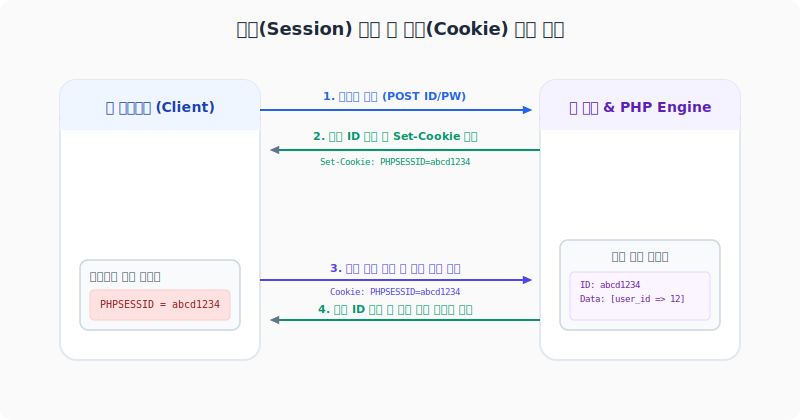

# 3. 쿠키와 세션 (Cookie & Session)
---
앞 단원에서 배웠듯 HTTP 프로토콜은 통신이 끝나면 연결을 끊고 상태를 잊어버리는 **무상태성(Stateless)**을 지닙니다. 그러나 실제 웹 서비스에서는 "한 번 로그인하면 다른 서브페이지를 돌아다닐 때도 내 로그인이 풀리지 않고 장바구니 정보가 보존되는 것"과 같은 **상태 유지(Stateful)**가 반드시 필요합니다.

이 문서에서는 무상태성 프로토콜 환경에서 상태 유지를 실현하는 2대 기술인 **쿠키(Cookie)**와 **세션(Session)**의 동작 아키텍처와 PHP 실무 제어 문법을 학습합니다.

<br>

## 3.1 쿠키 (Cookie)
쿠키는 **서버가 발급하여 클라이언트(웹 브라우저) 로컬 저장소에 저장해 두는 작은 크기(최대 4KB)의 키-값 텍스트 데이터**입니다.

```text
[ 웹 브라우저 (Client) ]                     [ 웹 서버 (Server) ]
        │                                             │
        │ ─────── (1) 최초 로그인 시도 ──────────────> │
        │ <────── (2) Set-Cookie: user=gildong ────── │ (쿠키 구워 송신)
  (쿠키 저장소에 저장)
        │                                             │
        │ ── (3) 재접속시 Cookie 헤더에 실어 전송 ───> │ (회원 식별)
```

### 3.1.1 쿠키의 동작 특징
* **자동 동반 전송**: 브라우저는 특정 사이트에서 발급받은 쿠키가 존재하면, 해당 사이트에 새로운 요청을 보낼 때마다 **HTTP Request Header에 쿠키 데이터를 무조건 자동으로 실어 전송**합니다.
* **보안 취약성**: 쿠키 정보는 클라이언트 로컬에 평문 텍스트 형태로 드러나 있으므로, 악의적인 사용자가 임의로 값을 수정하거나 해킹 프로그램(XSS)을 통해 값을 가로채 다른 회원으로 위장(세션 하이재킹 등)할 수 있어 매우 위험합니다.

### 3.1.2 PHP 쿠키 발급 및 제어 실습
PHP에서는 `setcookie()` 함수를 호출하여 브라우저에 쿠키 발급 명령(Set-Cookie 응답 헤더)을 전송합니다.

```php
<?php
// [setcookie() 기본 시그니처]
// setcookie(name, value, expire, path, domain, secure, httponly);

// 쿠키 발급: 1시간(3600초) 동안 유효하며, XSS 공격으로부터 안전한 HttpOnly 설정 활성화
$cookieValue = "hong_gildong";
$expireTime = time() + 3600; // 현재 시각 + 1시간

setcookie(
    "user_login_id",  // 1. 쿠키 이름
    $cookieValue,     // 2. 쿠키 값
    $expireTime,      // 3. 만료 시각 (Unix Timestamp)
    "/",              // 4. 경로 (사이트 전체에서 사용 가능)
    "",               // 5. 도메인 (현재 도메인 기본 지정)
    false,            // 6. Secure (true 지정 시 HTTPS 통신에서만 전송)
    true              // 7. HttpOnly (true 지정 시 자바스크립트 document.cookie 접근을 완전 차단하여 XSS 방어)
);

// [발급된 쿠키 읽기]
// PHP는 클라이언트가 전송해준 쿠키 정보를 슈퍼 글로벌 변수인 $_COOKIE 배열에 자동 매핑합니다.
if (isset($_COOKIE['user_login_id'])) {
    echo "환영합니다, " . htmlspecialchars($_COOKIE['user_login_id']) . " 님!\n";
} else {
    echo "비로그인 상태입니다.\n";
}

// [쿠키 삭제]
// 쿠키를 명시적으로 파괴하려면, 만료 시각을 과거 시각(현재 시각 - 3600초)으로 셋팅해 다시 덮어씁니다.
setcookie("user_login_id", "", time() - 3600, "/");
?>
```

<br>

## 3.2 세션 (Session)
세션은 중요하고 민감한 회원 정보 데이터를 탈취 위험이 있는 클라이언트에 보관하지 않고, **웹 서버의 안전한 전용 스토리지(파일 또는 메모리)에 저장한 뒤 클라이언트와는 오직 난수 형태의 식별 Key인 세션 ID(PHPSESSID)로만 통신하는** 상태 유지 아키텍처입니다.

<div style="text-align: center; margin: 30px 0;">
  
  <p style="font-size: 13px; color: #64748b; margin-top: 8px;">그림: 로그인 처리를 통한 세션 ID 발급과 쿠키를 활용한 상태 유지 검증 단계</p>
</div>

### 3.2.1 세션의 동작 특징
* **세션 ID의 매핑**: 세션을 구동하면 서버는 임의의 중복 불가능한 32자리 난수 텍스트(예: `PHPSESSID=89f81a7b...`)를 쿠키로 발급합니다.
* **높은 보안성**: 클라이언트 브라우저는 오직 의미 없는 난수 키(세션 ID)만 지니고 있으며, 실제 로그인 정보, 이름, 장바구니 객체 데이터 등은 서버 컴퓨터 장비 내부에 꽁꽁 숨겨져 실행되므로 조작 위험이 현저히 줄어듭니다.

### 3.2.2 PHP 세션 사용 및 로그인 구현 실습
PHP에서는 세션을 다루기 위해 반드시 스크립트 실행의 맨 최상단 헤더 영역에서 `session_start()` 함수를 한 번 호출해 주어야 합니다.

```php
<?php
// 1. 세션의 부팅 시작 (반드시 HTML 출력이나 에코 명령이 일어나기 전에 실행해야 함)
session_start();

// [세션 값 등록 및 로그인 처리]
// 사용자가 로그인 폼을 통과했다면, 슈퍼 글로벌 변수인 $_SESSION 배열에 데이터를 키-값 형태로 기록합니다.
$_SESSION['user_id'] = 7;
$_SESSION['user_name'] = "이순신";
$_SESSION['login_time'] = time();

echo "세션 등록 완료. 현재 세션 ID: " . session_id() . "\n";
?>
```

#### 세션 상태를 검증하는 다른 서브페이지 코드 예시
```php
<?php
// 2. 다른 페이지에서도 세션을 사용하기 위해 반드시 부팅 선언
session_start();

// 로그인 상태 여부 검사
if (isset($_SESSION['user_id'])) {
    echo "현재 로그인 유저: " . htmlspecialchars($_SESSION['user_name']) . " 님\n";
    echo "로그인 일시: " . date("Y-m-d H:i:s", $_SESSION['login_time']) . "\n";
} else {
    // 권한 제한: 로그인되지 않은 회원은 돌려보냄
    header("Location: /login.php");
    exit();
}
?>
```

#### 로그아웃 처리 및 세션 완전 파괴 코드 예시
```php
<?php
session_start();

// 3. 세션 완전 초기화 및 파괴
$_SESSION = array(); // 메모리 상의 세션 변수 일괄 비우기

if (ini_get("session.use_cookies")) {
    // 브라우저의 PHPSESSID 식별자 쿠키마저도 유효기간을 과거로 돌려 완벽히 말소
    $params = session_get_cookie_params();
    setcookie(
        session_name(), 
        '', 
        time() - 42000,
        $params["path"], 
        $params["domain"],
        $params["secure"], 
        $params["httponly"]
    );
}

session_destroy(); // 서버 측 물리 세션 임시 파일 최종 영구 파괴
echo "정상적으로 로그아웃되었습니다.\n";
?>
```

<br>

## 3.3 쿠키와 세션의 비교 요약

| 비교 기준 | 쿠키 (Cookie) | 세션 (Session) |
| :--- | :--- | :--- |
| **데이터 저장소** | 클라이언트의 웹 브라우저 로컬 디스크 | 백엔드 웹 서버의 메모리 또는 파일 저장 공간 |
| **보안 안전성** | 텍스트 노출 및 조작 가능성으로 **매우 낮음** | 세션 ID만 공유하므로 상대적으로 **매우 높음** |
| **서버 자원 소모** | 서버 연산이나 메모리 소모가 없어 **부하 없음** | 동시 접속자가 많을수록 서버 메모리 점유 증가 |
| **만료 조건** | 쿠키 생성 시 기재한 만료시각 기준 (브라우저 꺼져도 유지 가능) | 브라우저 종료 시 혹은 세션 만료 타임아웃 도달 시 소멸 |
| **용량 제약** | 도메인당 20개, 쿠키 1개당 최대 4KB | 서버 저장 공간 한도 내에서 사실상 제한 없음 |
