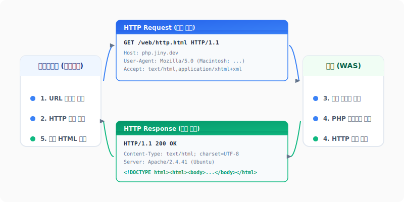

# 2. HTTP 프로토콜의 이해
---
클라이언트 브라우저와 백엔드 서버가 서로 데이터를 주고받기 위해 약속한 컴퓨터 네트워크 통신 규칙이 바로 **HTTP(HyperText Transfer Protocol)** 프로토콜입니다. 

모던 웹 백엔드 개발자로서 성능 병목이나 보안 취약점을 해결하기 위해 HTTP의 내부 동작 메커니즘과 패킷의 구조를 정확하게 파악하고 있어야 합니다.

<div style="text-align: center; margin: 30px 0;">
  
  <p style="font-size: 13px; color: #64748b; margin-top: 8px;">그림: 클라이언트 브라우저와 웹 서버 간의 HTTP 요청(Request) 및 응답(Response) 통신 흐름</p>
</div>

<br>

## 2.1 HTTP의 2대 아키텍처 철학

### 2.1.1 비연결성 (Connectionless)
비연결성은 **클라이언트가 요청을 보내고 서버가 그에 맞는 응답을 반환하면, 그 즉시 둘 사이의 네트워크 물리적 연결(TCP/IP Connection)을 끊어버리는** 특성입니다.
* **이유**: 웹 서비스는 수백만 명 이상의 불특정 다수가 동시에 접속합니다. 만약 클라이언트와 서버가 연결을 상시 유지하고 있다면, 서버의 포트(Port)와 메모리 리소스가 순식간에 고갈될 것입니다.
* **장점**: 응답 후 연결을 해제하므로 동시 접속자를 훨씬 유연하게 수용하여 서버 자원 활용성을 극대화합니다.
* **단점**: 매 요청을 보낼 때마다 네트워크를 새로 연결(3-way Handshake)해야 하므로 통신 초기 지연 지연시간(RTT)이 가산됩니다. (이를 개선하기 위해 HTTP/1.1부터는 일정 시간 연결을 살려두는 Keep-Alive 옵션을 표준 탑재하고 있습니다.)

### 2.1.2 무상태성 (Stateless)
무상태성은 **서버가 클라이언트의 이전 통신 상태 정보를 전혀 기억하지 못하며(State가 없는 상태), 각 요청을 완전히 독립적인 별개의 사건으로 취급하는** 통신 특성입니다.
* **이유**: 서버가 클라이언트들의 로그인 정보, 쇼핑몰 장바구니 목록 등을 메모리에 상시 들고 다닌다면 서버의 상태 관리가 극도로 복잡해지고, 대량 트래픽으로 인한 서버 증설(Scale-out) 시 장비 간 통신 데이터 동기화가 불가능해집니다.
* **장점**: 서버가 이전 상태를 유지할 필요가 없어 서버 디자인이 지극히 단순해지며, 트래픽 유입에 따른 로드밸런싱(여러 대의 서버로 요청을 임의 분산) 확장이 무한히 자유로워집니다.
* **단점**: 클라이언트가 물건을 장바구니에 넣고 결제 버튼을 누를 때마다 "저는 로그인한 홍길동 회원입니다"라는 신원 증명 데이터를 패킷마다 매번 처음부터 다시 제출해야 합니다. 이로 인해 불필요한 데이터 오버헤드가 발생하며, 로그인 인증 유지를 위한 부가적인 별도 기술(쿠키와 세션)이 강제됩니다.

<br>

## 2.2 HTTP Request (HTTP 요청 패킷 구조)
클라이언트가 서버로 송신하는 요청 메시지는 크게 세 영역(Start Line, Headers, Body)으로 분할되어 패킷이 전송됩니다.

```text
+-------------------------------------------------------------+
| GET /posts/view.php?id=45 HTTP/1.1                          | <-- Start Line
+-------------------------------------------------------------+
| Host: php.jiny.dev                                          | <-- Headers
| User-Agent: Mozilla/5.5 (Macintosh)                         |
| Accept: text/html,application/xhtml+xml                     |
| Accept-Language: ko-KR,ko;q=0.9                             |
+-------------------------------------------------------------+
| (한 줄 개행 빈 칸)                                           |
+-------------------------------------------------------------+
| (Body - GET 요청은 보통 바디가 없으므로 비어있음)               | <-- Body
+-------------------------------------------------------------+
```

1. **시작줄 (Start Line)**
   * **HTTP 메서드**: 요청의 목적 행위를 나타냅니다. 
     * `GET` (조회), `POST` (생성/제출), `PUT` (전체 수정), `DELETE` (삭제) 등.
   * **요청 대상(URI)**: 접근하려는 자원의 가상 파일 경로 및 파라미터.
   * **HTTP 버전**: 프로토콜 버전 명세 (예: `HTTP/1.1` 또는 `HTTP/2`).
2. **요청 헤더 (Request Headers)**
   * 요청을 보내는 브라우저의 종류(`User-Agent`), 대상 서버의 호스트 주소(`Host`), 브라우저가 수용 가능한 데이터 포맷(`Accept`), 요청을 보내는 사용자의 인증 자격 정보나 쿠키 내용 등이 포함됩니다.
3. **요청 바디 (Request Body)**
   * `POST` 또는 `PUT` 전송 시 사용자가 양식(Form)에 입력한 값이나 업로드하려는 파일 데이터, 또는 JSON 구조체 등이 실무적으로 실려 갑니다. (GET 요청 시에는 빈 줄 개행 처리 후 비워두는 것이 표준입니다.)

<br>

## 2.3 HTTP Response (HTTP 응답 패킷 구조)
서버가 계산을 완료한 후 브라우저로 되돌려 보내는 패킷 역시 3개 레이어로 규격화되어 포맷팅됩니다.

```text
+-------------------------------------------------------------+
| HTTP/1.1 200 OK                                             | <-- Status Line
+-------------------------------------------------------------+
| Date: Mon, 15 Jun 2026 00:54:12 GMT                         | <-- Headers
| Server: Nginx/1.24.0                                        |
| Content-Type: text/html; charset=UTF-8                      |
| Content-Length: 104                                         |
+-------------------------------------------------------------+
| (한 줄 개행 빈 칸)                                           |
+-------------------------------------------------------------+
| <!DOCTYPE html><html><body><h1>성공적으로...                  | <-- Body
+-------------------------------------------------------------+
```

1. **상태줄 (Status Line)**
   * 프로토콜 버전 및 요청의 성공/실패 여부를 코드로 요약한 **HTTP 상태 코드(Status Code)**가 가장 먼저 선언됩니다.
2. **응답 헤더 (Response Headers)**
   * 응답을 생성해 준 웹 서버 소프트웨어 종류(`Server`), 화면 문서의 종류(`Content-Type`), 전송 바디 데이터의 바이트 크기(`Content-Length`), 그리고 브라우저에 임시 저장할 쿠키 발급 명령(`Set-Cookie`) 등이 탑재됩니다.
3. **응답 바디 (Response Body)**
   * 브라우저 화면에 렌더링되어 출력될 원본 HTML 텍스트 문자열이나 이미지 바이너리, 혹은 API 호출 결과인 JSON 데이터 덩어리가 이 자리에 실려 전달됩니다.

<br>

## 2.4 핵심 HTTP 상태 코드 (Status Code) 정리
상태 코드는 3자리 정수로 표현되며, 첫째 자리가 분류 영역을 의미합니다.

* **2xx (성공 - Success)**
  * `200 OK`: 요청이 성공적으로 완료되었으며 요구 데이터가 정상적으로 전달됨.
  * `201 Created`: 생성 요청(POST)이 정상 접수되어 새 자원이 성공적으로 생성됨.
* **3xx (리다이렉션 - Redirection)**
  * `301 Moved Permanently`: 자원의 주소가 영구적으로 이동되어 새로운 URL 주소로 자동 포워딩 처리해야 함.
* **4xx (클라이언트 오류 - Client Error)**
  * `400 Bad Request`: 요청 파라미터 구문이나 전달 방식이 잘못되어 서버가 해독 불가함.
  * `401 Unauthorized`: 해당 요청을 처리하기 위한 로그인이 수행되지 않았거나 인증 자격 증명이 불충분함.
  * `403 Forbidden`: 사용자의 신원은 확인되었으나, 해당 파일이나 관리 기능에 접근할 권한이 박탈됨.
  * `404 Not Found`: 요청 주소에 해당하는 파일이나 데이터베이스 레코드가 존재하지 않음.
* **5xx (서버 오류 - Server Error)**
  * `500 Internal Server Error`: 서버 구동 스크립트(PHP 등) 내부에서 예외나 런타임 신택스 에러가 발생하여 처리가 비정상 중단됨.
  * `502 Bad Gateway`: Nginx나 Apache가 백엔드 PHP-FPM 엔진으로부터 올바른 응답을 수신하지 못하고 다운됨.
