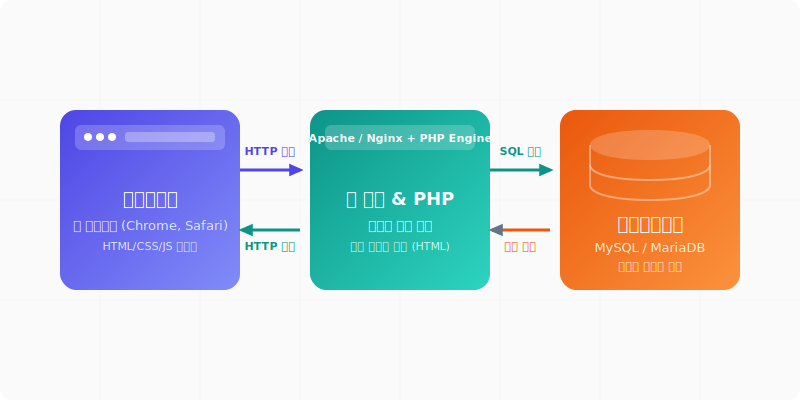

# 웹프로젝트 (Web Project)
---
기본적인 PHP 프로그래밍 기초 문법과 객체지향 설계 원칙을 학습했다면, 이제 이를 활용하여 실제 사용자가 브라우저를 통해 접속할 수 있는 **웹 애플리케이션 서비스**를 구축해야 합니다.

실무 수준의 웹 시스템은 단순 연산 코딩을 넘어, 클라이언트와의 통신 프로토콜, 로그인 상태 정보 보존, 화면과 데이터베이스 연동 등 종합적인 인프라 설계가 유기적으로 엮여 작동합니다. 

본 단원에서는 백엔드 엔지니어로서 실무적인 웹 서비스를 개발하는 데 필수적인 웹 아키텍처의 이론과 PHP의 데이터베이스 및 템플릿 제어 실습을 체계적으로 분류하여 학습합니다.

  
  
그림: 웹 브라우저(클라이언트) - 웹 서버(PHP) - 데이터베이스 간의 상호작용

 

## 📂 웹프로젝트 학습 목차
---

### 1. [웹 개발이란 무엇인가?](about.html)
* 웹 애플리케이션의 핵심인 클라이언트-서버 통신 모델을 이해합니다.
* 프론트엔드와 백엔드의 아키텍처적 역할 분담 및 정적 페이지(Static)와 동적 페이지(Dynamic)의 렌더링 라이프사이클 차이점을 정리합니다.

### 2. [HTTP 프로토콜의 이해](http.html)
* 웹의 기본 통신 규약인 HTTP의 무상태성(Stateless)과 비연결성(Connectionless) 특성을 분석합니다.
* Request(메서드, 헤더, 바디)와 Response(상태 코드, 헤더, 바디) 패킷의 구조와 통신 생애주기 과정을 이해합니다.

### 3. [쿠키와 세션 (Cookie & Session)](cookie-session.html)
* HTTP의 무상태성 한계를 극복하고 사용자의 로그인 인증 상태를 유지하기 위한 기법을 학습합니다.
* 브라우저에 저장되는 쿠키(Cookie)와 서버에 은닉되는 세션(Session)의 작동 원리 차이 및 PHP에서의 실무 상태값 제어 기법을 마스터합니다.

### 4. [템플릿 엔진 및 MVC 아키텍처](template/)
* 화면 UI(HTML) 디자인 레이어와 동작 논리 코드(PHP)를 깔끔하게 분리하는 관심사 분리(SoC) 설계 기법을 배웁니다.
* 다양한 템플릿 엔진의 문자열 치환 및 컴파일 메커니즘, 그리고 템플릿 엔진을 활용한 초소형 웹 MVC 구조를 학습합니다.

### 5. [PDO 데이터베이스 연동](pdo.html)
* SQL Injection(인젝션) 해킹 위협으로부터 웹 서비스를 완벽히 지키는 표준 데이터베이스 라이브러리인 **PDO(PHP Data Objects)**를 다룹니다.
* 준비된 선언(Prepared Statement)과 파라미터 바인딩의 원리를 이해하고 실제 PDO 기반 데이터베이스 CRUD 전체 예제를 실습합니다.

### 6. [실무 프로젝트 실습: 게시판 만들기](board/)
* 지금까지 배운 웹 기초, 쿠키와 세션, MVC/템플릿, 그리고 PDO 데이터베이스 연동 기술을 결합하여 실제 동작하는 게시판 애플리케이션을 단계별로 구축합니다.
* 데이터베이스 테이블 설계부터 데이터 목록 조회(Read), 새 글 작성(Create), 본문 상세 보기 및 XSS 공격 방어(Read Detail), 글 수정/삭제(Update/Delete)로 이어지는 완결된 CRUD 기능 전체를 실습합니다.