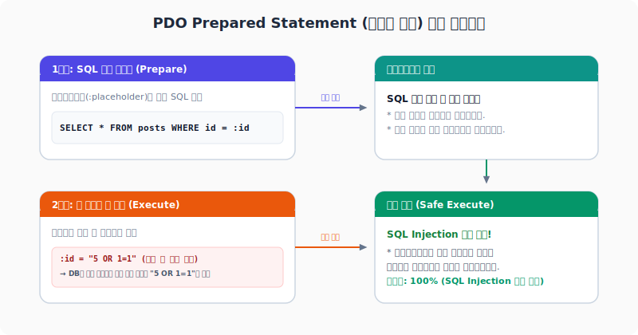

# 5. PDO 데이터베이스 연동
---
웹 서비스의 영속적인 데이터 보존을 위해 백엔드 프로그램은 데이터베이스(RDBMS)와의 긴밀한 통신이 필수적입니다. 과거에는 `mysql_query()` 같은 구식 API를 남용하여 데이터베이스와 연동하곤 했지만, 이는 보안에 극히 취약하고 특정 데이터베이스 소프트웨어에 종속되는 강력한 단점이 존재했습니다.

이 문서에서는 모던 PHP의 데이터베이스 표준 라이브러리인 **PDO(PHP Data Objects)**의 이점과 SQL Injection 공격을 완벽히 방어하는 **Prepared Statement(준비된 선언)**의 아키텍처, 그리고 실제 CRUD 연동을 위한 OOP 실무 코드를 학습합니다.

<br>

## 5.1 SQL Injection 위협과 Prepared Statement

### 5.1.1 SQL Injection(인젝션) 공격의 원리
SQL Injection은 악의적인 클라이언트가 웹 양식(Form)의 입력값 자리에 정상적인 변수 대신 **임의의 SQL 조각 구문을 입력하여 서버의 데이터베이스 쿼리 작동 논리를 의도적으로 위변조**하는 치명적인 보안 공격 기법입니다.

```php
<?php
// [보안에 극도로 취약한 레거시 쿼리 작성법]
$userEmail = $_POST['email']; // 입력값: "hacker@evil.com' OR '1'='1"

// 실제 완성되는 SQL: SELECT * FROM users WHERE email = 'hacker@evil.com' OR '1'='1';
// 이 조건식은 무조건 참('1'='1')이 되어 해커는 비밀번호 검증 없이 사이트 전체 유저 목록을 털어갈 수 있습니다.
$sql = "SELECT * FROM users WHERE email = '{$userEmail}'";
?>
```

### 5.1.2 Prepared Statement 및 매개변수 바인딩의 방어 메커니즘
PDO가 지원하는 Prepared Statement는 SQL 인젝션 공격을 원천적으로 차단합니다.
1. **템플릿 컴파일 선수행**: 쿼리 뼈대에 해당하는 SQL 문을 데이터베이스에 먼저 전달하여 컴파일(준비)시켜 둡니다. 이때 입력값이 채워질 자리에는 가상 매개변수인 **플레이스홀더(Placeholder, `:email` 등)**를 표시해 둡니다.
2. **엄격한 데이터 치환**: 이후 템플릿 자리에 실제 입력값을 매핑(Binding)시킵니다. 데이터베이스 엔진은 바인딩된 값을 SQL 제어 예약어로 절대 해독하지 않고, 오직 무해한 **단순 문자열/상수 데이터로만 취급**하므로 공격 구문을 기재하더라도 그대로 텍스트로 보존되어 무력화됩니다.

<div style="text-align: center; margin: 30px 0;">
  
  <p style="font-size: 13px; color: #64748b; margin-top: 8px;">그림: 쿼리 뼈대 사전 선언(Prepare)과 매개변수 값 바인딩(Execute) 분리를 통한 SQL Injection 차단 원리</p>
</div>

<br>

## 5.2 PDO 연결(Connection) 셋업
PDO는 DSN(Data Source Name) 설정을 바탕으로 하며, 예외(Exception) 처리 구문을 활용해 연결 실패 등의 인프라 장애를 안전하게 통제합니다.

```php
<?php
declare(strict_types=1);

// 데이터베이스 접속 정보 설정
$host = '127.0.0.1';
$db   = 'my_project_db';
$user = 'db_user';
$pass = 'secret_password_123';
$charset = 'utf8mb4';

// DSN (Data Source Name) 규격 설정
$dsn = "mysql:host={$host};dbname={$db};charset={$charset}";

// PDO 작동 옵션 배열 설정
$options = [
    // 1. 에러 발생 시 예외(PDOException)를 던지도록 강제 설정
    PDO::ATTR_ERRMODE            => PDO::ERRMODE_EXCEPTION,
    // 2. 조회 결과 데이터를 기본적으로 연관 배열('column_name' => value) 구조로 매핑해 반환
    PDO::ATTR_DEFAULT_FETCH_MODE => PDO::FETCH_ASSOC,
    // 3. 데이터베이스 드라이버 레벨에서 PreparedStatement 모방(Emulation)을 끄고 순정 prepared 기능을 가동
    PDO::ATTR_EMULATE_PREPARES   => false,
];

try {
    // PDO 인스턴스 생성 및 연결 시도
    $pdo = new PDO($dsn, $user, $pass, $options);
    echo "데이터베이스 서버 연결 성공!<br>";
} catch (PDOException $e) {
    // 연결 예외가 발생했을 때 화면에 에러 코드가 그대로 노출되는 것을 막고 안전한 로그를 기록
    error_log($e->getMessage());
    die("서버 에러가 발생했습니다. 잠시 후 다시 시도해주세요.");
}
?>
```

<br>

## 5.3 완결성 있는 PDO CRUD 구현 객체지향 예제

위에서 생성된 `$pdo` 커넥션 인스턴스를 활용해 실제 데이터를 추가, 조회, 수정, 삭제하는 실무 PHP 코드 예제입니다.

### 5.3.1 데이터 추가 (Insert)
```php
<?php
// 1. 쿼리 뼈대 사전 선언 (Placeholder :title, :content 사용)
$sql = "INSERT INTO posts (title, content, created_at) VALUES (:title, :content, NOW())";

$stmt = $pdo->prepare($sql); // 쿼리 준비

// 2. 바인딩할 파라미터 값 정의
$title = "PHP 웹개발 실무 가이드";
$content = "PDO와 Prepared Statement를 사용하면 데이터베이스를 매우 안전하게 다룰 수 있습니다.";

// 3. 파라미터 바인딩 및 최종 실행
$stmt->execute([
    'title'   => $title,
    'content' => $content
]);

// 방금 삽입된 레코드의 Auto Increment 기본키 ID 조회
$newId = $pdo->lastInsertId();
echo "성공적으로 {$newId}번 글이 추가되었습니다.<br>";
?>
```

### 5.3.2 데이터 단건 및 다건 조회 (Select)
```php
<?php
// [단건 조회]
$postId = 5;
$sql = "SELECT * FROM posts WHERE id = :id";
$stmt = $pdo->prepare($sql);

$stmt->execute(['id' => $postId]);
$post = $stmt->fetch(); // 단 한 건의 레코드만 가져옵니다.

if ($post) {
    echo "제목: " . htmlspecialchars($post['title']) . "<br>";
} else {
    echo "존재하지 않는 게시글입니다.<br>";
}

// [다건 전체 조회]
$sqlAll = "SELECT * FROM posts ORDER BY id DESC";
$stmtAll = $pdo->prepare($sqlAll);
$stmtAll->execute();

$posts = $stmtAll->fetchAll(); // 전체 매칭 레코드를 배열 구조로 가져옵니다.

foreach ($posts as $row) {
    echo " - [" . $row['id'] . "] " . htmlspecialchars($row['title']) . "<br>";
}
?>
```

### 5.3.3 데이터 수정 (Update)
```php
<?php
$sql = "UPDATE posts SET title = :title WHERE id = :id";
$stmt = $pdo->prepare($sql);

$stmt->execute([
    'title' => '수정된 PHP 웹개발 실무 가이드',
    'id'    => 5
]);

// 영향받은 데이터베이스 행(Row)의 개수 확인
$affectedRows = $stmt->rowCount();
echo "총 {$affectedRows}개의 레코드가 성공적으로 수정되었습니다.<br>";
?>
```

### 5.3.4 데이터 삭제 (Delete)
```php
<?php
$sql = "DELETE FROM posts WHERE id = :id";
$stmt = $pdo->prepare($sql);

$stmt->execute(['id' => 5]);

$affectedRows = $stmt->rowCount();
echo "총 {$affectedRows}개의 레코드가 데이터베이스에서 영구 삭제되었습니다.<br>";
?>
```
