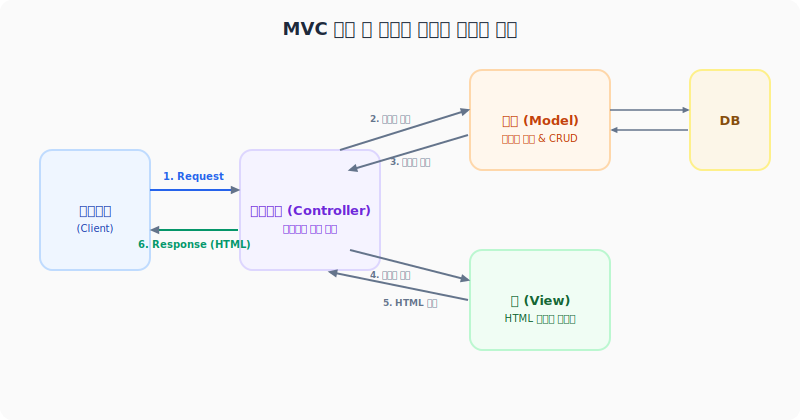

# 4. 템플릿 엔진 및 MVC 아키텍처
---
초기 PHP 개발은 HTML 태그 사이에 PHP 스크립트를 직접 섞어 쓰는 방식(`<?php echo ... ?>`)이 기본이었습니다. 하지만 웹 서비스의 기능이 많아지고 다수의 프론트엔드/백엔드 개발자가 협업을 진행하면서 이러한 방식은 가독성과 유지보수성을 극도로 떨어뜨렸습니다. 

이 문서에서는 화면 디자인(UI)과 백엔드 데이터 연산 로직을 격리하는 **관심사의 분리(SoC, Separation of Concerns)** 구현 기술인 **템플릿 엔진(Template Engine)**의 구동 원리와 웹 기반 **MVC 패턴**을 학습합니다.

<br>

## 4.1 관심사의 분리와 템플릿 엔진의 탄생
* **과거 스파게티 코드의 문제**: HTML 마크업 코드와 데이터베이스 쿼리 코드, 비즈니스 계산 로직이 하나의 파일 내에 얽히고설키면 디자이너는 코드를 건드릴 때 에러가 날까 봐 두려워지고, 백엔드 개발자는 사소한 화면 버튼 추가 요구사항에도 복잡한 DB 접근부를 계속 스캔해야 했습니다.
* **해결 원리**: 뷰 레이어(View)는 순수 화면 뼈대(HTML) 디자인에만 전념하고, 컨트롤러와 모델은 데이터 처리 및 비즈니스에만 전념하도록 이 둘을 엄격하게 격리하는 소프트웨어적 경계선이 필요했고, 이를 조율하는 엔진이 **템플릿 엔진(Template Engine)**입니다.

<br>

## 4.2 템플릿 엔진의 3대 핵심 메커니즘

```text
+-------------------------+                   +--------------------------+
|  자식 뷰 (HTML 템플릿)  | ─── (1) Parsing ──> |  템플릿 컴파일러 (Parser) |
|  {{ name }} / @foreach  |                   |  - 정규식 치환 매핑      |
+-------------------------+                   +--------------------------+
                                                            │
                                                   (2) Compile & Save
                                                            │
                                                            ▼
                                              +--------------------------+
                                              |  캐시된 순수 PHP 스크립트 |
                                              |  <?php echo $name; ?>    |
                                              +--------------------------+
```

### 4.2.1 문자열 치환 (Substitution) Parser
템플릿 엔진은 디자이너나 프론트엔드 엔지니어가 작성한 템플릿 파일 내부의 특수한 문자열 표기인 **치환 코드(Placeholder)**를 감지하여 백엔드 데이터로 대치하는 문자열 해석기(Parser)를 구동합니다.

```php
<?php
// [초소형 템플릿 엔진 치환 처리 시뮬레이션]
class MiniTemplateEngine 
{
    protected string $template;

    public function __construct(string $templatePath) 
    {
        $this->template = file_get_contents($templatePath);
    }

    public function render(array $data): string 
    {
        $output = $this->template;

        // 정규식을 사용해 치환용 중괄호 괄호 패턴을 찾아내어 
        // 주입받은 $data 배열의 실제 값으로 매핑 치환합니다.
        foreach ($data as $key => $value) {
            $pattern = '/\{\{\s*' . preg_quote($key, '/') . '\s*\}\}/';
            $output = preg_replace($pattern, htmlspecialchars((string)$value), $output);
        }

        return $output;
    }
}

// 템플릿 문서 (welcome.tpl): "<h1>Welcome, {{ username }}!</h1>"
// $engine = new MiniTemplateEngine('welcome.tpl');
// echo $engine->render(['username' => '홍길동']);
// 출력: "<h1>Welcome, 홍길동!</h1>"
?>
```

### 4.2.2 제어구조 로직 컴파일 (Control Structure Translation)
템플릿 파일 안에는 단순히 변수 출력뿐만 아니라 조건에 따른 뷰 제어(`@if`), 반복 배열 출력(`@foreach`) 등 최소한의 제어 처리가 필요합니다. 템플릿 컴파일러는 이 간결한 디렉티브 코드를 찾아 적합한 순수 PHP 제어문 코드로 자동 기계식 변환해 주는 로직 컴파일러를 구동합니다.

* **변환 전**:
  ```html
  @foreach ($users as $user)
      <li>{{ $user['name'] }}</li>
  @endforeach
  ```
* **변환 후 (컴파일 완료 시점)**:
  ```php
  <?php foreach ($users as $user): ?>
      <li><?php echo htmlspecialchars($user['name']); ?></li>
  <?php endforeach; ?>
  ```

### 4.2.3 컴파일 및 캐싱 아키텍처 (Compile & Caching)
매번 클라이언트 요청이 들어올 때마다 서버가 대량의 템플릿 텍스트 파일을 정규식으로 전체 스캔하고 변환하는 파싱 연산을 무한 반복한다면 CPU 성능 저하가 극심해집니다.
* **해석형 엔진**: 매번 파일을 읽어 실시간 해석하므로 속도가 느립니다.
* **컴파일형 엔진 (Blade, Twig)**:
  1. 클라이언트의 최초 요청 시, 템플릿 파일(`.blade.php`, `.twig`)을 위에서 구현한 파서가 단 한 번 해석하여 완성된 **순수 PHP 파일로 변환(Compile)**해 별도 캐시(Cache) 스토리지 경로에 영구 저장합니다.
  2. 두 번째 요청부터는 템플릿 원본 파일을 절대 건드리지 않고, 캐시 보관소에 저장되어 있는 순수 PHP 파일만 즉시 메모리 상에 `include` 시켜 구동하므로 날것의 PHP 코드와 맞먹는 고속의 렌더링 응답을 실현합니다.

<br>

## 4.3 웹 기초 관점에서의 MVC 아키텍처 패턴

<div style="text-align: center; margin: 30px 0;">
  
  <p style="font-size: 13px; color: #64748b; margin-top: 8px;">그림: Model-View-Controller(MVC) 모델과 뷰 템플릿 엔진 간의 유기적 데이터 처리 흐름</p>
</div>

템플릿 엔진의 렌더링 매커니즘은 웹 애플리케이션의 핵심인 **MVC(Model-View-Controller) 아키텍처**와 유기적으로 연합되어 동작합니다.

1. **컨트롤러 (Controller)**:
   * 사용자의 요청 인자(예: 회원 번호)를 접수한 뒤 유효성 필터링을 수행하고, 적합한 비즈니스 처리를 위해 **모델**을 기동합니다.
2. **모델 (Model)**:
   * 데이터베이스 접근 및 핵심 수학적 연산을 은닉하여 가공한 뒤, 그 결과를 깨끗한 데이터셋 객체로 컨트롤러에 이관합니다.
3. **뷰 (View)**:
   * 컨트롤러는 획득한 데이터셋을 캐시 보존된 **템플릿 뷰 엔진**의 변수 테이블에 주입하고 컴파일된 뷰를 기동합니다. 뷰는 HTML 안에 데이터를 바인딩한 후 최종 렌더링된 문자열 코드를 응답으로 클라이언트에 돌려보냅니다.