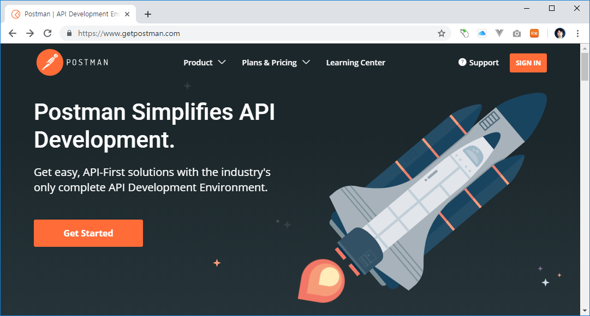

# 포스트맨

## 다운로드

포스트맨 공식사이트는 https://www.getpostman.com/ 입니다. 사이트로 접속합니다.

메인 화면에서 `Get Staerted`를 선택합니다. 

다운로드 페이지로 이동을 합니다. 포스트맨은 윈도우 및 맥등 다양한 운영체제를 지원합니다. 사이트를 접속하시면 자동으로 접속 운영체제를 인식하여 다운로드 파일을 추천해 줍니다.

빠른 설치를 위해서 [윈도우 64bit 다운로드](https://dl.pstmn.io/download/latest/win64) 링크를 여기에 걸어 둡니다.

## 설치하기

정상적으로 포스트맨 파일을 다운로드 하였다면, 컴퓨터에 설치를 진행합니다.

설치파일을 실행을 합니다.

포스트맨을 설치하기 위해서는 회원 가입이 필요합니다. 직접 회원을 가입하거나 구글 계정을 연동할 수 있습니다.

설치가 완료 되었습니다. 업데이트가 있는 경우 이와 같이 알려 줍니다. 업데이트도 같이 진행을 합니다.

업데이트가 진행이 됩니다.

업데이트 및 설치가 완료된 화면 입니다.

## 화면 UI

