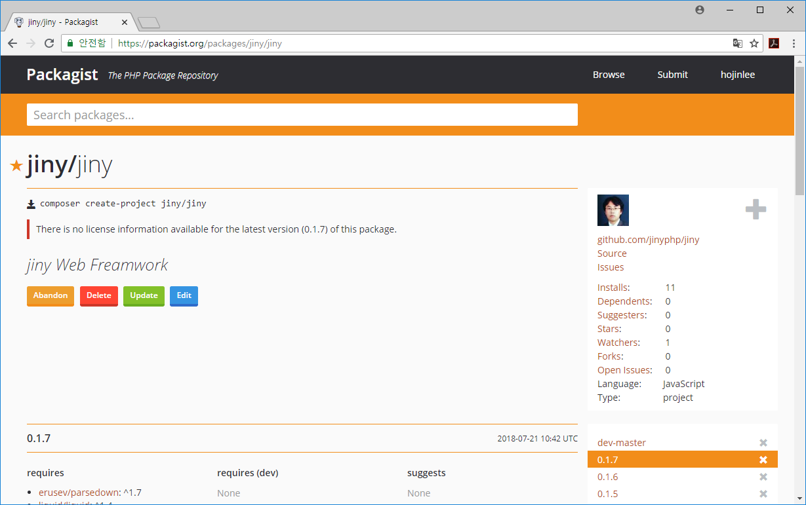

## 컴포저로 설치
---
전용 지니 인스톨러를 사용하지 않고 컴포저를 이용하여 지니PHP 프레임워크를 설치할 수 있습니다.
지니 프레임워크는 깃허브와 별도로 페키지화 되어 `https://packagist.org/packages/jiny/jiny` 에 등록이 되어 있습니다.

 

<br>

## 프로젝트 설치
---
페키지스트에 등록된 페키지를 페키지 라이브러리가 아닌 프로젝트로 설치를 하실 수 있습니다. 프로젝트로 설치할경우에는 `create-project` 명령을 사용하면 됩니다.

콘솔창에서 다음과 갗이 입력을 합니다:
```php
composer create-project jiny/jiny 폴더명
```

위와 같이 입력을 하면 컴포저는 `vendor`폴더가 아닌 프로젝트 형태로 페키지를 다운로드 받아 설치를 하게 됩니다.
설치가 완료가 되면 추가 의존성 페키지를 설치해 주어야 합니다.

```php
cd 폴더명
composer install
```

추가 의존 페키지 까지 설치가 완료하면 정상적인 지니 프레임 워크가 설치가 된 것입니다.

<br>


