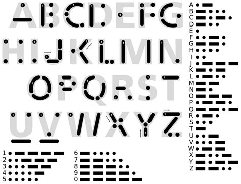

### 브리지 패턴
---

우리는 프로젝트를 개발함에 있어서 고객들의 다양한 확장에 대해서 대비가 필요합니다. 브리지 패턴은 프로젝트에서 기존에 A방식이 아닌 새로운 B방식도 대응할 수 있도록 기능의 확장을 처리하기 위한 패턴입니다.

객체지향 코드에서 우리는 새로운 기능을 확장하기 위해서는 `상속`을 이용하였습니다. 상속은 부모와 자식 관계로 단순한 기능의 확장입니다. 예를들어, 쇼핑몰을 제작하면서 기존에는 A결제 모듈 하나만 존재 하였습니다. 하지만, 모바일 시대가 되면서 다양한 결제모듈의 지원이 필요해 지고 이를 대응할려고 합니다.

새로운 기능과 달리 동작시 서로 다른 선택적인 처리를 확장을 해야 된다면 어떻게 해야 될까요? 이런경우에는 상속만으로는 처리하기 힘들 것입니다. 기존의 방식들은 새로운 동일한 유형의 기능이 추가될때 마다 메서드를을 호출하는 인터페이스가 변경이 될 수도 있습니다. 인터페이스가 변경이 되는 것은 시스템 코드의 많은 수정과 무리를 주게 됩니다.

사실 브리지 패턴의 경우 많은 정보들이 존재하지 않습니다. 이러한 이유로 많은 사람들과 책에서는 브리지 패턴을 각기 다른 방식으로 설명을 하고 있어 혼동되는 부분도 많이 있습니다.

GOF에서는 브리지 패턴을 "decouple an abstraction from its implementation so that the two can very independently" 로 정의합니다. 저의에서 처럼 브리지 패턴은 동작하고자 하는 기능을 구현부화 추상화 형태로 분리를 합니다. 그리고 이렇게 분리된 기능과 구분을 브리지화 형태로 결합하여 동작을 하는 패턴입니다. 

브리지 패턴은 기존 시스템에 유사한 새로운 기능이 지속적으로 추가될때 사용하면 유용한 패턴입니다. 브리지 패턴은 새로운 인터페이스를 정의하여 기존 프로그램의 변경이 없이 기능을 확장할 수 있는 패턴입니다. 새로운 기능을 확장으로 처리하는 것이 아닌, 위임(delegate)로 처리하는 패턴이 브리지 패턴입니다. 브리지 패턴은 추상 레벨간의 연결을 합니다.

<br>

### 기본실습
---

기본 코드를 통하여 브리지 패턴의 동작을 이해해 보도록 하겠습니다.

브리지 패턴을 학습하기 위해서 모르스부호의 구현을 예를 들어 보도록 하겠습니다. 우리는 응급구조 앱을 하나 만들 것입니다. 원하는 메시지를 입력하면 다양한 모르스 부호로 변환되어 출력하는 시스템이 필요로 합니다.

모르스 부호는 크게 3개의 구성되로 나누어저 있습니다. 문자의 경우 점(.)과 데쉬(-)입니다. 중간에는 스페이스 로 구분되어 있습니다. 모르스 부호는 문자, 소리, 빛 등 다양한 형태로 변환되어 일상 생활에서도 사용입니다.

구성요소에 대한 추상 인터페이스를 선언합니다.
bridge/01/Interface.php
```php
<?php
/**
 * 모르스부호는 3개의 구성요소로 이루어 집니다.
 */
interface MorseCode 
{
    public function dot();
    public function dash();
    public function space();
}
```

모르스 부호의 기본이 되는 클래스 객체를 생성합니다. 텍스트 코드와 비프음 2개를 만들 보도록 하겠습니다.
기능은 다양하게 앞으로도 추가될 수 있습니다.

bridge/01/Code.php
```php
<?php
/**
 * 모르스부호에 대해서 구성을 합니다.
 */
class Code implements MorseCode
{
    /**
     * 닷
     */
    public function dot()
    {
        echo "*";
        return $this;
    }

    /**
     * 가로 데쉬
     */
    public function dash()
    {
        echo "-";
        return $this;
    }

    /**
     * 스페이스
     */
    public function space()
    {
        echo " ";
        return $this;
    }

}
```

소리음에 대한 클래스도 정의해 봅니다.

bridge/01/Beep.php
```php
<?php
/**
 * 모르스부호에 대해서 구성을 합니다.
 */
class Beep implements MorseCode
{
    /**
     * 닷
     */
    public function dot()
    {
        echo "삐";
        return $this;
    }

    /**
     * 가로 데쉬
     */
    public function dash()
    {
        echo "음";
        return $this;
    }

    /**
     * 스페이스
     */
    public function space()
    {
        echo " ";
        return $this;
    }

}
```

구현된 모르스 코드를 처리할 수 있는 브리지 객체를 생성을 합니다.



bridge/01/Morse.php
```php
<?php
/**
 * 모스 코드를 상속받이 처리합니다.
 */
class Morse
{
    private $_m;
    public function __construct($type)
    {
        // echo __CLASS__."를 생성합니다. \n";
        $this->_m = $type;
    }
     
    public function a()
    {
        $this->_m->dot()->space();
        $this->_m->dash()->space();
    }

    public function b()
    {
        $this->_m->dash()->space();        
        $this->_m->dot()->space();      
        $this->_m->dot()->space();      
        $this->_m->dot()->space();      
    }

    public function c()
    {
        $this->_m->dash()->space();
        $this->_m->dot()->space();
        $this->_m->dash()->space();
        $this->_m->dot()->space();
    }

    public function d()
    {
        $this->_m->dash()->space();
        $this->_m->dot()->space();
        $this->_m->dot()->space();
    }

    public function e()
    {
        $this->_m->dot()->space();
    }

    public function f()
    {
        $this->_m->dot()->space();
        $this->_m->dot()->space();
        $this->_m->dash()->space();
        $this->_m->dot()->space();
    }

    public function g()
    {
        $this->_m->dash()->space();
        $this->_m->dash()->space();
        $this->_m->dot()->space();
    }

    public function h()
    {
        $this->_m->dot()->space();
        $this->_m->dot()->space();
        $this->_m->dot()->space();
        $this->_m->dot()->space();

    }

    public function i()
    {
        $this->_m->dot()->space();
        $this->_m->dot()->space();
    }

    public function j()
    {
        $this->_m->dot()->space();
        $this->_m->dash()->space();
        $this->_m->dash()->space();
        $this->_m->dash()->space();
    }

    public function k()
    {
        $this->_m->dash()->space();
        $this->_m->dot()->space();
        $this->_m->dash()->space();
    }

    public function l()
    {
        $this->_m->dot()->space();
        $this->_m->dash()->space();
        $this->_m->dot()->space();
        $this->_m->dot()->space();
    }

    public function m()
    {
        $this->_m->dash()->space();
        $this->_m->dash()->space();

    }

    public function n()
    {
        $this->_m->dash()->space();
        $this->_m->dot()->space();
    }

    public function o()
    {
        $this->_m->dash()->space();
        $this->_m->dash()->space();
        $this->_m->dash()->space();
    }

    public function p()
    {
        $this->_m->dot()->space();
        $this->_m->dash()->space();
        $this->_m->dash()->space();
        $this->_m->dot()->space();
    }

    public function q()
    {
        $this->_m->dash()->space();
        $this->_m->dash()->space();
        $this->_m->dot()->space();
        $this->_m->dash()->space();
    }

    public function r()
    {
        $this->_m->dot()->space();
        $this->_m->dash()->space();
        $this->_m->dot()->space();
    }

    public function s()
    {
        $this->_m->dot()->space();
        $this->_m->dot()->space();
        $this->_m->dot()->space();
    }

    public function t()
    {
        $this->_m->dash()->space();

    }

    public function u()
    {
        $this->_m->dot()->space();
        $this->_m->dot()->space();
        $this->_m->dash()->space();
    }

    public function v()
    {
        $this->_m->dot()->space();
        $this->_m->dot()->space();
        $this->_m->dot()->space();
        $this->_m->dash()->space();
    }

    public function w()
    {
        $this->_m->dot()->space();
        $this->_m->dash()->space();
        $this->_m->dash()->space();
    }

    public function x()
    {
        $this->_m->dash()->space();
        $this->_m->dot()->space();
        $this->_m->dot()->space();
        $this->_m->dash()->space();
    }

    public function y()
    {
        $this->_m->dash()->space();
        $this->_m->dot()->space();
        $this->_m->dash()->space();
        $this->_m->dash()->space();
    }

    public function z()
    {
        $this->_m->dash()->space();
        $this->_m->dash()->space();
        $this->_m->dot()->space();
        $this->_m->dot()->space();
    }
}
```

`Morse`객체는 생성자에서 매개변수로 전달받은 모르스코드 구현방식에 대한 객체 인스턴스를 위임(delegate)처리를 하게 됩니다. 그리고 이를 호출하는 코드로 브리지 합니다.

이렇게 생성된 브리지를 적용하여 출력을 해보도록 하겠습니다.

bridge/01/index.php
```php
<?php

// 선언부
require("Interface.php");

// 구현부
require("Code.php");
require("Beep.php"); 

// 브리지
require("morse.php");

echo "모르스코드를 출력합니다.\n";

function mPrint($msg, $type) {
    echo "String = ".$msg."\n";
    $m = new Morse($type);

    for($i=0; $i<strlen($msg); $i++){
        echo $m->{$msg[$i]}()."\n";
    }

    unset($m);
}

mPrint("JINYPHP", new Code);

mPrint("JINYPHP", new Beep);
```

출력부분의 예를 보면 입력된 문자열을 지정한 모르스 부호로 브리지하여 화면에 출력을 하게 됩니다. 처음에는 코드부분을 적용 받아서, 두번째는 비프음을 적용받아 처리를 하게 됩니다.

```php
$ php index.php
모르스코드를 출력합니다.
String = JINYPHP
* - - -
* *
- *
- * - -
* - - *
* * * *
* - - *
String = JINYPHP
삐 음 음 음
삐 삐
음 삐
음 삐 음 음
삐 음 음 삐
삐 삐 삐 삐
삐 음 음 삐
```

이처럼 브리지 패턴을 이용하여 기능과 자원을 분리하여 사용을 합니다.

어떻게 보면 `Morse`객체에서 위임된 객체를 호출하는 것은 전략패턴과 비슷할 수 있습니다. 전략패턴은 위임된 객체를 통하여 호출하는 것은 비슷할 수도 있겠지만 외부에서 보면 직접 위임처리 하는 것이 아니라, 브리지인 `Morse`객체를 통하여 처리하는 것에 대한 차이점이 있습니다. 또한 중간에 위임 처리되는 알고리즘 객체를 변경을 할 수 없습니다.

<br>

### 정리
---

브리지 패턴에 대해서 모르스부호를 이용하여 설명을 하였지만, 여러대의 TV리모콘을 제어하는 모델에서 브리지 패턴을 사용할 수 있습니다. 또한, 여러 종류의 결제모듈을 연동하여 처리하는 곳에서도 브리지 패턴을 응용할 수 있습니다.


